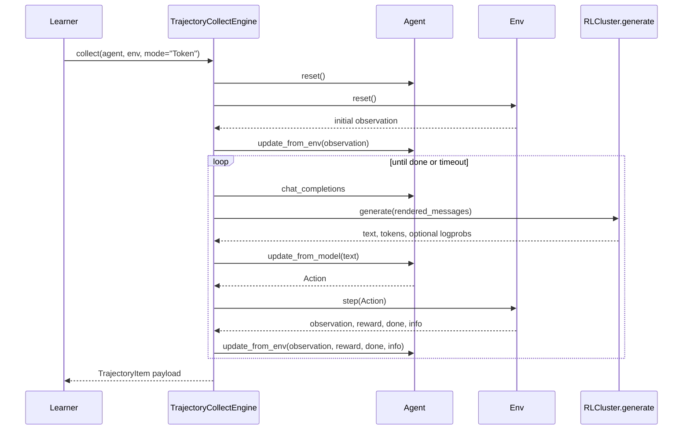
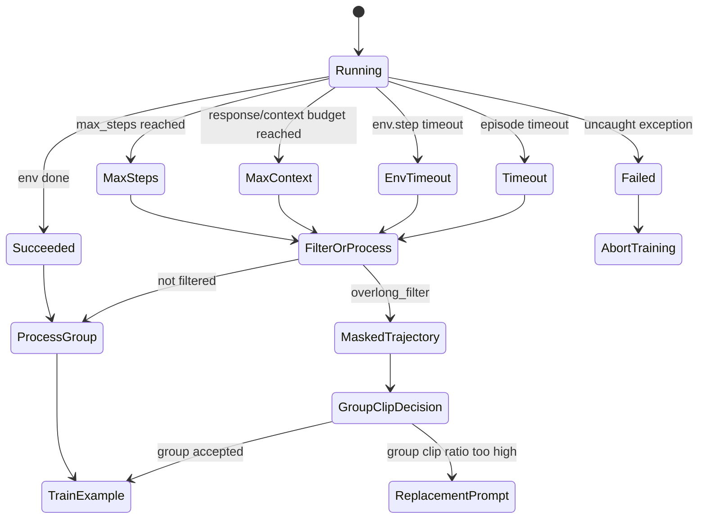

<!-- DO NOT REMOVE! Placeholder for TOC. -->

# Agentic RL Detailed Design

Status: implementation design reference

Last reviewed: 2026-07-30

Primary implementation package: `tunix/rl/agentic`

This document describes the current Tunix Agentic RL implementation in code
terms. It expands the shorter [Agentic RL](agentic_rl.md) overview into a
design reference for contributors who need to debug, extend, or operate
multi-turn online RL workloads such as DeepSWE.

The implementation is centered on one idea: separate expensive, asynchronous
agent-environment trajectory collection from JAX actor optimization, while
preserving enough metadata to train policy-gradient algorithms on the exact
tokens sampled by the rollout policy.

## Goals

Agentic RL in Tunix is designed to support the following workloads.

* Multi-turn tasks where a model repeatedly observes environment state,
  generates an action, receives a new observation, and eventually terminates.
* Tool or sandbox based tasks where environment steps may be slow, blocking, or
  external to JAX, for example repository editing in DeepSWE.
* GRPO-style group training where each original prompt produces multiple
  trajectories, and rewards are normalized across the group.
* Asynchronous online training where rollout collection, environment work,
  reward computation, and actor updates can overlap.
* Rollout engines that may be colocated with the trainer, disaggregated from
  the trainer, or implemented by an external engine such as vLLM.
* Trainer-side recomputation of old policy log probabilities when rollout
  logprobs are unavailable or intentionally not trusted.

## Requirements and Success Criteria

This design document was written after the implementation existed, so the
requirements below describe both implemented behavior and the operational
targets the implementation is intended to satisfy.

### Functional Requirements

| ID | Requirement | Current implementation hook | Success criteria |
|---|---|---|---|
| FR-1 | Support multi-turn model-environment interaction | `TrajectoryCollectEngine.collect()` loops over `agent.update_from_model()` and `env.step()` | A task can run for multiple turns until `done`, timeout, max steps, or context limit |
| FR-2 | Support task-specific agent and environment classes | `GRPOLearner(agent_class=..., env_class=...)` | DeepSWE, single-turn QA, tool tasks, and game-like tasks can plug in without changing learner core |
| FR-3 | Preserve GRPO group semantics under async rollout | `group_id`, `pair_index`, `GroupQueueManager` | `_process_results()` only receives complete prompt groups of size `num_generations` |
| FR-4 | Train only on model-emitted tokens | `conversation_masks`, `completion_mask` | Environment/tool observation tokens have loss mask 0 |
| FR-5 | Support rollout logps and trainer-side recompute | `use_rollout_logps`, `get_actor_per_token_logps()` | Old policy logps are available for multi-iteration training and vLLM recompute mode |
| FR-6 | Support vLLM agentic rollout | `rollout_engine="vllm"`, `rollout_vllm_server_mode=True` | Agentic episodes can issue repeated generation calls through vLLM |
| FR-7 | Support trajectory-counted microbatching | `_chunk_train_micro_batch()` | `train_micro_batch_size` directly controls flattened trajectory count |
| FR-8 | Surface task and trainer metrics | `buffer_metrics_async()`, actor trainer metrics, trajectory logger | Dashboards contain generation, reward, trajectory timing, sampler-trainer, and actor loss metrics |

### Performance Requirements

The exact numbers are workload-dependent, but the design targets the following
properties.

```yaml
performance_targets:
  max_concurrency:
    target: "up to algo_config.max_concurrency active rollout tasks"
    implementation: "async loop default executor uses max_concurrency + 1 workers"
  rollout_micro_batch_size:
    target: 1
    reason: "agentic episodes advance one evolving conversation at a time"
  train_micro_batch_size:
    target: "small enough to avoid XLA compile-time HBM OOM"
    unit: "flattened trajectories"
  compute_logps_micro_batch_size:
    target: "match train_micro_batch_size when > 1"
    reason: "current consumer-side recompute path assumes aligned microbatch sizing"
  global_step_latency:
    target: "stable p50/p95 after warmup"
    alert_rule: "investigate when p95 is >2x recent baseline"
```

### Reliability Requirements

```yaml
reliability_targets:
  trajectory_completion:
    target: "most groups should become complete or be explicitly skipped"
    failure_behavior: "producer exceptions propagate; clipped groups may be replaced"
  policy_lag:
    target: "bounded by configured off_policy_steps plus active in-flight rollouts"
    mechanism: "RolloutSyncLock blocks new rollouts when weight sync is waiting"
  timeout_handling:
    target: "environment hangs should finish the trajectory as ENV_TIMEOUT"
    retry_policy: "no automatic retry in current implementation"
  checkpoint_resume:
    target: "resume from actor trainer restored global_step"
    known_gap: "mid-global-step and mini-batch exact resume are not fully modeled"
```

### Memory and OOM Requirements

The design must expose enough knobs for users to fit long-context training.
It cannot eliminate the fundamental memory cost of large models and long
sequences.

```text
Peak train memory roughly grows with:
  model_state
  + optimizer_state
  + activation_memory(model, prompt_len + response_len, train_micro_batch_size)
  + optional_old_logp_forward
  + optional_reference_forward

Primary OOM controls:
  train_micro_batch_size
  compute_logps_micro_batch_size
  max_prompt_length
  max_response_length
  beta / force_compute_kl
  max_num_batched_tokens for vLLM rollout
  tensor parallel and FSDP mesh sizes
```

### Success Criteria for a New Agentic Task

```text
minimum_success:
  - one prompt can produce num_generations complete trajectories
  - each trajectory has group_id, pair_index, policy_version, status, reward
  - TrainExample tensors have expected prompt/completion/mask shapes
  - at least one actor update runs without XLA OOM
  - trajectory_rewards and generation/completions metrics appear

production_success:
  - global_step_time is stable after warmup
  - environment timeout rate stays below the workload-specific threshold
  - clipped group skip rate does not starve training
  - sampler_trainer metrics are either healthy or sampler-IS/recompute is used
  - checkpoint save and restore can continue from a full global step boundary
```

## Terminology and Glossary

| Term | Unit | Meaning | Common confusion |
|---|---|---|---|
| dataset `batch_size` | prompts | Number of original prompts in one dataset batch | Not the number of trajectories after GRPO expansion |
| `num_generations` | trajectories per prompt | Number of independent rollouts for each original prompt | These are re-generated from the prompt, not copied from one trajectory |
| full batch training units | trajectories | `batch_size * num_generations` | This is the unit for one RL global step |
| `mini_batch_size` | trajectories | Optimizer mini-batch size used by RL training config | Not necessarily equal to prompt batch size |
| `train_micro_batch_size` | trajectories | Actor micro-step size after flattening prompt groups | Can be smaller than `num_generations` |
| `compute_logps_micro_batch_size` | trajectories | Microbatch size for actor/reference logprob forward passes | In current agentic path, if greater than 1 it must equal `train_micro_batch_size` |
| `rollout_micro_batch_size` | prompts | Rollout generation microbatch | Forced to 1 by `AgenticRLLearner` because conversations evolve independently |
| `actor_trainer.train_steps` | actor train steps | Trainer-side optimizer/microbatch step counter | Can advance faster than RL `global_steps` |
| `rl_cluster.global_steps` | full RL batches | Counts completed full trajectory batches and weight sync boundaries | This is the checkpoint/resume step used by the learner |
| `policy_version` | rollout policy version | Version written into trajectories before generation | Increments after rollout weights are synced |
| `off_policy_steps` | full prompt batches | Number of batches prefetched ahead of training | It bounds queue-ahead behavior, not per-token KL drift |
| `old_per_token_logps` | per-token logprobs | Policy logprobs used as denominator/reference for policy ratios | May come from rollout or trainer recompute |
| `ref_per_token_logps` | per-token logprobs | Fixed reference model logprobs for KL | Only computed when KL is enabled |
| `completion_mask` | token mask | 1 on assistant/model tokens, 0 on environment/tool tokens and padding | Not just an attention mask |
| `trajectory_reward` | scalar | Reward accumulated from environment/final reward path | Can be combined with optional reward functions |
| async rollout | episode tasks | Concurrent Python episode collection in `RolloutOrchestrator` | This is true async/concurrent execution of many environments |
| async producer | coroutine | Background learner coroutine that turns prompts into complete groups or `TrainExample`s | It is not the actor optimizer |
| training consumer | synchronous loop | Main learner loop that reads `train_data_queue` and calls actor/critic updates | It can overlap with rollout production, but each optimizer call is synchronous |
| async training overlap | pipeline behavior | Rollout producer continues filling the queue while the consumer trains previous groups | This does not mean JAX gradient updates run asynchronously |
| backpressure | queue/lock effect | Prompt, train-data, group, and sync-lock boundaries that limit how far rollout can run ahead | It bounds lag but does not make all trajectories same-policy |

## Non-goals

The current implementation deliberately keeps several concerns outside the
agentic core.

* It does not define a universal tool protocol beyond the lightweight
  `BaseTool`, `ToolManager`, and parser interfaces.
* It does not make every rollout engine expose its underlying model object.
  vLLM is treated as a rollout engine boundary, and trainer-side logprob
  recomputation is routed through the actor.
* It does not regenerate trajectories for each `num_iterations` pass. Multiple
  iterations replay the same collected training examples for additional
  optimizer updates.
* It does not yet fully support exact mid-global-step resume semantics when a
  checkpoint is restored in the middle of a mini-batch. The code has a TODO on
  group id recovery for this case.

## Code Map

| Area | Main files | Responsibility |
|---|---|---|
| Learner orchestration | `tunix/rl/agentic/agentic_rl_learner.py` | Async rollout producer, queue consumer, batch accounting, eval scheduling, weight sync, reward buffering |
| GRPO algorithm | `tunix/rl/agentic/agentic_grpo_learner.py` | Trajectory to `TrainExample` conversion, logprob selection, reward and advantage computation, GRPO loss wiring, sampler-IS metrics |
| Trajectory collection | `tunix/rl/agentic/trajectory/trajectory_collect_engine.py` | Single agent-env episode loop, model calls, token/mask construction, status handling, timing |
| Rollout scheduling | `tunix/rl/agentic/pipeline/rollout_orchestrator.py` | Concurrent producer pool, group completion, exception propagation |
| Group queue | `tunix/rl/agentic/queue_manager/group_queue_manager.py` | Buckets `TrajectoryItem`s by group id and yields complete groups |
| Agent contract | `tunix/rl/agentic/agents/base_agent.py` | Conversation state, trajectory state, model/env update interface |
| Built-in agents | `tunix/rl/agentic/agents/model_agent.py`, `tunix/rl/agentic/agents/tool_agent.py` | Single-turn model response agent and parser-driven tool agent |
| Environment contract | `tunix/rl/agentic/environments/base_environment.py` | Reset, step, close, max-step template |
| Built-in environments | `tunix/rl/agentic/environments/task_environment.py`, `tunix/rl/agentic/environments/tool_environment.py` | Single-turn task env and tool execution env |
| Parser layer | `tunix/rl/agentic/parser/...` | Chat-template rendering and tool-call parsing |
| Tool layer | `tunix/rl/agentic/tools/...` | Tool schema, execution, and parallel tool routing |
| RL cluster boundary | `tunix/rl/rl_cluster.py` | Actor, reference, rollout, vLLM, logprob inference, checkpoint metadata, weight sync |
| Reward manager | `tunix/rl/reward_manager.py` | Sequence and agentic sequence reward aggregation |
| Trajectory logging | `tunix/utils/trajectory_logger.py` | Async CSV trajectory logging |
| DeepSWE integration | `examples/deepswe/train_deepswe_nb.py`, `examples/deepswe/swe_agent.py`, `examples/deepswe/swe_env.py` | Concrete agentic SWE training recipe |

## Architecture Summary

Agentic RL uses two loops that are connected by queues.

```text
dataset prompt batch
  -> split into single prompts
  -> create G agent-env pairs per prompt
  -> RolloutOrchestrator collects trajectories concurrently
  -> GroupQueueManager waits for complete prompt groups
  -> GRPOLearner converts each group to TrainExample
  -> AgenticRLLearner merges and chunks TrainExamples
  -> RLCluster.update_actor trains the actor
  -> RLCluster.sync_weights updates rollout weights after a full batch
```

The important split is that Python and environment work happen outside the JAX
training step. The rollout side may run many independent agent-environment
episodes concurrently. The trainer side consumes complete GRPO groups and
performs deterministic tensor transformations before invoking the actor
trainer.

## End-to-End Flow Diagrams

The implementation has three nested flows: the full online RL loop, a single
agent-environment episode, and the model-weight synchronization boundary.

### Online RL Loop

```mermaid
flowchart LR
  Dataset["Dataset batches\nB original prompts"]
  Split["Single-prompt iterator"]
  PairFactory["Pair factory\nG agent-env pairs per prompt"]
  Orchestrator["RolloutOrchestrator\nasync episodes"]
  GroupQueue["GroupQueueManager\ncomplete GRPO groups"]
  Processor["GRPOLearner._process_results\nreward, logps, advantages"]
  Consumer["AgenticRLLearner consumer\nmerge, pack, chunk"]
  Trainer["RLCluster.update_actor\nactor micro-steps"]
  Sync["RLCluster.sync_weights\npolicy_version + 1"]

  Dataset --> Split --> PairFactory --> Orchestrator --> GroupQueue
  GroupQueue --> Processor --> Consumer --> Trainer --> Sync
  Sync -. enqueue next prompts .-> Split
```



This diagram emphasizes that `batch_size` is initially a prompt count, but the
trainer consumes flattened trajectory counts after `num_generations` expansion.

### Single Episode Loop



The episode loop is intentionally Python-native. The model call is the only
mandatory accelerator-backed operation; environment work may be local Python,
Kubernetes, Docker, file I/O, or a tool call.

### Policy Version Boundary

```mermaid
sequenceDiagram
  participant Consumer as Training consumer
  participant Actor as Actor trainer
  participant Lock as RolloutSyncLock
  participant Rollout as Rollout engine

  Consumer->>Actor: update_actor(micro_batches)
  Consumer->>Consumer: count training_units
  alt full batch reached
    Consumer->>Lock: acquire_weight_sync()
    Lock-->>Consumer: exclusive sync access
    Consumer->>Rollout: sync_weights(actor params)
    Consumer->>Consumer: policy_version += 1
    Consumer->>Lock: release_weight_sync()
  else partial batch
    Consumer->>Consumer: continue accumulating
  end
```

This boundary is the reason `actor_trainer.train_steps`, `global_steps`, and
`policy_version` are different counters.

## Async Execution Model

The async design has two separate meanings that are easy to conflate. Rollout
collection is genuinely concurrent: many agent-environment episodes can be in
flight at once. Training is pipelined with that producer, but the actor update
itself remains a synchronous trainer call. In other words, the implementation
uses async rollout plus producer-consumer overlap, not a fully asynchronous
optimizer.

### Async Layers

| Layer | Async? | Code path | What overlaps | What remains ordered |
|---|---|---|---|---|
| Episode rollout | Yes | `RolloutOrchestrator.run_producers_from_stream()` | Multiple agent-env episodes, model calls, tools, Docker/Kubernetes work | Each individual episode still advances turn by turn |
| Group formation | Yes | `GroupQueueManager` and `yield_batches()` | Fast groups can become ready while slow groups are still running | A GRPO group is emitted only when all `num_generations` trajectories arrive |
| Learner producer | Yes | `asyncio.run_coroutine_threadsafe(self._producer(...), self.loop)` | Prompt-to-trajectory conversion runs in the background event loop | Prompt group ids and replacement group ids stay deterministic |
| Training consumer | Partly | Main `train()` loop reading `train_data_queue` | Consumer can train while producer rolls out future prompts | `update_actor()` and `update_critic()` are synchronous calls |
| Metrics/logging | Yes, best effort | `buffer_metrics_async()` and `AsyncTrajectoryLogger` | Metric writes do not block hot path as much | Step semantics still use learner counters |
| Weight sync | No, exclusive boundary | `RolloutSyncLock` and `RLCluster.sync_weights()` | Active rollouts may finish before sync | New rollouts block while sync is waiting/running |

### Control Flow

The main learner thread creates bounded prompt work, starts a background
producer, then trains from the consumer queue.

```text
main train thread:
  single_prompt_iterator = split dataset batches into prompts
  full_batch_training_units = batch_size * num_generations

  prefill prompt_queue with (off_policy_steps + 1) * batch_size prompts

  producer_future = run_coroutine_threadsafe(
      _producer(orchestrator, prompt_queue, train_data_queue),
      background_event_loop,
  )

  for train_micro_batch in train_data_queue:
    train_examples = process_or_merge(train_micro_batch)
    chunks = chunk_by_trajectory_count(train_examples, train_micro_batch_size)

    update_actor(chunks)      # synchronous JAX/trainer call
    update_critic(chunks)     # synchronous if critic exists

    if full batch worth of trajectories has trained:
      acquire RolloutSyncLock for weight sync
      sync rollout weights
      increment policy_version/global step boundary
      enqueue next prompt batch
```

The background producer is responsible for keeping future rollout work moving.

```text
background event loop:
  _producer:
    async for prompt in prompt_queue:
      create num_generations independent agent-env pairs
      run pairs through RolloutOrchestrator
      wait for complete groups from GroupQueueManager

      if group should be skipped:
        put skipped marker in train_data_queue
      elif consumer-side processing is required:
        put raw trajectory group in train_data_queue
      else:
        put TrainExample in train_data_queue
```

Inside the orchestrator, concurrency is explicit.

```text
RolloutOrchestrator:
  while not stopped:
    while active_tasks < max_concurrency:
      task = asyncio.create_task(_runner(agent, env, ...))
      active_tasks.add(task)

    done, pending = asyncio.wait(
        active_tasks,
        return_when=asyncio.FIRST_COMPLETED,
    )

    for task in done:
      task.result()  # re-raises producer failures immediately
```

The `FIRST_COMPLETED` wait is the core reason slow DeepSWE episodes do not
serialize the entire batch. As soon as one episode finishes, a concurrency slot
can be refilled. The group queue then reorders by readiness while preserving
the complete-group invariant.

### Concrete Async Timeline

Example configuration:

```text
batch_size = 8
num_generations = 8
max_concurrency = 64
train_micro_batch_size = 8
mini_batch_size = 64
full_batch_training_units = 64 trajectories
```

With `off_policy_steps=0`, the learner enqueues one prompt batch. The 8 prompts
expand into 64 rollout episodes, all tagged with the current `policy_version`.
Because `max_concurrency=64`, the first full RL batch can be in flight at once.
As soon as one prompt group finishes all 8 generations, `GroupQueueManager`
emits that complete group and the trainer can run the first 8-trajectory actor
micro-step. Other groups from the same full batch may still be rolling out.

The step boundary is reached only after all 64 trajectories from the full batch
have been trained. At that point the learner acquires `RolloutSyncLock`, calls
`RLCluster.sync_weights()`, increments the rollout `policy_version`, and then
enqueues the next prompt batch.

With `off_policy_steps=1`, the prompt queue initially contains two prompt
batches. When rollout slots free up, episodes from the second batch may start
under the old `policy_version` before the first full batch has synced. This
improves rollout utilization but increases bounded policy lag.

Design implications:

* `max_concurrency` controls active episodes, not the RL global-step size.
* `actor_trainer.train_steps` can increase before `rl_cluster.global_steps`.
* `policy_version` changes only after a full-batch train and weight-sync
  boundary.
* Lower `off_policy_steps` gives fresher trajectories; higher values hide more
  environment latency.

### Backpressure and Policy Lag

Async rollout is intentionally bounded. The design uses several backpressure
points so rollout cannot run arbitrarily far ahead of training.

```text
prompt_queue:
  carries at most the initial prefill plus later full-batch refills

train_data_queue:
  connects producer output to synchronous trainer consumption

GroupQueueManager:
  withholds partial GRPO groups until all generations are complete

RolloutSyncLock:
  lets active rollouts finish, then blocks new rollout starts for weight sync
```

The effective policy lag is therefore bounded by the configured prefetch window
and active in-flight rollouts. It is not zero. When strict on-policy behavior is
required, `off_policy_steps` and `max_concurrency` should be reduced, and
sampler-trainer logprob metrics should be monitored.

### What "Async Training" Means Here

In this implementation, "async training" means the training consumer does not
wait for an entire future rollout epoch before starting optimization. It can
train on complete groups already emitted by the producer while the producer
continues collecting later groups.

It does not mean:

* multiple actor optimizer steps mutate the same actor state concurrently;
* weight sync races with active rollout model mutation;
* `num_iterations` regenerates new trajectories in the background;
* partial GRPO groups can train early.

This boundary is deliberate. It gives most of the practical win for slow
agentic environments while keeping JAX compilation, checkpointing, and trainer
state easier to reason about.

### Failure Propagation

Async code must not hide failures behind empty queues. The orchestrator calls
`task.result()` for completed runner tasks, so a failed episode re-raises in
the orchestrator producer and is recorded in `GroupQueueManager`. The learner
producer then exits through its cleanup path and puts a sentinel into
`train_data_queue`; the main loop later observes the failed `producer_future`.
This is intentionally fail-fast rather than allowing the consumer to wait
forever for a group that can never complete.

### Operational Knobs

| Knob | Primary effect | Async-specific tradeoff |
|---|---|---|
| `max_concurrency` | Number of active episode tasks | Higher hides environment latency, but increases sandbox load and in-flight policy lag |
| `off_policy_steps` | Prompt batches prefetched ahead | Higher keeps producer busy, but increases stale rollout exposure |
| `episode_timeout` | Max wall time per episode | Lower frees stuck tasks sooner, but may clip valid long tasks |
| `group_clip_filter_threshold` | Skip heavily clipped groups | Protects training quality, but may require replacement prompts |
| `train_micro_batch_size` | Actor micro-step trajectory count | Lower reduces HBM, but more consumer updates are needed per full batch |
| `compute_logps_micro_batch_size` | Logprob forward trajectory count | Lower reduces recompute HBM, but increases trainer-side scoring overhead |

### Metrics to Watch

Async rollout and training overlap should be evaluated with both throughput and
correctness metrics.

```yaml
async_health_metrics:
  rollout:
    - generation/completions/status/*
    - trajectory/env_time/*
    - generation/completions/group_clip_filter/*
  training:
    - perf/global_step_time
    - actor trainer loss and grad_norm
    - actor_trainer.train_steps versus rl_cluster.global_steps
  policy_lag:
    - trajectory policy_version distribution
    - sampler_trainer/logp_diff_mean
    - sampler_trainer/probs_pearson_corr
  queue_symptoms:
    - long gaps before first actor update
    - completed rollout groups but no actor metrics
    - weight sync delayed behind long active episodes
```

## Data Contracts

The design relies on a few small payload contracts. These are design-level
schemas, not strict serialized protobufs.

### Training Input

```yaml
TrainingInput:
  prompts: list[str] | array[str]
  optional_task_fields:
    answer: list[str] | array[str]
    problem_statement: list[str] | array[str]
    repo_name: list[str]
    docker_image: list[str]
    any_reward_fn_kwarg: list[Any] | array[Any]
  internal_optional:
    _tunix_group_id_override: array[int]
```

Design notes:

* Dataset batches are split into single-prompt dictionaries before agent-env
  pair creation.
* Non-prompt fields are preserved and later merged across group items so reward
  functions and metrics can use task metadata.
* `_tunix_group_id_override` is internal and exists so a skipped group can be
  replaced without changing the expected step.

### Trajectory Item

```yaml
TrajectoryItem:
  group_id: int
  pair_index: int
  start_step: int
  metadata:
    generation_id: int
  traj:
    original_input: TrainingInput
    conversation_text: list[Message]
    prompt_tokens: int[token_count]
    conversation_tokens: int[response_token_count]
    conversation_masks: int[response_token_count]
    old_logprobs: float[response_token_count] | null
    trajectory_reward: float
    policy_version: int
    status: str
    env_time: dict[str, float]
    reward_time: dict[str, float]
```

Design notes:

* `conversation_masks` is the policy-loss mask, not merely an attention mask.
* `conversation_tokens` includes assistant tokens and environment tokens.
* `old_logprobs` may be null when rollout logprobs are disabled or unavailable.
* `policy_version` is written before generation and allows debugging of stale
  trajectory use.

### TrainExample

```yaml
TrainExample:
  prompt_ids: int[trajectory_batch, max_prompt_length]
  prompt_mask: bool[trajectory_batch, max_prompt_length]
  completion_ids: int[trajectory_batch, max_response_length]
  completion_mask: bool[trajectory_batch, max_response_length]
  advantages: float[trajectory_batch] | float[trajectory_batch, seq_len]
  ref_per_token_logps: float[trajectory_batch, max_response_length] | null
  old_per_token_logps: float[trajectory_batch, max_response_length] | null
  policy_version: int[trajectory_batch] | null
  sampler_is_weights: float[trajectory_batch, max_response_length] | null
```

Design notes:

* `trajectory_batch` is a flattened trajectory count, not a prompt count.
* `completion_mask` excludes environment-injected tokens from policy loss.
* `old_per_token_logps` is required when the algorithm replays trajectories
  across multiple training iterations.

### Cross-component Invariants

```text
For every complete GRPO group:
  len(group) == num_generations
  all(item.group_id == group[0].group_id for item in group)
  sorted(item.pair_index for item in group) covers the intended generations

For every TrainExample:
  completion_ids.shape == completion_mask.shape
  old_per_token_logps is None or old_per_token_logps.shape == completion_ids.shape
  ref_per_token_logps is None or ref_per_token_logps.shape == completion_ids.shape
  completion_mask == 1 only on model-emitted assistant tokens

For every full RL step:
  training_units_consumed == dataset_batch_size * num_generations
  weight sync happens at most once
  policy_version increments iff rollout weights are synchronized
```

These invariants are more important than the exact implementation mechanics.
They should remain stable even if the queue implementation or rollout backend
changes.

## Formal API Contracts

This section describes the public contracts expected by the current
implementation. These contracts are code-backed, but phrased at design level so
new implementations can be reviewed against them.

### Agent Contract

An agent must implement the `LLMBaseAgent` interface. In practice, most agents
should subclass `ConversationAgentBase`.

```python
class AgentContract:
  @property
  def chat_completions(self) -> list[dict[str, str]]: ...

  @property
  def trajectory(self) -> Trajectory: ...

  def reset(self) -> None: ...

  def update_from_env(
      self,
      observation: Any,
      reward: float,
      done: bool,
      info: dict[str, Any] | None = None,
      **kwargs,
  ) -> None: ...

  def update_from_model(self, response: str, **kwargs) -> Action: ...
```

Required behavior:

* `chat_completions` must be renderable by the configured chat parser or
  tokenizer chat template.
* `update_from_env()` should append new user/tool/environment messages when the
  model needs another turn of context.
* `update_from_model()` must append or update a `Step` in `trajectory.steps`
  and return an environment-executable `Action`.
* `reset()` must clear per-episode state.

Non-requirements:

* The agent does not need to know about GRPO, logprobs, mesh layout, or weight
  sync.
* The agent does not need to tokenize its own messages. Tokenization is handled
  by the collection engine and parser.

### Environment Contract

An environment must implement `BaseEnv`. Task-style environments should use
`BaseTaskEnv` unless they need custom lifecycle logic.

```python
class EnvContract:
  def reset(self) -> tuple[dict[str, Any], dict[str, Any]]: ...

  def step(self, action: Any) -> tuple[Any, float, bool, dict[str, Any]]: ...

  async def step_async(
      self,
      action: Any,
  ) -> tuple[Any, float, bool, dict[str, Any]]: ...

  def close(self) -> None: ...

  @classmethod
  def from_dict(cls, env_args: dict[str, Any]) -> "EnvContract": ...
```

Required behavior:

* `reset()` returns the first observation and optional reset info.
* `step()` consumes the agent action and returns `(observation, reward, done,
  info)`.
* `done=True` means the trajectory should terminate after the current step.
* `close()` should release external resources such as Docker containers,
  subprocesses, network clients, or temporary directories.
* Long-running environments should enforce their own per-step timeout or rely
  on the collection engine's episode timeout.

Non-requirements:

* The environment does not need to group GRPO generations.
* The environment does not need to pad, mask, or compute logprobs.
* The environment does not need to checkpoint itself in the current design.

### Reward Function Contract

Reward functions are optional in agentic GRPO because environment trajectory
rewards can be sufficient.

```python
def reward_fn(
    prompts: list[str],
    completions: list[str],
    **task_metadata,
) -> list[float]:
  ...
```

Required behavior:

* Return exactly one scalar per prompt/completion pair.
* Accept extra keyword arguments for merged dataset fields and algorithm config
  values.
* Avoid side effects that depend on call order, because groups may be processed
  asynchronously.

Current implementation details:

* `AgenticSequenceRewardManager` requires `trajectory_rewards` in kwargs.
* If `reward_fns=None`, final rewards are exactly the trajectory rewards.
* If reward functions are provided, their outputs are added to trajectory
  rewards.

### Metric Function Contract

Metric functions are optional post-processing hooks invoked after rewards and
advantages are computed.

```python
def metric_fn(
    prompts: list[str],
    completions: list[str],
    rewards: np.ndarray,
    advantages: np.ndarray,
    **task_metadata,
) -> dict[str, tuple[Any, Callable]]:
  ...
```

Required behavior:

* Return a mapping from metric name to `(value, aggregation_fn)`.
* Use names that do not collide accidentally with core metrics unless the goal
  is intentional override.
* Keep expensive metrics bounded; metric functions run on the learner path.

### Rollout Backend Contract

Rollout backends implement `BaseRollout` and are wrapped by `RLCluster`.

```python
class RolloutContract:
  def generate(
      self,
      prompts: list[str],
      rollout_config: RolloutConfig,
      **kwargs,
  ) -> RolloutOutput: ...

  def get_per_token_logps(
      self,
      prompt_tokens: jax.Array,
      completion_tokens: jax.Array,
  ) -> jax.Array: ...

  def update_params(
      self,
      params: PyTree,
      filter_types: tuple[Any, ...] | None = None,
  ) -> None: ...

  def pad_id(self) -> int: ...
  def eos_id(self) -> int: ...
  def model(self) -> Any: ...
```

Agentic-specific requirements:

* `generate()` must support repeated calls from Python episode loops.
* `RolloutOutput` should include text and token ids. Logprobs are optional
  unless `use_rollout_logps=True`.
* vLLM must run with `rollout_vllm_server_mode=True`.
* If direct rollout scoring is unavailable or untrusted, trainer-side recompute
  through `RLCluster.get_actor_per_token_logps()` is the supported path.

### Learner Subclass Contract

New agentic algorithms should subclass `AgenticRLLearner` and implement only
the algorithm-specific group conversion.

```python
class AlgorithmLearner(AgenticRLLearner):
  def _process_results(
      self,
      trajectories: list[TrajectoryItem],
      mode: rl_cluster.Mode,
      expected_step: int | None,
  ) -> list[TrainExample]:
    ...
```

Required behavior:

* Accept complete groups produced by `GroupQueueManager`.
* Return trainer-ready examples whose batch dimension is flattened trajectory
  count.
* Populate whatever tensors the selected actor loss needs.
* Preserve policy identity if the algorithm uses off-policy ratios or replay.

## Design Options and Decisions

This section records the main design choices behind the current implementation.
The goal is not only to describe what the code does, but also to explain why
the current option was selected over plausible alternatives.

### Decision 1: Agent and Environment Boundary

Problem: agentic tasks need to combine model reasoning, tool calls, sandbox
state, external process cleanup, and reward computation without hard-coding
task-specific behavior into the learner.

| Option | Design | Pros | Cons |
|---|---|---|---|
| A. Put task logic in the learner | The learner directly calls task functions, tools, and reward code | Fewer abstraction layers for one-off experiments | Learner becomes task-specific, hard to test, hard to reuse across DeepSWE, math, games, and tool tasks |
| B. Use Python `Agent` and `Environment` interfaces | Agent owns conversation/trajectory state; environment owns reset/step/close | Matches RL mental model, isolates blocking systems, lets new tasks plug in with small classes | More Python objects and interface surface |
| C. Require every task to be a remote service | Learner calls a uniform RPC environment API | Strong isolation and language independence | High setup cost, poor notebook ergonomics, harder local debugging |

Chosen option: B.

The current code chooses lightweight Python interfaces because agentic tasks
are heterogeneous and often start as local prototypes. The learner can stay
algorithmic, while `SWEAgent` and `SWEEnv` can encode repository-editing
behavior without leaking R2E-Gym details into `GRPOLearner`.

### Decision 2: Rollout Scheduling Model

Problem: multi-turn environments have highly variable latency. A DeepSWE
trajectory may finish quickly, time out in the sandbox, or spend many minutes
running commands.

| Option | Design | Pros | Cons |
|---|---|---|---|
| A. Synchronous full-batch rollout | Generate and finish all trajectories in a batch before training | Simple ordering and simple debugging | Slowest trajectory stalls the full batch; poor utilization for external environments |
| B. Async rollout orchestrator | Run many agent-env episodes concurrently and yield completed groups | Hides environment latency, supports blocking tools, keeps trainer fed | Requires queueing, exception propagation, and sync coordination |
| C. Static vectorized environment | Treat all environments as a JAX/vectorized batch | High throughput for simple games | Not realistic for Docker/Kubernetes/tool environments |

Chosen option: B.

`RolloutOrchestrator` uses asyncio to keep many full episodes in flight while
`GroupQueueManager` preserves the group semantics required by GRPO. This is the
best fit for slow, uneven, Python-native tasks.

### Decision 3: Group Formation for GRPO

Problem: GRPO needs `num_generations` trajectories from the same original
prompt before rewards can be normalized into group-relative advantages.

| Option | Design | Pros | Cons |
|---|---|---|---|
| A. Pre-expand the dataset | Repeat each prompt `G` times before rollout | Simple stream, no group queue | Harder to recover exact groups under async completion; duplicate prompt metadata everywhere |
| B. Create `G` pairs per prompt and queue complete groups | Assign one `group_id` per prompt and wait for `G` `TrajectoryItem`s | Stable group semantics under async execution; natural replacement for skipped groups | Requires grouping queue and complete-group buffering |
| C. Train individual trajectories immediately | Avoid waiting for complete groups | Lowest latency | Incorrect for GRPO advantage computation |

Chosen option: B.

The current implementation creates `num_generations` independent agent-env
pairs from one prompt and assigns them the same `group_id`. The group queue only
releases a group when all `G` trajectories are ready, so `_process_results`
always receives the right unit for advantage computation.

### Decision 4: Token Representation

Problem: a multi-turn conversation contains model tokens and environment tokens.
Only model-emitted assistant tokens should receive policy loss.

| Option | Design | Pros | Cons |
|---|---|---|---|
| A. Store text only and tokenize later | Keep full conversation text, reconstruct everything in the learner | Smaller rollout payload | Token alignment is fragile; hard to distinguish assistant and environment positions |
| B. Store flattened tokens with assistant masks | `TrajectoryCollectEngine` emits `conversation_tokens` and `conversation_masks` | Loss masking is explicit; works for multi-turn env observations | More token bookkeeping during rollout |
| C. Store one train sample per assistant turn | Keep every assistant response as a separate training row | Fine-grained control over turns | More complicated batching and advantage assignment |

Chosen option: B.

The `Token` collection mode flattens assistant and environment tokens while
marking assistant tokens with mask 1 and environment tokens with mask 0. This
keeps the trainer input compatible with sequence-level RL losses while
preventing environment text from contributing policy gradient.

### Decision 5: Old Policy Logprob Source

Problem: PPO/GRPO ratios need old policy logprobs. In agentic RL, the rollout
engine and trainer may not be the same runtime, especially with vLLM.

| Option | Design | Pros | Cons |
|---|---|---|---|
| A. Always trust rollout logprobs | Use whatever the rollout engine returns | Lowest trainer compute | Not every backend exposes reliable logprobs; sampler/trainer mismatch can bias ratios |
| B. Always recompute on trainer | Ignore rollout logprobs and score with actor anchor policy | Consistent with trainer loss; works with vLLM generation | Extra actor forward pass; higher HBM and time cost |
| C. Configurable hybrid | Use rollout logps when requested, trainer recompute when requested, and support sampler-IS diagnostics | Covers low-cost and robust modes; supports vLLM without requiring underlying model exposure | More config surface and more branches to test |

Chosen option: C.

The current design keeps `use_rollout_logps` configurable and adds trainer-side
recompute via `RLCluster.get_actor_per_token_logps()`. When sampler importance
sampling is enabled, the learner can use trainer logps as old logps and apply
token-level correction weights derived from rollout-vs-trainer differences.

### Decision 6: Weight Synchronization

Problem: rollout workers must periodically receive updated actor weights, but
sync must not race with active rollouts.

| Option | Design | Pros | Cons |
|---|---|---|---|
| A. Sync after every trajectory | Update rollout as soon as any trajectory trains | Freshest rollout policy | Extremely high sync overhead; destroys batching |
| B. Sync after each full trajectory batch with a lock | Train one full batch worth of trajectories, then pause new rollouts and sync | Clear policy-version boundary; amortized sync cost | Rollouts within the prefilled window can be slightly stale |
| C. Never lock and sync opportunistically | Update rollout in background while rollouts continue | High overlap | Policy identity becomes ambiguous; possible partial-weight races |

Chosen option: B.

`RolloutSyncLock` lets active rollouts finish while blocking new rollouts once a
weight sync is waiting. `RLCluster.sync_weights()` then updates the rollout
model and snapshots the actor anchor policy used for future trainer-side old
logprob recomputation.

### Decision 7: Microbatch Unit

Problem: agentic GRPO has prompt groups and flattened trajectories. Users need
a batch knob that directly controls memory during training.

| Option | Design | Pros | Cons |
|---|---|---|---|
| A. Count microbatch in prompt groups | `train_micro_batch_size=1` means one prompt group | Preserves groups naturally | Memory jumps by `num_generations`; cannot train smaller than one group |
| B. Count microbatch in trajectories | `train_micro_batch_size=8` means eight flattened trajectories | Direct HBM control; can be smaller than `num_generations` | Requires consumer buffering and chunking |
| C. Count microbatch by token budget | Fill microbatches up to a token limit | Best memory proportionality for variable lengths | Harder to preserve current trainer assumptions; more complex loss scaling |

Chosen option: B.

The current implementation interprets `train_micro_batch_size` and
`compute_logps_micro_batch_size` as trajectory counts. This is the most useful
control when long responses and large models cause HBM pressure. Sequence
packing is still available as a later stage when token-budget packing is
enabled.

### Decision 8: Reward Composition

Problem: some tasks produce rewards inside the environment, while others need
external reward functions after completions are collected.

| Option | Design | Pros | Cons |
|---|---|---|---|
| A. Environment-only rewards | Trust `env.step` and trajectory reward only | Natural for DeepSWE and games | Less flexible for post-hoc completion scoring |
| B. Reward-function-only rewards | Ignore environment rewards and call reward functions after rollout | Natural for math or static QA | Awkward for sandbox tasks where reward is computed by the environment |
| C. Agentic sequence reward manager | Add environment trajectory rewards and optional reward function outputs | Supports both DeepSWE and simpler tasks | Requires clear metric naming to avoid confusion |

Chosen option: C.

`AgenticSequenceRewardManager` always consumes `trajectory_rewards` and then
adds optional reward function values. This is why DeepSWE can pass
`reward_fns=None`, while a single-turn task can still provide reward functions.

### Decision 9: vLLM Integration

Problem: vLLM can provide high-throughput rollout generation, but its internal
model state and scoring path should not be treated as a normal JAX actor object.

| Option | Design | Pros | Cons |
|---|---|---|---|
| A. Require vLLM to expose the underlying model | Reuse rollout model for scoring and state inspection | Unified code path if available | Couples Tunix to vLLM internals; brittle across backend versions |
| B. Use vLLM only for generation and recompute logps on trainer when needed | Treat vLLM as a rollout engine boundary | Robust backend separation; works when vLLM returns text/tokens but not trusted logps | Extra trainer compute for recompute mode |
| C. Disable vLLM for agentic RL | Use vanilla rollout only | Simpler implementation | Loses an important production rollout backend |

Chosen option: B.

Agentic vLLM uses server mode for repeated Python-driven generation calls. When
old logps should come from the trainer, `use_rollout_logps=False` routes scoring
through the actor anchor policy instead of relying on vLLM internals.

### Decision 10: Iteration Semantics

Problem: `num_iterations` could mean either replay the same collected data or
regenerate new trajectories from the same prompts.

| Option | Design | Pros | Cons |
|---|---|---|---|
| A. Replay collected trajectories | Train multiple passes over the same sampled trajectories | Matches PPO-style epochs; no extra environment cost | Requires old logps for correctness |
| B. Regenerate prompts every iteration | For each iteration, rerun rollout from the original prompt | Fresher data | Much higher environment cost; `num_iterations` becomes rollout multiplier |
| C. Mix replay and regeneration | Replay some data and regenerate when stale | Flexible | More policy-version and queue complexity |

Chosen option: A.

The current learner treats `num_iterations` as optimizer replay over the same
sampled trajectories. This matches PPO/GRPO minibatch epoch semantics. If a
future algorithm wants "regenerate per iteration", it should be a separate
config or learner because it changes rollout cost, policy identity, and metric
interpretation.

### Decision 11: Async Training Boundary

Problem: agentic workloads need to hide slow rollout latency, but allowing
fully asynchronous optimizer mutation would make policy identity, checkpointing,
and rollout weight sync much harder to reason about.

| Option | Design | Pros | Cons |
|---|---|---|---|
| A. Fully synchronous rollout then train | Finish a full rollout batch before any actor update | Simple counters and simplest failure handling | Wastes accelerator time while environments run |
| B. Async producer with synchronous trainer consumer | Rollout producer runs ahead; consumer trains ready complete groups; optimizer calls remain synchronous | Hides environment latency while keeping trainer state deterministic | Requires queues, sentinels, and policy-lag monitoring |
| C. Fully async actor optimizer | Launch optimizer work concurrently with more optimizer or sync work | Maximum theoretical overlap | Races actor state, complicates checkpoints, makes old-policy identity ambiguous |

Chosen option: B.

The current implementation starts `_producer()` on a background event loop using
`asyncio.run_coroutine_threadsafe()`, but the main loop still owns
`update_actor()`, `update_critic()`, full-batch accounting, and weight sync.
This is the intended meaning of async training in Tunix Agentic RL: rollout and
training overlap as a pipeline, while optimizer state mutates in one ordered
consumer loop.

## Compatibility and Migration Plan

The current document describes an implementation that already exists. The main
migration concern is therefore semantic compatibility with previous agentic
training scripts and with non-agentic GRPO mental models.

### Compatibility Matrix

| Area | Previous or non-agentic expectation | Current agentic behavior | Migration note |
|---|---|---|---|
| Dataset `batch_size` | Often read as total examples used by one update | Counts original prompts before `num_generations` expansion | Compute full batch as `batch_size * num_generations` |
| `train_micro_batch_size` | Sometimes interpreted as prompt groups | Counts flattened trajectories | Set it based on HBM, can be smaller than `num_generations` |
| `rollout_micro_batch_size` | Rollout may batch multiple prompts | Agentic learner forces it to 1 | Use `max_concurrency` for rollout throughput |
| `num_iterations` | PPO-style replay or sometimes confused with regeneration | Replay same collected trajectories | Do not expect prompt regeneration per iteration |
| old logps | May come from rollout by default | Configurable rollout logps or trainer recompute | For vLLM robustness, prefer `use_rollout_logps=False` |
| reward | Reward function often required | `reward_fns=None` allowed with trajectory rewards | DeepSWE uses environment trajectory reward |
| global step | Trainer step can be visible as primary counter | RL `global_steps` counts full trajectory batches | Dashboard step axes must be interpreted carefully |
| checkpoint metadata | Actor checkpoint has global step metadata | Learner restores `global_steps` from actor trainer | Exact mid-step resume is not fully guaranteed |

### Migration Checklist

```text
from existing DeepSWE or agentic script:
  confirm max_response_length == rollout max_tokens_to_generate
  set rollout_vllm_server_mode=true when rollout_engine=vllm
  decide old logp source:
    - use_rollout_logps=true only if return_logprobs=true and trusted
    - use_rollout_logps=false for trainer-side recompute
  convert batch reasoning:
    full_batch_trajectories = batch_size * num_generations
    mini_batch_size and train_micro_batch_size are trajectory counts
  keep rollout_micro_batch_size conceptually 1
  validate trajectory_rewards metrics before judging reward dashboards
```

### Backward-compatible Behaviors

* Existing `Agent` and `Env` subclasses that follow `ConversationAgentBase` and
  `BaseTaskEnv` contracts should continue to work.
* Existing reward functions that accept `prompts`, `completions`, and kwargs
  still work when passed as `reward_fns`.
* vLLM generation remains supported as a rollout engine boundary.
* Checkpoints saved at full global step boundaries can be restored through the
  actor trainer's restored global step.

### Behavior Changes to Call Out

* `train_micro_batch_size` is intentionally trajectory-counted.
* `compute_logps_micro_batch_size > 1` must currently equal
  `train_micro_batch_size`.
* `num_iterations` reuses trajectories and does not regenerate prompt rollouts.
* Missing rollout logps are acceptable only when trainer-side recompute is used
  or when the algorithm does not require old logps.

## Core Implementation Notes

This section keeps only the implementation details that materially affect the
design. The full API surface is described earlier in the formal contracts.

### Runtime Objects

Agentic RL is built from five task-level objects.

| Object | Owner | Design responsibility |
|---|---|---|
| Agent | Task author | Owns conversation state, parses model output, returns environment actions |
| Environment | Task author | Owns reset/step/close lifecycle, external resources, and task reward signal |
| Parser | Framework or task author | Renders chat messages and, when needed, parses tool calls |
| Tool | Task author | Executes bounded capabilities requested by tool-capable agents |
| Trajectory | Framework | Records turns, tokens, masks, rewards, status, and timing |

The learner should not contain task-specific environment logic. For DeepSWE,
repository setup, command execution, and final evaluation live in `SWEEnv`, while
model-response parsing lives in `SWEAgent`.

### Trajectory Collection

`TrajectoryCollectEngine` runs one full agent-environment episode. Its main
responsibilities are:

* reset agent and environment state;
* render the current conversation into a model prompt;
* call the rollout model for one assistant response;
* let the agent convert that response into an action;
* call `env.step(action)` and feed the observation back to the agent;
* terminate on `done`, timeout, max steps, context limit, or failure;
* emit token ids, assistant-token masks, rollout logprobs when available,
  rewards, status, and timing.

The most important training invariant is that `conversation_tokens` can contain
both assistant tokens and environment/tool observation tokens, but
`conversation_masks` marks only assistant-generated tokens as trainable.

### Rollout Orchestration

`RolloutOrchestrator` runs many collection engines concurrently. It fills up to
`max_concurrency` active tasks and waits with `FIRST_COMPLETED`, so slow
sandboxes do not serialize the whole batch. Completed trajectories are sent to
`GroupQueueManager`, which emits only complete GRPO groups of size
`num_generations`.

`RolloutSyncLock` protects the rollout model during weight sync. Existing
rollouts may finish, but once sync is waiting, new rollout starts block until
sync completes.

### Learner Loop

`AgenticRLLearner` owns the algorithm-independent online loop. `GRPOLearner`
adds the GRPO-specific conversion from complete trajectory groups into
`TrainExample`s.

The high-level loop is:

```text
split dataset batches into single prompts
prefill prompt_queue with (off_policy_steps + 1) prompt batches
start async producer on a background event loop

for each consumer batch from train_data_queue:
  convert complete trajectory groups to TrainExample
  merge and split by train_micro_batch_size trajectories
  synchronously update actor, and critic if configured
  after one full RL batch, sync rollout weights and advance policy_version
```

Important counter semantics:

| Counter | Advances when |
|---|---|
| `actor_trainer.train_steps` | Actor trainer performs optimizer/microbatch work |
| `rl_cluster.global_steps` | One full RL batch has trained and reached the sync boundary |
| `policy_version` | Updated actor weights have been synchronized into rollout |

### Batch Semantics

Agentic GRPO uses prompt-level rollout expansion and trajectory-level training.

```text
full_batch_training_units = batch_size * num_generations
```

`batch_size` counts original prompts. `num_generations` counts independent
rollouts per prompt. `mini_batch_size`, `train_micro_batch_size`, and
`compute_logps_micro_batch_size` count flattened trajectories.

A common DeepSWE shape is:

```text
batch_size = 8
num_generations = 8
mini_batch_size = 64
train_micro_batch_size = 8
compute_logps_micro_batch_size = 8
rollout_micro_batch_size = 1
```

This means one RL global step contains 64 trajectories and the actor update is
split into eight 8-trajectory micro-steps.

### Iterations, Eval, and Resume

`num_iterations` replays the same collected trajectories for multiple optimizer
passes. It does not regenerate prompts. Therefore `num_iterations > 1` requires
valid `old_per_token_logps`.

Eval uses the same rollout and group-conversion path, but scheduling is based on
actor trainer steps. This is why dashboard actor steps and RL global steps can
legitimately differ.

Resume is anchored on the actor trainer's restored global step. The current
implementation fast-forwards the dataset by full RL batches. Exact mid-step
resume would require persisting dataset cursor, group cursor, consumed training
units, and pending queue state.

## Performance Model and Resource Estimate

Agentic RL performance is a combination of model compute, environment latency,
Python scheduling, and synchronization overhead. The model side usually
dominates HBM, while the environment side often dominates wall-clock latency.

### Key Variables

```text
B = prompt batch size
G = num_generations
T_prompt = max_prompt_length
T_resp = max_response_length
T_total = T_prompt + T_resp
M_train = train_micro_batch_size in trajectories
M_logps = compute_logps_micro_batch_size in trajectories
I = num_iterations
C = max_concurrency
P = number of parameter/optimizer bytes for actor training
```

### Training Work per Full RL Step

```text
full_batch_trajectories = B * G
actor_micro_steps_per_iteration =
  ceil(full_batch_trajectories / M_train)

actor_update_calls_per_global_step =
  actor_micro_steps_per_iteration * I

if reference KL is enabled:
  reference_scoring_batches =
    ceil(full_batch_trajectories / M_logps)

if trainer-side old logp recompute is enabled:
  old_logp_scoring_batches =
    ceil(full_batch_trajectories / M_logps)
```

Design implication: reducing `M_train` and `M_logps` lowers peak memory but
increases the number of forward/backward calls per global step.

### Approximate HBM Pressure

This is not an exact compiler memory model, but it is the right intuition for
configuration review.

```text
peak_train_hbm ~= model_and_optimizer_state(P)
               + activation_memory(M_train, T_total, model_depth, hidden_size)
               + temporary_loss_tensors(M_train, T_resp)
               + optional_reference_forward(M_logps, T_total)
               + optional_old_logp_forward(M_logps, T_total)

peak_rollout_hbm ~= rollout_model_state
                + kv_cache(max_num_batched_tokens, layers, kv_heads, head_dim)
                + rollout_runtime_overheads
```

For a 32B model with a 32K response budget, `T_resp` is large enough that
activation and logprob scoring memory can dominate the practical compile-time
limit. This is why the recommended first moves are usually:

```text
1. lower train_micro_batch_size
2. lower compute_logps_micro_batch_size
3. disable reference KL if not needed
4. make max_num_batched_tokens explicit and conservative
5. increase tensor parallelism when supported
```

### Throughput Model

Rollout throughput and training throughput are coupled by the queue.

```text
rollout_group_latency ~= max(latency of G trajectories for one prompt group)
rollout_supply_rate ~= C / average_trajectory_latency
training_consume_rate ~= full_batch_trajectories / global_step_time

healthy_state:
  rollout_supply_rate >= training_consume_rate
  without excessive policy lag or timeout rate
```

If the trainer is waiting for rollout data, increase environment throughput
first. If rollout queueing creates too much stale data, reduce `off_policy_steps`
or `max_concurrency`.

### 32B / 32K Configuration Implication

```yaml
large_context_example:
  model: 32B
  max_response_length: 32768
  high_risk_dimensions:
    - train_micro_batch_size
    - compute_logps_micro_batch_size
    - reference KL forward pass
    - vLLM max_num_batched_tokens
  preferred_shape:
    batch_size: "prompt count chosen for RL statistics"
    num_generations: "group size required by GRPO"
    mini_batch_size: "usually full_batch_trajectories"
    train_micro_batch_size: "small trajectory count such as 4 or 8"
    compute_logps_micro_batch_size: "match train_micro_batch_size"
```

## GRPOLearner

`GRPOLearner` implements the concrete agentic GRPO algorithm.

### Config Validation

`GRPOConfig` requires `num_generations > 1`. It supports `loss_algo="grpo"` and
`loss_algo="gspo-token"`. If `epsilon_high` is unset, it defaults to
`epsilon`.

The default reward manager is inherited from `AgenticRLConfig`:
`agentic-sequence-level`.

### Trajectory to TrainExample

`_process_results` takes one complete GRPO group and returns one
`TrainExample`.

The conversion does the following.

1. Extract assistant completion text from `conversation_text`.
2. Read prompt tokens, flattened completion tokens, completion masks, rollout
   logprobs, policy version, original input, and trajectory reward.
3. Pad prompt ids to `RolloutConfig.max_prompt_length`.
4. Pad completion ids, completion masks, and rollout old logprobs to
   `max_response_length`.
5. Select old policy logps from rollout logprobs or trainer-side recomputation.
6. Optionally compute reference logps for KL.
7. Combine environment trajectory rewards with optional reward functions.
8. Compute advantages with the configured advantage estimator.
9. Optionally zero masks for degenerate groups.
10. Buffer generation, reward, advantage, timing, sampler-trainer, and custom
    metrics.
11. Return a `TrainExample` consumed by the actor trainer loss function.

The group conversion is conceptually:

```text
input: complete_group[TrajectoryItem] with len == num_generations

for each trajectory:
  completion_text <- first assistant message
  prompt_tokens <- trajectory.prompt_tokens
  completion_tokens <- trajectory.conversation_tokens
  completion_mask <- trajectory.conversation_masks
  rollout_logps <- trajectory.old_logprobs
  trajectory_reward <- trajectory.trajectory_reward

pad prompt_tokens to max_prompt_length
pad completion_tokens, completion_mask, rollout_logps to max_response_length

old_logps <- choose old policy logprob source
ref_logps <- compute only if KL is enabled
rewards <- trajectory_rewards + optional reward_fn outputs
advantages <- advantage_estimator(rewards, num_generations)

return TrainExample(
  prompt_ids,
  completion_ids,
  completion_mask,
  advantages,
  old_per_token_logps=old_logps,
  ref_per_token_logps=ref_logps,
)
```

### Old Logprobs

Old logprobs serve as the baseline policy probabilities in PPO/GRPO ratios.
They are useful even in mostly on-policy training because microbatching,
multiple iterations, and trainer-rollout separation mean the actor may update
after a trajectory is generated but before all training passes using that
trajectory are complete.

There are three main paths.

| Config | Source of `old_per_token_logps` | Notes |
|---|---|---|
| `use_rollout_logps=True`, rollout returned logprobs | rollout engine logprobs | Lowest extra trainer compute |
| `use_rollout_logps=False` | `RLCluster.get_actor_per_token_logps()` | Trainer-side recompute from anchor policy |
| `sampler_is="token"` | trainer logps as old logps plus sampler-IS weights | Corrects trainer-vs-sampler mismatch when rollout logps are also available |

When `use_rollout_logps=True`, the learner may also recompute trainer logps for
diagnostics. The diagnostic computes sampler-trainer logp/prob differences and
Pearson correlation on assistant-token positions.

When `use_rollout_logps=False`, vLLM can still be used for rollout generation.
The old logps are recomputed on the trainer actor side using the anchor policy
state. This is important because vLLM does not need to expose its internal model
object to the learner for trainer-side recompute.

The logprob decision tree is:

```text
if use_rollout_logps and rollout_logps are present:
  rollout_per_token_logps = padded rollout_logps
  old_per_token_logps = rollout_per_token_logps

  if diagnostics are enabled or sampler_is == "token":
    trainer_per_token_logps = actor_anchor_recompute(prompt_ids, completion_ids)

  if sampler_is == "token":
    old_per_token_logps = trainer_per_token_logps
    sampler_is_weights = clipped_exp(trainer_logps - rollout_logps)

elif use_rollout_logps:
  old_per_token_logps = None

else:
  trainer_per_token_logps = actor_anchor_recompute(prompt_ids, completion_ids)
  old_per_token_logps = trainer_per_token_logps

if num_iterations > 1 and old_per_token_logps is None:
  raise configuration/runtime error
```

Design-level rule:

```text
rollout logps answer: "what did the sampler report?"
trainer recompute answers: "what does the actor loss implementation score?"
sampler-IS answers: "how much should we correct when those differ?"
```

### Reference Logps and KL

Reference logps are computed only when `force_compute_kl=True` or `beta != 0`.
The call goes through `RLCluster.get_ref_per_token_logps()`.

If KL is disabled with `beta=0.0` and `force_compute_kl=False`, the reference
forward pass is skipped to save memory and time.

The KL path is intentionally lazy:

```text
if beta != 0 or force_compute_kl:
  ref_per_token_logps = reference_model_score(prompt_ids, completion_ids)
else:
  ref_per_token_logps = None
```

This is one of the highest-impact memory and latency switches for large-model
long-context agentic training.

### Rewards and Advantages

Agentic reward aggregation uses `AgenticSequenceRewardManager`.

The manager always expects `trajectory_rewards` from the collected trajectories.
Those rewards come from the environment. Optional `reward_fns` can be supplied
and are added to the trajectory rewards.

This is why DeepSWE can pass `reward_fns=None`: the environment's repository
evaluation reward is already enough to train. In contrast, a math or
single-turn task may provide reward functions that compare completions against
answers.

After rewards are computed, GRPO uses the configured advantage estimator from
the function registry. The default grouping assumes rewards are ordered by
prompt group and `num_generations`.

The reward and advantage path is:

```text
trajectory_rewards = [item.traj.trajectory_reward for item in group]
final_rewards = trajectory_rewards

if reward_fns are configured:
  for reward_fn in reward_fns:
    final_rewards += reward_fn(prompts, completions, task_metadata)

advantages = advantage_estimator(
  rewards=final_rewards,
  num_generations=num_generations,
)
```

This keeps environment-native rewards and post-hoc reward functions composable.

### Degenerate Groups

If `degenerate_group_masking=True` and all advantages in a group are close to
zero, the learner zeroes `completion_mask`. This keeps a group in the pipeline
for accounting and metrics, but prevents it from contributing policy loss.

### Group Clip Filtering

`group_clip_filter_threshold` operates before `TrainExample` conversion. It
counts trajectories that look clipped or masked. If the clipped ratio exceeds
the threshold, the group is skipped, skip metrics are buffered, and the training
loop tries to replace it with one extra rollout prompt using the same group id.

This is a group-level quality filter. It is separate from per-trajectory
`overlong_filter`, which can zero individual masks.

Group filtering is:

```text
clipped = 0
for trajectory in group:
  if status is configured filtered status:
    clipped += 1
  elif completion_mask exists and all mask values are 0:
    clipped += 1
  elif completion reached max_response_length without EOS:
    clipped += 1

clip_ratio = clipped / len(group)
skip group iff clip_ratio > group_clip_filter_threshold
```

The replacement path is best-effort. If the dataset is exhausted, the learner
cannot always preserve the originally requested number of usable groups.

### Sampler Importance Sampling

`sampler_is="token"` enables truncated per-token importance sampling correction
when the rollout sampler logprobs differ from trainer recomputed logprobs.

The learner computes:

```text
log_ratio = trainer_per_token_logps - rollout_per_token_logps
sampler_is_weights = min(exp(log_ratio), sampler_is_threshold)
```

Weights are masked to assistant-token positions and stop-gradiented. The actor
loss reads them from `TrainExample.sampler_is_weights`.

This path still requires both rollout logps and trainer recomputed logps.

The intended loss-side interpretation is:

```text
ppo_ratio = exp(current_actor_logp - old_per_token_logp)
effective_token_weight = completion_mask * sampler_is_weight
policy_loss = loss_fn(ppo_ratio, advantages, effective_token_weight)
```

The exact loss formula depends on the selected policy loss function, but the
contract is that sampler-IS only scales model-emitted token positions.

## RLCluster Boundary

`RLCluster` is the boundary between the Python agentic learner and the model
runtime.

It owns five possible roles.

| Role | Meaning |
|---|---|
| `ACTOR` | Trainable policy model |
| `ROLLOUT` | Model or engine used to sample trajectories |
| `REFERENCE` | Fixed model for KL/reference logps |
| `CRITIC` | Optional value model for PPO-style algorithms |
| `REWARD` | Optional model reward inference role |

### Rollout Engines

The cluster supports `vanilla`, `vllm`, `sglang_jax`, and custom rollout
classes. Vanilla rollout can share model weights with the actor when meshes are
the same. Non-vanilla engines use the actor as the source of initial weights,
but the rollout engine owns generation execution.

For vLLM, `VllmRollout` is created with the rollout mesh, model version, cache
size, and rollout config. Agentic mode requires server mode because Python
episodes issue repeated generation calls.

### Generation

`RLCluster.generate()` optionally applies the tokenizer's chat template, chunks
the string prompts by rollout micro-batch size, calls the rollout engine, and
returns a `RolloutOutput` containing text, tokens, optional logits, optional
logprobs, and left-padded prompt tokens.

Agentic learning forces rollout micro-batch size to 1 at the learner level
because each episode step is driven by one evolving conversation.

### Logprob Inference

`RLCluster.get_old_per_token_logps()` asks the rollout model for logprobs. This
is primarily useful for vanilla rollout where the rollout model can directly
score prompt/completion pairs.

`RLCluster.get_actor_per_token_logps()` computes old policy logps from the
actor-side anchor policy state. It shards inputs to the actor mesh, uses the
rollout temperature, and returns per-token logps for completion ids. The anchor
state is snapshotted at initialization and each weight sync.

`RLCluster.get_ref_per_token_logps()` computes reference logps for KL.

### Checkpoints and Resume

The actor trainer stores checkpoint metadata with `global_step` offset by one
because `global_steps` is incremented after the training loop finishes a full
batch. On learner construction, `AgenticRLLearner` restores
`global_steps` from the actor trainer metadata when available.

Resume currently fast-forwards the dataset by `global_steps` full batches. A
TODO notes that fast-forwarding does not fully account for mini-batch
mid-step resume semantics.

## DeepSWE Integration

DeepSWE is a concrete agentic RL recipe built on the same primitives.

### SWEAgent

`examples/deepswe/swe_agent.py` defines `SWEAgent`, a
`ConversationAgentBase` subclass.

It formats the first environment observation with a SWE prompt template. On
later steps, it appends the environment observation as a user message. It also
adds warnings when the environment reports that max steps or token budget are
nearly exhausted.

On model output, `SWEAgent` parses XML or function-calling style actions,
records thought/action/model response into the current `Step`, and returns an
`Action` containing the XML action string.

### SWEEnv

`examples/deepswe/swe_env.py` defines `SWEEnv`, a `BaseTaskEnv` wrapper around
R2E-Gym `RepoEnv`.

On reset, it creates or resets `RepoEnv`, registers command files, stores
`final_reward_fn`, and returns the task instruction. On step, it converts the
agent action string into an R2E-Gym action, calls `RepoEnv.step`, and returns
the observation, reward, done, and info.

`SWEEnv` stores `group_id` and `pair_index` in `extra_kwargs`, which the
agentic learner later uses for tracing and GRPO grouping.

### Training Script

`examples/deepswe/train_deepswe_nb.py` constructs `GRPOConfig`, `RLCluster`,
and a `DebugGRPOLearner` that overrides a few methods only to add logging. The
learner is instantiated with:

```python
agent_class=SWEAgent
env_class=SWEEnv
reward_fns=None
```

This means DeepSWE reward comes from the environment trajectory reward path.

For large-model DeepSWE runs, the important memory-sensitive knobs are:

* `max_prompt_length`
* `max_response_length`
* `batch_size`
* `num_generations`
* `mini_batch_size`
* `train_micro_batch_size`
* `compute_logps_micro_batch_size`
* `rollout_vllm_max_num_seqs`
* `max_num_batched_tokens`
* mesh tensor-parallel and FSDP sizes

`max_num_batched_tokens` is now specified directly by the script flag rather
than derived from max sequences and KV cache size.

## Security, Isolation, and Privacy

Agentic RL can execute tools, inspect repositories, run shell commands, and log
multi-turn conversations. The framework design must therefore treat
environment outputs and trajectory logs as sensitive by default.

### Trust Boundaries

```text
trusted:
  trainer process
  model parameters and optimizer state
  Tunix learner code

semi_trusted:
  task dataset metadata
  reward functions provided by the experiment owner
  metric functions provided by the experiment owner

untrusted_or_task_controlled:
  model-generated actions
  environment observations
  tool outputs
  repository contents under evaluation
  shell command output
```

Design implication: model outputs and environment observations must be treated
as data, not instructions to the trainer or orchestration layer.

### Environment Isolation

DeepSWE uses an environment wrapper around R2E-Gym `RepoEnv`, which may create a
runtime backed by Docker or Kubernetes. The isolation boundary is provided by
the environment backend, not by the learner itself.

Required practices for sandbox-like environments:

* Run repository mutations inside task-specific sandboxes or containers.
* Do not mount host secrets into the task runtime unless explicitly required.
* Use per-step and per-episode timeouts to prevent resource exhaustion.
* Ensure `env.close()` releases containers, subprocesses, file handles, and
  temporary state.
* Treat tool output and shell output as untrusted strings.

Current code-backed behavior:

* `SWEEnv.close()` closes the underlying `RepoEnv`.
* `TrajectoryCollectEngine` ends an episode with `ENV_TIMEOUT` when
  `env.step()` exceeds the remaining timeout.
* `ToolManager` catches tool execution exceptions and converts them to
  `ToolOutput` strings.

### Tool Execution Safety

Tool-capable agents convert model output into structured tool calls. The tool
manager routes calls by registered tool name.

```text
model text
  -> ToolParser.parse()
  -> Action(function calls)
  -> ToolEnvironment._execute_tool_calls()
  -> ToolManager.run()
  -> BaseTool.apply()
```

Safety requirements:

* Register only tools intended for the experiment.
* Validate tool arguments inside each tool implementation.
* Prefer sandboxed tools for shell, file editing, network, and repository
  operations.
* Avoid giving tools ambient access to credentials or host-local private files.

### Secret Handling

The learner does not provide a secret-management layer. Experiments should
follow these rules:

```text
do:
  pass credentials through infrastructure-level secret mechanisms
  scope credentials to the minimum required resource
  redact secrets in environment observations and tool outputs

do_not:
  put secrets in prompts
  put secrets in dataset fields
  write secrets into trajectory logs
  expose host-level credentials inside repository sandboxes
```

### Trajectory Log Privacy

`AsyncTrajectoryLogger` can write conversation text, original inputs, and
trajectory rewards to local storage or GCS. For DeepSWE, conversation text can
include repository paths, code snippets, command output, model reasoning, and
tool observations.

Privacy requirements:

* Treat trajectory logs as sensitive experiment artifacts.
* Store logs only in access-controlled locations.
* Avoid logging raw secrets in prompts, observations, tool outputs, or reward
  metadata.
* Consider redaction or sampling before enabling trajectory logging on data
  with private code or user content.
* Make retention explicit for long-running training jobs.

### Denial-of-Service Risks

Agentic tasks can fail by consuming too much wall time, CPU, memory, disk, or
external service quota.

Mitigations in the current design:

* `max_concurrency` bounds concurrent rollout tasks.
* `episode_timeout` bounds total episode wall time.
* `BaseTaskEnv.max_steps` bounds turn count.
* vLLM `max_num_batched_tokens` and max sequence counts bound rollout pressure.
* Group clip filtering can skip groups dominated by unusable trajectories.

## Metrics and Logging

Metrics are buffered through `RLCluster.buffer_metrics_async()` and
`RLCluster.buffer_metrics()`. The actor trainer logs its own loss and auxiliary
metrics with prefix `actor`.

Agentic GRPO adds several metric families.

| Prefix | Examples |
|---|---|
| `generation/prompts` | prompt length statistics |
| `generation/completions` | assistant-token length, raw response length, clip ratio |
| `trajectory_rewards` | sum, mean, min, max of environment rewards |
| `rewards` | optional reward function metrics and advantages |
| `trajectory/env_time` | environment timing breakdown |
| `trajectory/reward_time` | reward timing breakdown |
| `sampler_trainer` | rollout-vs-trainer logprob/prob differences |
| `sampler_is` | IS weights and clipping |
| `perf` | global step time and exported perf spans |

Trajectory CSV logging is handled by `AsyncTrajectoryLogger` when
`metrics_logging_options.log_dir` is configured. Agentic GRPO logs a lightweight
record containing global step, group id, pair index, trajectory reward,
conversation text, and original input.

### Step Semantics in Dashboards

Dashboards may show actor trainer steps advancing faster than RL global steps.
This is expected.

* Actor trainer steps count optimizer/microbatch calls.
* `rl_cluster.global_steps` counts completed full trajectory batches and weight
  sync boundaries.
* `policy_version` increments after rollout weights are synced.

For example, with a full batch of 64 trajectories and
`train_micro_batch_size=8`, the actor trainer may run eight actor micro-steps
before one RL global step and one rollout weight sync complete.

## Monitoring and Alerting

Metrics are useful only if operators know which values indicate healthy
training. The thresholds below are starting points. They should be tuned per
task, model, and environment backend.

### Core Health Metrics

| Metric | Healthy signal | Warning threshold | Critical threshold | Likely action |
|---|---|---|---|---|
| `perf/global_step_time` | Stable after warmup | p95 > 2x recent baseline | p95 > 3x recent baseline | Inspect env latency, rollout starvation, XLA recompiles |
| `trajectory/env_time/*/mean` | Stable by environment step type | > 2x baseline | > 3x baseline or sustained growth | Inspect backend, sandbox, external service load |
| `generation/completions/clip_ratio` | Near 0 for normal runs | > 0.05 | > 0.20 | Reduce response length pressure, improve stopping, inspect EOS |
| `generation/completions/group_clip_filter/skip` | Near 0 | Any sustained non-zero | Starves full batches | Inspect statuses and max_response_length |
| `trajectory_rewards/mean` | Task-dependent trend | Flat at zero unexpectedly | Drops sharply after code/config change | Inspect reward path and env failures |
| `rewards/advantage/std` | Non-zero for GRPO learning | Near 0 for many groups | Exactly 0 with high frequency | Check degenerate groups or reward collapse |
| `sampler_trainer/logp_diff_mean` | < 0.01 nat is usually good | > 0.01 | > 0.05 | Check template, temperature, tokenizer, recompute path |
| `sampler_trainer/prob_diff_mean` | Near 0 | > 0.01 | > 0.05 | Prefer trainer recompute or sampler-IS |
| `sampler_trainer/probs_pearson_corr` | Close to 1 | < 0.99 | < 0.95 | Investigate sampler/trainer mismatch |
| `sampler_is/frac_clipped_at_threshold` | Low | > 0.05 | > 0.20 | Tune threshold or fix sampler mismatch |
| actor `grad_norm` | Stable | Sudden spike | NaN/Inf | Lower LR, inspect rewards/logps |
| actor `pg_clipfrac` | Moderate | Saturates near 1 | Sustained near 1 | Check old logps, epsilon, advantage scale |

### Status-derived Alerts

The current metrics do not expose every trajectory status as a first-class
counter, but trajectory logs and clip/filter metrics can be used to derive
status rates. For production runs, consider adding explicit status counters.

```yaml
recommended_status_alerts:
  env_timeout_rate:
    warning: "> 1% of trajectories"
    critical: "> 5% of trajectories"
  max_context_rate:
    warning: "> 5% of trajectories"
    critical: "> 20% of trajectories"
  failed_trajectory_rate:
    warning: "any sustained non-zero"
    critical: "producer exception aborts run"
  group_replacement_rate:
    warning: "> 1% of groups"
    critical: "dataset exhaustion during replacement"
```

### Dashboard Interpretation Rules

```text
if actor/loss steps advance but global_steps does not:
  this may be normal microbatching
  compare against full_batch_training_units and train_micro_batch_size

if rewards metrics appear delayed:
  rewards are buffered at expected_step and flushed by global step progression
  verify groups are reaching _process_results

if rollout throughput drops:
  compare trajectory/env_time metrics against perf/global_step_time
  inspect max_concurrency and environment backend health

if first actor update is delayed:
  check whether GroupQueueManager is waiting for slow generations in the first
  prompt groups
  inspect max_concurrency, num_generations, episode_timeout, and env_time

if weight sync is delayed:
  active rollouts may be draining before RolloutSyncLock grants exclusive sync
  reduce episode_timeout or max_concurrency if policy lag is too high

if actor metrics advance much faster than rollout/global metrics:
  confirm this is expected microbatching or num_iterations replay
  then check whether rollout producer is starving or metrics are buffered

if sampler-trainer mismatch grows:
  compare rollout template, trainer template, temperature, and tokenizer
  consider use_rollout_logps=false or sampler_is=token
```

## Failure Modes and Debugging

### Compile-time HBM OOM

Long context, large models, large train micro-batches, and logprob recompute can
make XLA compile-time HBM exceed device capacity. The highest-impact mitigations
are:

* reduce `train_micro_batch_size`
* reduce `compute_logps_micro_batch_size`
* disable unnecessary KL reference computation by setting `beta=0.0` and
  `force_compute_kl=False`
* reduce `max_response_length` or `max_prompt_length`
* reduce vLLM `max_num_batched_tokens`
* increase tensor parallelism if the model and rollout backend support it

For DeepSWE 32B with 32K response length, keeping trajectory-level
micro-batches small is usually necessary.

### Missing Rollout Logprobs

If `use_rollout_logps=True`, `RolloutConfig.return_logprobs=True` is required.
If rollout logprobs are absent and `num_iterations > 1`, GRPO raises because
off-policy replay needs old logps.

If the rollout engine is vLLM and rollout logps are not the desired source, set
`use_rollout_logps=False` so trainer-side recompute produces old logps from the
anchor actor state.

### vLLM Server Mode

Agentic learner construction fails for vLLM unless
`rollout_vllm_server_mode=True`. This is intentional. Agentic collection uses
many Python-driven generation calls per episode, so the rollout engine must be
available as a server-like backend.

### Group Never Becomes Ready

A GRPO group becomes ready only when `num_generations` trajectories with the
same `group_id` are collected. If a producer task crashes, the orchestrator
propagates the exception. If an environment hangs without timeout, the group can
stall. Use `episode_timeout`, environment step timeouts, and max-turn limits to
bound this.

### Metrics Missing Reward Sections

Reward metrics are produced during `_process_results`, not during raw rollout
collection. If only actor/loss/JAX metrics appear, check whether groups are
reaching `_process_results`, whether metric logging options are configured, and
whether async buffered metrics have flushed past the current global step.

For DeepSWE, `reward_fns=None` is valid. The expected reward section is
`trajectory_rewards`, not necessarily the generic reward function names.

### Overlong or Clipped Groups

If many completions hit max response length without EOS, the group clip filter
can skip groups. Per-trajectory overlong filtering can also zero masks. Inspect:

* `generation/completions/clip_ratio`
* `generation/completions/group_clip_filter/skip`
* `generation/completions/group_clip_filter/clip_ratio`
* trajectory statuses in logs

### Trainer-Sampler Logprob Mismatch

Large `sampler_trainer/logp_diff_mean` or low
`sampler_trainer/probs_pearson_corr` indicates the rollout sampler and trainer
actor are scoring tokens differently. Common causes include temperature
mismatch, tokenizer/template mismatch, or backend-specific processed-logprob
semantics.

Set `TUNIX_DEBUG_LOGP_DIFF=1` to log top token-level mismatches.

## Failure Recovery Semantics

The current implementation favors explicit failure propagation over hidden
automatic retries. This is important because agentic environments can have
side effects, such as editing a repository or running commands in a sandbox.

### Failure Policy Table

| Failure | Current behavior | Retry? | Training consequence |
|---|---|---|---|
| `env.step()` exceeds remaining episode timeout | Trajectory status becomes `ENV_TIMEOUT`; current step is marked done | No automatic retry | Trajectory may be masked/skipped depending on filtering |
| Episode exceeds total timeout | Trajectory status becomes `TIMEOUT` | No automatic retry | Same as above |
| Response budget exhausted | Status becomes `MAX_CONTEXT_LIMIT_REACHED` | No automatic retry | May be masked by overlong filtering |
| `BaseTaskEnv.max_steps` reached | Status becomes `MAX_STEPS_REACHED` | No automatic retry | May be masked by overlong filtering |
| Model call raises | Exception propagates through collection task | No | Producer/orchestrator failure aborts training |
| Agent parsing raises | Exception propagates unless agent catches it | No | Producer/orchestrator failure aborts training |
| Tool implementation raises | `ToolManager` converts to `ToolOutput(error=...)` | Tool-specific | Model sees error string as observation |
| Group clip ratio too high | `_SkippedTrainingGroup` marker is queued | Replacement prompt is attempted | Group is skipped; replacement preserves group id if data remains |
| Dataset exhausted while replacing skipped group | Warning logged | No | Training continues with available data until queues drain |
| Producer task exception | Stored in `GroupQueueManager` and re-raised to consumer | No | Training aborts |
| Unsupported rollout config | Learner construction raises `ValueError` | No | Job fails early |

### Recovery State Machine



### Retry Philosophy

The current system does not retry failed environment steps automatically.
Reasons:

* Environment actions may be non-idempotent.
* Repository edits and shell commands can leave mutated state.
* Retrying model calls can change the sampled trajectory distribution.
* Silent retries make policy-version and reward attribution harder to audit.

If a task needs retries, the recommended design is to implement them inside the
environment where idempotency and cleanup semantics are task-specific.

### Partial Group Handling

GRPO training requires complete groups. The orchestrator and group queue do not
train on partial groups.

```text
complete group:
  len(items_for_group_id) == num_generations
  -> yield to learner

partial group:
  producer still running
  -> wait

producer exception:
  -> put_exception
  -> consumer raises
  -> training aborts
```

This is stricter than best-effort training, but it protects advantage
computation correctness.

## Checkpoint and Resume Semantics

Checkpoint and resume are currently anchored on the actor trainer's restored
global step.

### Current Behavior

```text
on RLCluster initialization:
  global_steps = 0

on AgenticRLLearner initialization:
  rl_cluster.global_steps = actor_trainer.restored_global_step()
  policy_version = rl_cluster.global_steps
  iter_steps = actor_trainer.iter_steps

on full RL step completion:
  if rollout sync needed:
    sync_weights()
    # RLCluster.sync_weights increments global_steps
  else:
    rl_cluster.global_steps += 1

checkpoint metadata:
  actor checkpoint stores global_step = rl_cluster.global_steps + 1
```

The checkpoint metadata uses `global_steps + 1` because the trainer saves from
inside the training loop while the RL global step is finalized after the update
boundary.

### Dataset Fast-forward

When `global_steps > 0`, the learner skips that many batches from
`train_dataset` before resuming.

```text
resume:
  for _ in range(restored_global_steps):
    next(full_batch_iterator)
```

Known limitation: this fast-forward is full-batch based and does not fully
model partial mini-batch, partial microbatch, or mid-global-step recovery.

### Resume Guarantees

| Scenario | Expected behavior |
|---|---|
| Resume from clean full global step boundary | Supported |
| Resume with same dataset order and same batch size | Supported best-effort |
| Resume after actor checkpoint restore | `global_steps` restored from actor trainer |
| Resume mid-global-step | Not fully precise today |
| Resume with changed batch size or dataset shuffling | Not guaranteed |
| Resume exact prompt group ids inside a partially consumed step | Future work |

### Future Resume Design

A stricter resume design would persist:

```yaml
resume_state:
  global_step: int
  policy_version: int
  dataset_cursor: opaque
  prompt_group_cursor: int
  consumed_training_units_in_step: int
  pending_group_ids: list[int]
  rng_state: optional
  rollout_queue_state: optional_or_rebuild
```

The current design intentionally does not persist active rollout queues because
environment state may be non-serializable and side-effectful.

## Configuration Design Recipes

This section gives design-level configuration recipes. They are not full launch
commands; they show which knobs move together and why.

### Recipe A: Low-HBM Long-context Training

Use this shape for large models and long responses, for example 32B models with
32K response budgets.

```yaml
goal: minimize compile-time and train-time HBM
recommended:
  beta: 0.0
  force_compute_kl: false
  train_micro_batch_size: small trajectory count
  compute_logps_micro_batch_size: same small trajectory count
  mini_batch_size: full_batch_trajectories if possible
  max_num_batched_tokens: explicit conservative value
  rollout_micro_batch_size: 1
tradeoffs:
  lower_microbatch: more actor micro-steps per full batch
  no_kl: less regularization but saves reference forward memory
  recompute_logps: robust old logps but extra actor forward pass
```

Design rationale: the biggest memory multipliers are model size, sequence
length, reference/logprob forward passes, and trajectory microbatch size. The
recipe keeps the policy semantics unchanged while reducing peak tensor shapes.

### Recipe B: vLLM Rollout with Trainer-side Recompute

Use this shape when vLLM is the sampler but the trainer should own old logprob
scoring.

```yaml
goal: decouple rollout generation from logprob scoring
rollout_engine: vllm
rollout_vllm_server_mode: true
use_rollout_logps: false
compute_logps_micro_batch_size: train_micro_batch_size
old_logp_source: actor_anchor_policy
required:
  actor mesh must be available for recompute
  rollout temperature must match trainer-side scoring
```

Design rationale: vLLM does not need to expose or share its underlying model
object. The actor anchor policy is the source of truth for old policy logps.

### Recipe C: Trust Rollout Logprobs

Use this shape when rollout logprobs are known to match the trainer scoring
path closely enough and extra actor recompute is too expensive.

```yaml
goal: minimize trainer-side logprob compute
use_rollout_logps: true
rollout_config:
  return_logprobs: true
sampler_is: null
watch:
  sampler_trainer/logp_diff_mean
  sampler_trainer/prob_diff_mean
  sampler_trainer/probs_pearson_corr
```

Design rationale: rollout logprobs are the cheapest old logprob source, but the
system should keep diagnostics available because sampler and trainer scoring
can drift due to template, temperature, or backend differences.

### Recipe D: Token-level Sampler-IS Correction

Use this shape when rollout logprobs are available but sampler/trainer mismatch
is large enough to bias policy ratios.

```yaml
goal: correct token-level sampler/trainer mismatch
use_rollout_logps: true
sampler_is: token
sampler_is_threshold: tuned_clip_value
requires:
  rollout logprobs
  trainer recomputed logprobs
loss_contract:
  old_per_token_logps: trainer recomputed logps
  sampler_is_weights: clipped exp(trainer_logp - rollout_logp)
```

Design rationale: this keeps PPO/GRPO ratios anchored to trainer scoring while
using IS weights to correct for the sampler distribution that actually produced
the tokens.

### Recipe E: High-throughput Environment Collection

Use this shape when environment latency dominates model training.

```yaml
goal: keep rollout side ahead of trainer
max_concurrency: high enough to saturate environment throughput
off_policy_steps: 1 or more
episode_timeout: bounded
env_step_timeout: bounded by environment implementation
group_clip_filter_threshold: optional quality guard
watch:
  trajectory/env_time/*/mean
  perf/global_step_time
  rollout queue starvation
```

Design rationale: async rollouts are valuable only if slow environments cannot
stall the full batch. Timeouts and clip filters protect the queue from
unbounded tail latency.

## Operational Design

A safe rollout plan should validate the task contract before scaling throughput:

1. Run one prompt with a small `num_generations` and inspect the raw trajectory.
2. Run one full batch and validate group ids, pair indexes, rewards, masks, and
   `TrainExample` shapes.
3. Move to the target sequence length and tune `train_micro_batch_size` plus
   `compute_logps_micro_batch_size` until XLA compile and actor updates fit.
4. Increase `max_concurrency` only after environment timeouts and clip rates are
   understood.
5. Run a checkpoint/resume smoke test from a clean full-step boundary.

Acceptance criteria:

* every emitted group has exactly `num_generations` trajectories;
* environment/tool tokens are masked out of policy loss;
* old logps are present whenever replay semantics require them;
* `trajectory_rewards` and generation metrics appear before relying on actor
  loss metrics;
* `policy_version` advances only after rollout weight sync.

Main risks and mitigations:

| Risk | Symptom | Mitigation |
|---|---|---|
| Compile-time HBM OOM | XLA compile fails | Reduce train/logps microbatch, skip KL, shorten sequence length |
| Rollout starvation | Actor waits for data | Increase `max_concurrency`, inspect env latency |
| Environment tail latency | Groups never become ready | Add timeouts and group clip filtering |
| Sampler-trainer mismatch | Large logp/prob diff | Use trainer recompute or sampler-IS, check templates |
| Stale trajectories | Policy version lag grows | Reduce `off_policy_steps` or active rollout concurrency |

## Implementation Sketches

The examples below are intentionally schematic. They show extension points
without turning this design doc into a tutorial.

### Minimal Task

```python
class BinaryAnswerEnv(BaseTaskEnv):
  def _initial_observation(self):
    return {"prompt": self.task["question"]}

  def _step_impl(self, action):
    answer = getattr(action, "action", action)
    reward = 1.0 if str(answer).strip() == self.task["answer"] else 0.0
    return EnvStepResult(observation={}, reward=reward, done=True, info={})
```

### Minimal Agent

```python
class FinalAnswerAgent(ConversationAgentBase):
  def update_from_model(self, response: str, **kwargs):
    del kwargs
    self.chat_completions.append({"role": "assistant", "content": response})
    answer = response.split("FINAL:", 1)[-1].strip()
    action = Action(action=answer)
    self.trajectory.steps.append(Step(model_response=response, action=action))
    return action
```

### GRPO Wiring

```python
algo_config = GRPOConfig(
    num_generations=4,
    num_iterations=1,
    max_response_length=512,
    max_concurrency=32,
    use_rollout_logps=False,
    beta=0.0,
)

learner = GRPOLearner(
    rl_cluster=rl_cluster,
    reward_fns=None,
    algo_config=algo_config,
    chat_parser=chat_parser,
    agent_class=FinalAnswerAgent,
    env_class=BinaryAnswerEnv,
)
```

Design points shown by this sketch:

* task logic stays in agent and environment classes;
* environment reward flows through `trajectory_reward`;
* GRPO grouping is controlled by `num_generations`;
* trainer-side old-logp recompute is enabled with `use_rollout_logps=False`.

## Extension Guide

### Add a New Agent

1. Subclass `ConversationAgentBase`.
2. Override `_observation_to_messages()` if environment observations are not
   simple strings or prompt dictionaries.
3. Override `update_from_model()` to parse model output and append a `Step`.
4. Return an `Action` that the target environment can execute.
5. Pass the class through `GRPOLearner(agent_class=...)`.

### Add a New Environment

1. Subclass `BaseTaskEnv` for task-style environments.
2. Implement `_initial_observation()`.
3. Implement `_step_impl(action)`.
4. Set `max_steps` and timeout behavior so rollouts cannot hang indefinitely.
5. Store useful rollout metadata in `extra_kwargs` when needed.
6. Pass the class through `GRPOLearner(env_class=...)`.

### Add a New Tool

1. Subclass `BaseTool`.
2. Implement `get_json_schema()`.
3. Implement `apply()` or `apply_async()`.
4. Add it to `ToolAgent(tool_map=...)` and `ToolEnvironment(tool_map=...)`.
5. Ensure the selected `ToolParser` can render and parse the model's tool-call
   format.

### Add a New Rollout Engine

A rollout engine should implement the `BaseRollout` interface used by
`RLCluster`: `generate`, `model`, `update_params`, token ids, and optional
logprob scoring. If it cannot expose direct scoring, trainer-side recompute can
still support GRPO as long as actor-side anchor logps are available.

### Add a New Agentic Algorithm

1. Subclass `AgenticRLLearner`.
2. Define an algorithm config extending `AgenticRLConfig`.
3. Implement `_process_results()` to convert complete groups into
   `TrainExample`s or an equivalent trainer input.
4. Register or pass the algorithm's loss function to `actor_trainer`.
5. Decide whether old logps, reference logps, value estimates, or reward model
   calls are required.
6. Add tests for grouping, microbatching, logprob paths, and resume semantics.

## Quality Attributes

### Scalability

The design scales rollout collection by using Python async tasks and thread
executors around blocking environment work. It scales model compute through
`RLCluster` meshes, tensor parallelism, FSDP, and rollout engine selection.

### Correctness

Correctness depends on preserving policy identity and token alignment.

* `policy_version` is written into each environment task before generation.
* `group_id` and `pair_index` keep GRPO groups stable under concurrency.
* `completion_mask` excludes environment-injected tokens from policy loss.
* `old_per_token_logps` anchor PPO/GRPO ratios to the policy that sampled the
  trajectory.
* `RolloutSyncLock` prevents weight sync from racing with active rollouts.

### Fault Isolation

Environment failures are isolated to trajectory collection tasks, then
propagated through the orchestrator to the consumer. Tool execution errors are
usually captured as tool outputs, allowing the model to observe the failure
rather than crashing the training loop.

### Observability

The framework logs both model-training metrics and agentic task metrics. The
most useful operational signals are global step time, rollout/environment
latency, trajectory rewards, clip ratio, raw response length, sampler-trainer
agreement, and actor loss metrics.

## Testing Plan

Testing should focus on invariants rather than implementation details.

### Existing Coverage Map

| Area | Representative tests |
|---|---|
| Config validation | `tests/rl/agentic/agentic_rl_learner_test.py` |
| GRPO conversion and replay | `tests/rl/agentic/agentic_grpo_learner_test.py` |
| Trajectory collection | `tests/rl/agentic/trajectory/trajectory_collect_engine_test.py` |
| Rollout orchestration | `tests/rl/agentic/pipeline/rollout_orchestrator_test.py` |

### Required Invariants

Unit tests should verify:

* complete groups are emitted only at `num_generations` items;
* prompt ids, completion ids, masks, old logps, and ref logps have compatible
  shapes;
* environment/tool tokens have `completion_mask=0`;
* `num_iterations` reuses collected trajectories and requires old logps when
  needed;
* producer exceptions do not deadlock the consumer;
* `RolloutSyncLock` blocks new rollout starts while sync is waiting;
* full-step resume restores `global_steps` and fast-forwards the dataset.

Integration tests should cover:

* single-turn `ModelAgent + TaskEnvironment` GRPO;
* multi-turn tool environment with masked tool observations;
* DeepSWE smoke test with short timeouts;
* vLLM rollout with trainer-side old-logp recompute;
* async overlap with slow fake environments;
* checkpoint/resume from a full global-step boundary.

Stress tests should be opt-in and target high concurrency, long context,
group-clip replacement, and failure injection. Long-context OOM tests should
not run in fast presubmit.

### Regression Invariants

```text
must_not_regress:
  - async rollout remains concurrent up to max_concurrency
  - actor optimizer updates remain ordered in the training consumer
  - partial GRPO groups are never trained
  - train_micro_batch_size remains trajectory-counted
  - num_iterations does not regenerate trajectories
  - vLLM recompute works with use_rollout_logps=false
  - environment tokens remain masked out of policy loss
  - global_steps and actor_trainer.train_steps may differ
```

## Open Issues

The following areas are visible in the implementation as TODOs or practical
limitations.

* Resume from the middle of a mini-batch or global step needs more precise
  dataset and group-id recovery.
* `rollout_micro_batch_size` is forced to 1 for agentic episodes. Batched
  rollout inside an episode would require a different conversation scheduler.
* vLLM can generate for agentic workflows, but trainer-side recompute remains
  the robust path when underlying model scoring is not exposed or not trusted.
* `GeminiToolParser` is currently minimal compared with the Qwen parser.
* Group clip filtering replaces skipped groups best-effort; if the dataset is
  exhausted, the full batch may contain fewer usable groups.
* The current implementation bounds policy lag through prefill size, active
  rollout concurrency, and `RolloutSyncLock`, but the TODO off-policy filtering
  path is not enabled.
* Queue-depth, first-actor-update-latency, and sync-wait metrics are useful for
  async rollout operations, but are not yet all exposed as first-class metrics.
* Long-context compile-time memory remains a user-visible constraint. The
  framework exposes microbatch and rollout token knobs, but cannot eliminate
  the fundamental model, sequence length, and XLA memory tradeoff.
