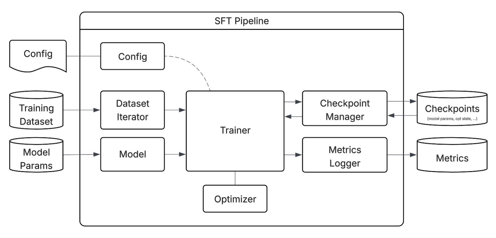

# Design Overview

This document provides an overview of Tunix (Tune-in-JAX), a JAX-native
framework for post-training large language models. It covers the overall layered
architecture and the training loop architectures for Supervised Fine-Tuning
(SFT), Reinforcement Learning (RL), and Agentic RL. Understanding this design
should help you better utilize and extend Tunix for model tuning.

## High Level Architecture

The diagram below illustrates the layered architecture of Tunix:

-   **User Interface & Application Layer**: This top layer provides the primary
    access points for users through CLI tools, interactive notebooks, and
    configuration files to define and manage tuning experiments. See
    [Launching Jobs](launching.md) for more details.
-   **Algorithm & Workflow Layer**: This layer houses the core training
    paradigms, including supervised fine-tuning, reinforcement learning, and
    agentic workflows, to support diverse model optimization strategies. See
    [Algorithms Supported](algorithms.md) for more details.
-   **Core Components Layer**: Responsible for the inner workings of the system,
    this layer handles training loop orchestration, metrics tracking, and the
    complex distributed state management required for large-scale runs.
-   **Foundation Frameworks & Integration Layer**: This layer integrates
    powerful underlying libraries like JAX, Flax, and Optax to provide
    high-performance computation, neural network primitives, and efficient
    gradient optimization.
-   **Hardware Layer**: The base of the stack manages the physical or virtual
    compute resources, specifically optimized for Google Cloud TPUs, multi-host
    GPU clusters, and CPU hosts.

## SFT

Supervised Fine-Tuning (SFT) is a fundamental technique in machine learning used
to adapt pre-trained models to specific downstream tasks by training them on a
labeled dataset. In Tunix, the SFT pipeline is designed to efficiently fine-tune
large language models (LLMs) using various datasets and optimization strategies,
leveraging the underlying JAX ecosystem.

The following diagram illustrates the Supervised Fine-Tuning (SFT) pipeline in
Tunix, showing the flow of data and control.

-   **Config**: Manages configurations for all pipeline components, such as
    dataset details (e.g., URL), model specifics (e.g., URL, tokenizer), trainer
    settings (e.g., max steps, hyperparameters), and checkpointing (e.g., save
    frequency). See [Config Explanation](launching.md#config-explanation) for
    more details.
-   **Dataset Iterator**: Manages the stream of data from the external Training
    Dataset, ensuring the model receives processed batches during the training
    process. Tunix supports various data sources like TFDS and Parquet, and also
    allows for the integration of custom datasets.
-   **Model**: Manages the initialized LLMs (e.g., nnx.Graph) loaded with
    weights from external Model Params, serving as the core entity being
    trained. Tunix supports a set of predefined models (e.g. gemma, llama, qwen)
    and also allows for the integration of new custom models. See
    [Models](models.md) for more details.
-   **Trainer**: Orchestrates the training steps by coordinating interactions
    between the model, data, and optimizer.
-   **Optimizer**: Applies optimization algorithms (e.g., AdamW) to update model
    parameters based on the calculated loss.
-   **Checkpoint Manager**: Handles periodic saving of model states to external
    storage for training recovery or model deployment. Tunix leverages the Orbax
    library for robust and efficient checkpoint management.
-   **Metrics Logger**: Captures performance data during training and exports it
    to external databases for monitoring and analysis. See [Metrics](metrics.md)
    for more details.

## RL

Reinforcement Learning (RL) is a paradigm where an agent learns to make
decisions by interacting with an environment to maximize a cumulative reward.
Tunix provides a framework for Reinforcement Learning, designed to support
various RL algorithms and optimization strategies, leveraging the underlying JAX
ecosystem.

The following diagram illustrates a typical Reinforcement Learning (RL) pipeline
in Tunix. The exact pipeline details can differ based on the specific RL
algorithm being used.

-   **RL Config**: Provides the central hyperparameters and algorithmic settings
    that initialize the entire pipeline and define the training objectives. See
    [Config Explanation](launching.md#config-explanation) for more details.
-   **Orchestrator**: Manages the global workflow, coordinating **Resource
    Control**, monitoring progress via the **Metrics Logger**, and directing the
    execution of the chosen RL algorithm (such as PPO or GRPO). See
    [Algorithms Supported](algorithms.md) for more details.
-   **Rollout Workers**: These workers generate sample trajectories from the
    current model using optimized runtimes like **vLLM** or **SGLang**. This
    ensures high-throughput data collection, crucial for efficient RL training.
    See [Rollout](rollout.md) for more details.
-   **Inference Workers**: These workers host inference models (e.g., critic,
    reference, and reward models in PPO) to evaluate collected samples. They
    compute rewards, reference log probabilities, and value estimates.
-   **Train Data Queue**: This in-memory buffer collects evaluated samples from
    the inference and rollout stages and streams them into the trainers.
-   **Trainers**: Performs weight updates for the **Actor** and **Critic**
    models. A subsequent **Weight Sync** pushes these updated parameters back to
    the Rollout Workers, ensuring they use the latest model for the next
    iteration.

The **Orchestrator** drives the overall RL training loop. Within each iteration,
**Rollout Workers** generate sample trajectories by interacting with the
environment. These trajectories are then passed to the **Inference Workers** for
evaluation, computing necessary values like rewards and log probabilities. The
evaluated samples are collected and used by the **Trainers** to update the Actor
and Critic models. Finally, a **Weight Sync** step propagates the updated model
parameters back to the Rollout Workers, preparing for the next iteration. This
entire process can be orchestrated in both synchronous and asynchronous manners
(e.g. async data loading, async rollout).

## Agentic RL

Agentic Reinforcement Learning in Tunix provides a framework for
training agents that can perform multi-turn reasoning and interact with external
tools. The design follows a standard RL paradigm where an **Agent** interacts
with an **Environment** over multiple steps to complete a task.

  

The core design supports agents that engage in **multi-turn conversations**,
breaking down complex problems into sequential steps of reasoning, tool
invocation, and response generation. Agents can leverage external **tools** (e.g.,
search, code execution, APIs) to gather information or perform actions; the
environment manages tool execution and feeds results back to the agent for
subsequent steps.

A key design focus is performance and scalability, achieved through a highly
**asynchronous architecture for both rollout and training**. The trajectory
collection pipeline is designed for high throughput, allowing many
agent-environment interactions to run concurrently. This design efficiently
overlaps model inference latency, I/O-bound tool execution, and reward
computations, maximizing hardware utilization (e.g., TPUs) and enabling
efficient online RL training.

The framework naturally supports **trajectory batching and grouping**, making it
compatible with various RL algorithms, including those like GRPO that require
multiple trajectory samples per prompt for robust learning.
