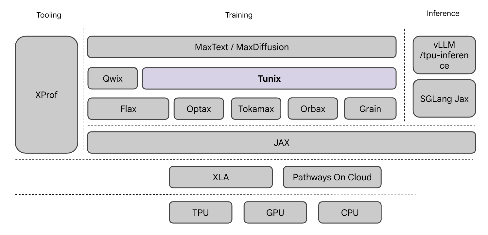

<!-- DO NOT REMOVE! Placeholder for TOC. -->

# Tunix: A Lightweight LLM Post-Training Library

**Tunix (Tune-in-JAX)** is a JAX based library designed to streamline the
post-training of Large Language Models. It provides efficient and scalable
support for:

- **SOTA Training performance on TPUs**
- **Supervised Fine-Tuning**
- **Reinforcement Learning (RL)**
- **Agentic RL**

Tunix leverages the power of JAX for accelerated computation and seamless
integration with JAX-based modeling frameworks like
[Flax NNX](https://flax.readthedocs.io/en/latest/nnx_basics.html), and
integrates with high-performance inference engines like vLLM and SGLang-JAX for
rollout.

**Current Status: V2 Release**

Tunix is under active development. Our team is actively working on expanding its
capabilities, usability and performance. Stay tuned for upcoming updates and new
features! See [Talks and Announcements](talks.md) for latest updates, talks, and blog posts.


## High Level Architecture

Tunix serves as a state-of-the-art post-training library within the JAX training
stack, positioned to leverage foundational tools like Flax, Optax, Orbax, etc.
for efficient model refinement. It sits as an intermediate layer between these
core utilities and optimized models like MaxText and MaxDiffusion, streamlining
tuning workflows on top of the XLA and JAX infrastructure.



See [Design Overview](design.md) for more details on the architecture.

## Key Features

-   **[Supervised Fine-Tuning (SFT)](algorithms.md)**:
    -   Full Weights Fine-Tuning
    -   [PEFT](performance.md#peft-with-lora) (Parameter-Efficient Fine-Tuning)
    -   [DPO](https://arxiv.org/abs/2305.18290) (Direct Preference Optimization)
        -   [ORPO](https://arxiv.org/abs/2403.07691) (Odds Ratio Preference
            Optimization)
-   **[Reinforcement Learning (RL)](algorithms.md)**:
    -   [PPO](https://arxiv.org/abs/1707.06347) (Proximal Policy Optimization)
    -   [GRPO](https://arxiv.org/abs/2402.03300) (Group Relative Policy
        Optimization)
        -   [GSPO-Token](https://arxiv.org/abs/2507.18071) (Token-level Group
            Sequence Policy Optimization)
        -   [DAPO](https://arxiv.org/abs/2503.14476) (Direct Alignment via
            Preference Optimization)
        -   [Dr.GRPO](https://arxiv.org/abs/2503.20783) (Distributionally Robust
            GRPO)
-   **[Agentic RL](agentic_rl.md)**:
    -   Multi-turn tool use
    -   Asynchronous rollout for high-throughput trajectory collection
    -   Trajectory batching and grouping

## Framework & Infra Highlights

-   **Modularity**:
    -   Components are designed to be reusable and composable
    -   Easy to customize and extend
-   **Performance & Efficiency**:
    -   Native [vLLM](rollout.md#vllm) and [SGLang-JAX](rollout.md#sglang) on
        TPU integration for performant rollout
    -   Native [MaxText](https://github.com/AI-Hypercomputer/maxtext) model
        integration for high performance kernels and model execution
    -   [Micro-batching](performance.md#batching-config) support for component
        level efficient execution
-   **Stability**
    -   Seamless multi-host distributed training with Pathways which can scale
        up to thousands of devices
    -   [Checkpointing and Fault Tolerance](reliability.md)

## Getting Started

**Installation:** Jump to [Installation](https://tunix.readthedocs.io/en/latest/quickstart.html#installation) to install Tunix and run your first training
job.

For TPU users integrating `vllm` and `tpu-inference`, there are two supported
setup paths:

- Docker image builds use [Dockerfile](https://github.com/google/tunix/blob/main/Dockerfile) and install
    the pinned dependencies directly from `requirements/requirements.txt` and
    `requirements/special_requirements.txt`.
- Local TPU VM or developer-machine installs can use
    [scripts/install_tunix_vllm_requirement.sh](https://github.com/google/tunix/blob/main/scripts/install_tunix_vllm_requirement.sh),
    which installs the same requirement files outside Docker.

These are separate entry points. If you are building the Docker image, you do
not need to run the install script inside the container build.

**Examples:** To get started, we have a number of detailed examples and tutorials. You can see [Quick Start](https://tunix.readthedocs.io/en/latest/quickstart.html) for a great set of starting examples and [Examples and Guides](https://tunix.readthedocs.io/en/latest/examples.html) for a comprehensive list of all the notebooks and examples we have.

## Supported Models

Tunix supports a growing list of models including Gemma, Llama, and Qwen families.
See [Models](models.md) for a full list and details on how to add new ones.

## Citing Tunix

```bibtex
@misc{tunix2025,
  title={Tunix (Tune-in-JAX)},
  author={Bao, Tianshu and Carpenter, Jeff and Chai, Lin and Gao, Haoyu and Jiang, Yangmu and Noghabi, Shadi and Sharma, Abheesht and Tan, Sizhi and Wang, Lance and Yan, Ann and Yu, Weiren and others},
  year={2025},
  howpublished={\url{https://github.com/google/tunix}},
}
```

## Acknowledgements

Thank you to all our wonderful contributors!

[](https://github.com/google/tunix/graphs/contributors)
