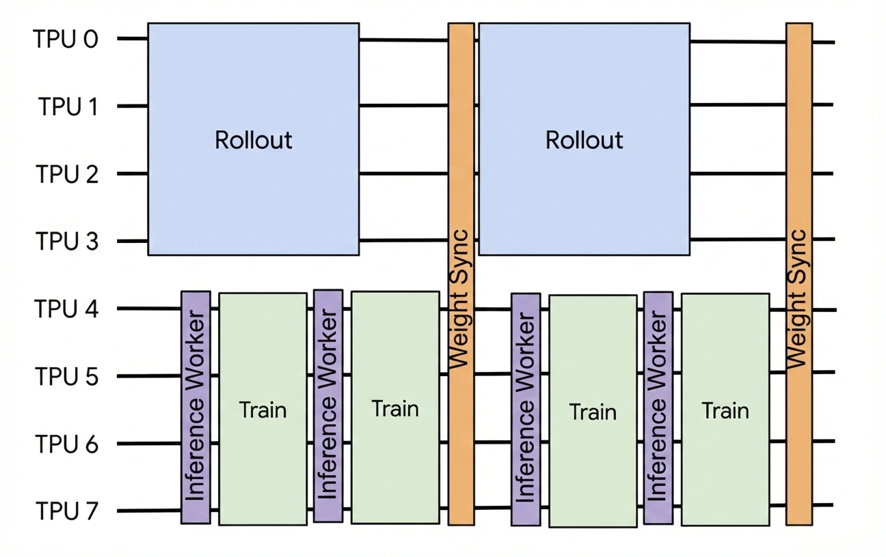

# Performance Considerations

This guide provides an overview of performance optimization techniques in Tunix
that help maximize hardware utilization, alleviate memory pressure or OOMs, and
increase training throughput.

## PEFT with LoRA

Tunix provides native support for LoRA (Low-Rank Adaptation), enabling parameter
efficient fine-tuning for LLMs. By injecting low-rank trainable matrices into
specific transformer layers, Tunix allows you to update the model’s parameters
without the massive HBM overhead of full-parameter training.

Key benefits:

*   Drastically reduces HBM overhead by training only a fraction of the total
    parameters, enabling large model training with constrained capacity.
*   Optimizes disk space by persisting only the lightweight LoRA parameters
    during checkpointing.
*   In RL workflows, it allows the Actor and Reference models to share a single
    frozen base model, effectively reducing the HBM footprint.
*   Enhances weight synchronization speed between the Actor and Rollout engines
    by transferring only the LoRA parameters instead of the full model
    parameters.
*   Tunix automatically handles LoRA layer detection and processing, ensuring a
    zero-config experience for the user.

You can apply LoRA/QLoRA to Tunix models using
[qwix](https://github.com/google/qwix) as shown below. If the base model is
sharded, then sharding strategy will be automatically propagated to LoRA layers.
Under the hood, Tunix will automatically detect if a model contains LoRA layers
and configures the training pipeline accordingly, requiring no manual
intervention from the user.

```python
import qwix

lora_provider = qwix.LoraProvider(
    module_path=".*q_einsum|.*kv_einsum|.*gate_proj|.*down_proj|.*up_proj",
    rank=16,
    alpha=2.0,
    weight_qtype="nf4",  # enable qlora, you can omit this if normal lora is preferred
)
lora_model = qwix.apply_lora_to_model(
  model, lora_provider, **model.get_model_input()
)

# rest code with Tunix is not changed

```

## Batching Config

Tunix supports three hierarchical levels of batch size configuration for RL
training: **global batch size**, **mini-batch size**, and **micro-batch size**.
Let's deep dive into each of them and understand their performance implications
and when to tune them.

### Global Batch Size

Global batch size represents the total amount of data processed in one full RL
iteration, which is the product of dataloader batch size and the number of
generations per prompt. For example, if your input batch contains 256 prompts
and number of generations is set to 4 (for algorithms like GRPO, DAPO, etc),
then the effective global batch size will be 1024. For algorithms that don't
require group generation (e.g. PPO), global batch size equals dataloader's batch
size. **Note**: you don't directly tune the global batch size in Tunix, but
instead this is derived from the dataloader batch size and
[num_generation](https://github.com/google/tunix/blob/04f17e0b842901c13339874a25db77ba920adbc5/tunix/rl/grpo/grpo_learner.py#L52-L55)
configurations.


### Mini Batch Size

[Mini batch size](https://github.com/google/tunix/blob/04f17e0b842901c13339874a25db77ba920adbc5/tunix/rl/rl_cluster.py#L102)
determines how frequently the model is updated within a global step (commonly
known as mini-batch gradient update), which is used to reduce memory pressure on
the trainer for a large global batch and stabilize training. For a global batch size
of 1024 and mini batch size of 256, the model will be updated 4 times in a
global step. **NOTE**: Global batch size needs to be divisible by mini batch
size; if not specified, mini batch size defaults to global batch size.


### Micro Batch Size

Micro batching is a practical solution to further reduce HBM pressure while
enabling efficient, component-specific computation. Within the RL training
pipeline, HBM requirements vary significantly across different stages, such as
rollout, inference, and training. For example, the trainer typically has a much
higher memory footprint than the inference worker (which only handles forward
passes) because it must maintain optimizer states, gradients, and activations in
HBM. This means the effective batch size for the trainer is typically smaller than
the inference worker.

Tunix allows per-component micro-batching to maximize throughput across
different stages:

1.  [rollout_micro_batch_size](https://github.com/google/tunix/blob/04f17e0b842901c13339874a25db77ba920adbc5/tunix/rl/rl_cluster.py#L104)
    controls the input batch size to rollout engine. **NOTE**: with the new
    agentic rollout, this is deprecated as the system automatically decomposes
    batches into individual prompts to leverage continuous batching.

2.  [compute_logps_micro_batch_size](https://github.com/google/tunix/blob/04f17e0b842901c13339874a25db77ba920adbc5/tunix/rl/rl_cluster.py#L105):
    Controls the batch size for the inference worker during log-probability
    calculation. Since this is forward-only, you can typically set this 2–4x
    higher than the trainer's micro-batch size.

3.  [train_micro_batch_size](https://github.com/google/tunix/blob/04f17e0b842901c13339874a25db77ba920adbc5/tunix/rl/rl_cluster.py#L103C3-L103C25):
    Controls the trainer's input batch size. Setting this automatically enables
    **gradient accumulation**, where the number of accumulation steps is
    calculated as `mini_batch_size / train_micro_batch_size`. This value is
    usually determined by your model size, sharding strategy, and available HBM.

### Tuning Tips

After determining your global batch size and mini batch size based on your
algorithm and training targets, follow these steps to optimize your hardware
utilization:

1.  Based on the actor model's size, sharding strategy, and HBM capacity, decide
    the effective `train_micro_batch_size`. Follow
    [this guide](https://jax-ml.github.io/scaling-book/training/) for detailed
    effective batch size estimation.

2.  Set `compute_logps_micro_batch_size` to be 2x the size of
    `train_micro_batch_size`. You can also try bumping it up to 4x for higher
    throughput, but if you encounter OOM issues, lower it back to 2x.

3.  Generally, you can set `rollout_micro_batch_size` to the same value as
    `compute_logps_micro_batch_size` (you can try to push it higher as well). If
    you are using the new agentic rollout, then you can omit this configuration.

## Collocated vs Disaggregated Training

Tunix provides two fundamental mechanisms for executing RL workflows: Collocated
and Disaggregated execution. Choose between them based on your available
resources and training requirements.

### Collocated Execution

In collocated mode, the entire TPU cluster is shared by all components (rollout,
inference, and trainer) throughout the workflow.


This setup is ideal for resource-constrained scenarios where the
model must be sharded across every available chip to fit into memory. In
collocated mode, each component will be executed in sequential order, which
means the cluster will finish rollout generation before shifting to inference
and training. To further maximize the hardware utility, you can consider enabling
[host_offloading](https://github.com/google/tunix/blob/main/rl/rl_cluster.py?q=offload_to_cpu) with `offload_to_cpu`, which saves HBM by moving
non-active models to CPU RAM when a
different component is occupying the TPU.

Enabling collocated mode is straightforward; you simply provide the same mesh to
every component when configuring the `role_to_mesh` mapping for your `rl_cluster`.

```python
import numpy as np
import jax
from jax.sharding import Mesh
from tunix.rl.rl_cluster import ClusterConfig, Role

devices = jax.devices()
devices_mesh = np.array(devices).reshape(len(devices), 1)
mesh = Mesh(devices_mesh, axis_names=('fsdp', 'tp'))

ClusterConfig(
  role_to_mesh={
      Role.ACTOR: mesh,
      Role.REFERENCE: mesh,
      Role.ROLLOUT: mesh,
  },
  ...
)
```

### Disaggregated Execution

Disaggregated mode partitions the TPU cluster into distinct "sub-meshes",
assigning dedicated hardware resources to specific components.



In the disaggregated setup, the rollout, inference worker, and trainer can execute
concurrently. This mode unlocks advanced performance optimization techniques. For example,
the inference worker and trainer can begin executing in parallel with the
rollout engine as soon as the first [mini-batch](performance.md#mini-batch-size) or [micro-batch](performance.md#micro-batch-size) of data is
produced. This is the preferred mode for large-scale runs where maximizing
global throughput is more critical.

To enable disaggregated mode, simply assign distinct meshes to each component
when defining the role_to_mesh mapping in your rl_cluster configuration.

```python
import numpy as np
import jax
from jax.sharding import Mesh
from tunix.rl.rl_cluster import ClusterConfig, Role

devices = jax.devices()
split = int(len(devices) / 2)
rollout_devices = np.array(devices[:split]).reshape(split, 1)
train_devices = np.array(devices[split:]).reshape(split, 1)
rollout_mesh = Mesh(rollout_devices, axis_names=('fsdp', 'tp'))
train_mesh = Mesh(train_devices, axis_names=('fsdp', 'tp'))

ClusterConfig(
  role_to_mesh={
      Role.ACTOR: train_mesh,
      Role.REFERENCE: train_mesh,
      Role.ROLLOUT: rollout_mesh,
  },
  ...
)
```

## Weight transfer/sync

Weight transfer and sync is critical to keeping rollout models up-to-date with
the policy model. This process is controlled by RLCluster regardless of which
rollout engine is used (vanilla, vllm, or sglang-jax), and requires no user
intervention.

Rollout models often have different mesh or sharding specifications than policy
models, meaning that when syncing weights, resharding is required to place the
new weights onto the right devices with the right shards. Efficient weight sync
improves end-to-end performance and reduces HBM and host memory capacity
requirements.

The Tunix resharding algorithm eliminates expensive all-gather collective operations
between different meshes when needed. It resolves the OOM issue where all-gather
replicates the model weights to each TPU device. Please see
[this section](https://github.com/google/tunix/blob/main/rl/reshard.py;l=70-93)
for more details.

The following diagram illustrates how the Tunix resharding algorithm avoids OOM caused by
all-gather ops.


