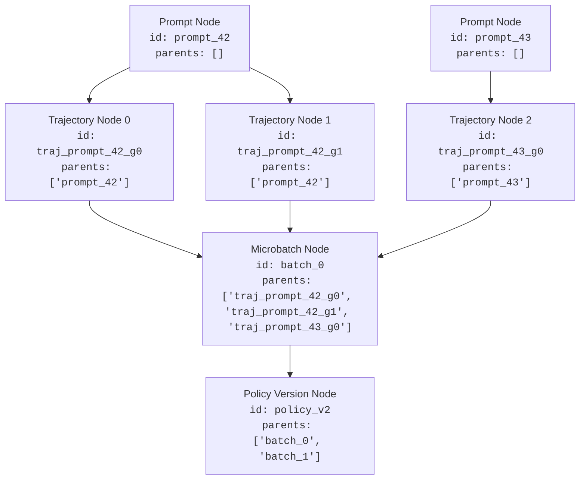
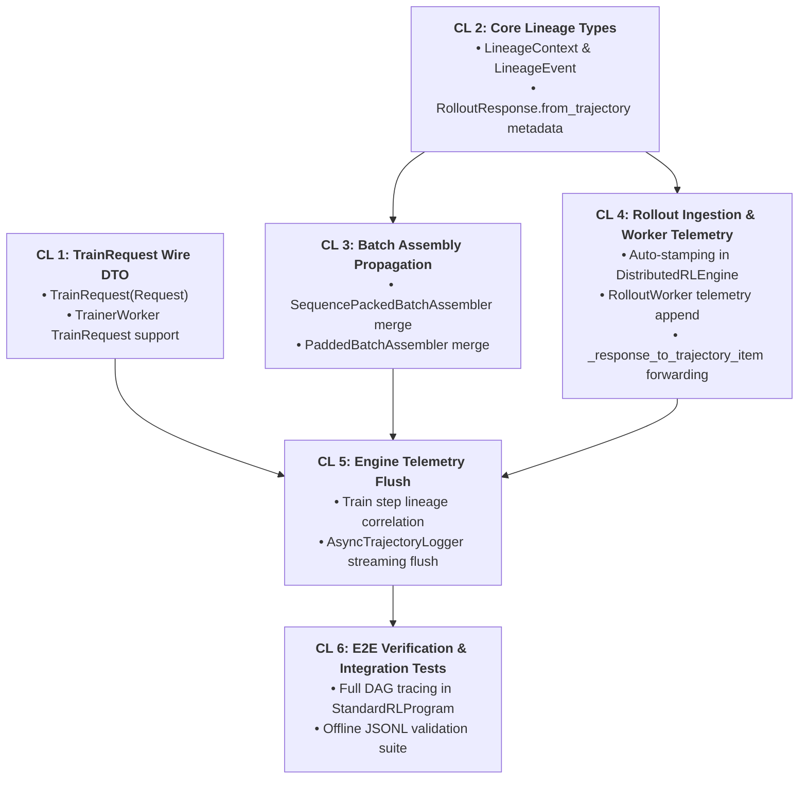

# Tunix Distributed RL Lineage Tracking System Design

This document details the design of a lineage tracking system for the Tunix distributed RL workflow (`Orchestrator V2`). The system tracks the flow of data (prompts -> trajectories -> scored payloads -> training batches -> model versions) across process boundaries (Orchestrator <-> Workers) and provides explicit injection points for metadata tracing.

## 1. System Architecture & Core Principles

RL environments form complex Directed Acyclic Graphs (DAGs) of data:
- **1-to-N**: 1 Prompt $\rightarrow$ N Generated Rollouts
- **1-to-1**: 1 Rollout $\rightarrow$ 1 Scored Trajectory (Critique)
- **N-to-1**: M Scored Trajectories $\rightarrow$ 1 Packed Batched Payload
- **M-to-1**: K Batches $\rightarrow$ 1 Model Policy Version

Standard linear tracing (like OpenTelemetry) falls short for aggregating batch lineages. Therefore, we introduce a `LineageContext` that travels within the `metadata` of our Data Transfer Objects (DTOs), capturing a tree of lineage events.

### Core Architectural Principles

1. **Zero-Involvement for `RLProgram`:**
   The `RLProgram` layer (e.g. `StandardRLProgram`, custom user loops) focuses purely on the mathematical and control-flow aspects of the RL algorithm. **The `RLProgram` contains no lineage instantiation, propagation, or event logging code.**
2. **Pure Mathematical Payloads (`RLTrainerPayload` / `TrainExample`):**
   Tensor payloads passed into JAX kernels contain strictly numerical arrays (`token_ids`, `loss_mask`, `advantages`). They contain no strings, dictionary trees, or lineage objects.
3. **Wire Request Wrapping (`TrainRequest`):**
   `DistributedRLEngine` wraps the pure tensor payload in a `TrainRequest(Request)`, carrying `LineageContext` across the gRPC wire. The `TrainerWorker` strips the pure payload for JAX and echoes lineage inside the standard `datatypes.Response`.

```
+-------------------------------------------------------------------------------+
|                             RLProgram (User Loop)                             |
|  - Calls engine.dispatch_rollouts(prompts)                                    |
|  - Calls assembler.pack(scored_items)                                         |
|  - Calls engine.train_step(batch)                                             |
|  * ZERO Lineage Boilerplate *                                                 |
+-------------------------------------------------------------------------------+
                                     |
                                     v
+-------------------------------------------------------------------------------+
|                     Infrastructure & Middleware Layers                        |
|                                                                               |
|  1. DistributedRLEngine (Ingestion & Dispatch)                                |
|     --> Auto-stamps LineageContext(tracking_id, parent_ids=[prompt_id])       |
|     --> Wraps in RolloutRequest(Request)                                      |
|                                                                               |
|  2. RolloutWorker                                                             |
|     --> Appends worker generation metrics to RolloutResponse.metadata          |
|                                                                               |
|  3. BatchAssembler (Universal Packing)                                        |
|     --> Merges item lineages: LineageContext.merge(...)                       |
|     --> Produces pure tensor RLTrainerPayload + batch LineageContext          |
|                                                                               |
|  4. DistributedRLEngine (Training & Telemetry)                                 |
|     --> Wraps payload in TrainRequest(payload=batch, metadata={"lineage": ...})|
|     --> TrainerWorker executes JAX and returns generic datatypes.Response     |
|     --> Engine flushes completed lineage to AsyncTrajectoryLogger             |
+-------------------------------------------------------------------------------+
```

### The `LineageContext` Datastructure (Native Tracking ID Approach)

Instead of generating random UUIDs per event, we rely on native Orchestrator tracking IDs (e.g., `prompt_id`, `traj_id`, or `batch_id`). This natively maps to flat JSONL records and relational logs by ensuring node IDs correspond directly to domain objects, preventing ID explosion and keeping keys human-interpretable.

```python
import dataclasses
import time
from typing import Any

@dataclasses.dataclass
class LineageEvent:
    component: str               # e.g., "engine.dispatch", "worker.rollout", "worker.trainer"
    operation: str               # e.g., "dispatch", "generate", "critique", "pack", "train_step"
    timestamp_s: float
    attributes: dict[str, Any]   # Custom metadata (worker_id, latency, metrics, etc.)

@dataclasses.dataclass
class LineageContext:
    tracking_id: str             # Native orchestrator ID (e.g. traj_prompt_1_gen_0, batch_0)
    parent_tracking_ids: list[str] = dataclasses.field(default_factory=list)
    events: list[LineageEvent] = dataclasses.field(default_factory=list)

    def add_event(self, component: str, operation: str, attributes: dict[str, Any] = None):
        event = LineageEvent(
            component=component,
            operation=operation,
            timestamp_s=time.time(),
            attributes=attributes or {}
        )
        self.events.append(event)
        return event

    @classmethod
    def merge(cls, batch_id: str, contexts: list["LineageContext"], component: str, operation: str, attributes: dict[str, Any] = None) -> "LineageContext":
        """Used by Batch Assemblers to merge N trajectories into a single parent batch lineage."""
        parent_ids = [ctx.tracking_id for ctx in contexts if ctx is not None]
        
        new_ctx = cls(tracking_id=batch_id, parent_tracking_ids=parent_ids)
        new_ctx.add_event(component, operation, attributes)
        return new_ctx
```

## 2. Cross-Boundary Data Flow & Engine-Driven Injection

Data crosses boundaries using `cloudpickle` over gRPC in `remote_execution.py`. All RPC interactions use typed `Request` envelopes carrying `metadata["lineage"]` and generic `Response` returns.

### Stage 1: Auto-Stamping on Dispatch
**Component:** `DistributedRLEngine.dispatch_rollouts`

The program passes raw prompt dictionaries or objects. The Engine automatically extracts `prompt_id`, expands groups, instantiates `LineageContext`, and attaches it to `RolloutRequest.metadata["lineage"]`.

```python
# Inside DistributedRLEngine.dispatch_rollouts
for idx, p in enumerate(prompts):
    prompt_id = str(getattr(p, "prompt_id", p.get("prompt_id", idx)))
    
    for g_idx in range(group_size):
        traj_id = f"traj_{prompt_id}_{g_idx}"
        
        # Engine automatically creates and stamps LineageContext
        lineage = LineageContext(
            tracking_id=traj_id,
            parent_tracking_ids=[prompt_id]
        )
        lineage.add_event(
            component="engine.dispatch",
            operation="rollout",
            attributes={"policy_version": version, "group_index": g_idx}
        )
        
        request_metadata = dict(base_metadata)
        request_metadata["lineage"] = lineage
        
        rollout_reqs.append(
            datatypes.RolloutRequest(
                request_id=f"req_{prompt_id}_{g_idx}_v{version}",
                prompt=raw_prompt,
                prompt_id=prompt_id,
                group_offset_id=str(g_idx),
                target_policy_version=version,
                metadata=request_metadata,
            )
        )

await self.dispatch_rollout_requests(rollout_reqs)
```

### Stage 2: Generation Telemetry
**Component:** `RolloutWorker`

The Rollout Worker extracts `lineage` from the incoming request, generates tokens, and appends worker telemetry before returning `RolloutResponse`.

```python
# Inside RolloutWorker.generate
lineage = request.metadata.get("lineage")
if lineage is not None:
    lineage.add_event(
        component="worker.rollout",
        operation="generate",
        attributes={
            "worker_id": self.worker_id,
            "generated_tokens": len(trajectory.steps),
            "latency_ms": generation_latency_ms
        }
    )

response = RolloutResponse.from_trajectory(...)
response.metadata["lineage"] = lineage
```

### Stage 3: Polling & Critique Propagation
**Component:** `DistributedRLEngine.poll_rollouts` & `AlgorithmAdapter`

When the Engine receives worker responses, `_response_to_trajectory_item` forwards `resp.metadata["lineage"]` to `TrajectoryItem.metadata["lineage"]`. During scoring, `AlgorithmAdapter.create_trainer_payloads` passes the lineage context forward into `RLTrainerPayload.metadata["lineage"]`.

```python
# Inside DistributedRLEngine._response_to_trajectory_item
metadata = dict(resp.metadata) if resp.metadata else {}
item = datatypes.TrajectoryItem(
    pair_index=metadata.get("pair_index", 0),
    group_id=metadata.get("group_id", resp.prompt_id),
    traj=traj,
    metadata=metadata,  # Preserves metadata["lineage"]
    ...
)
```

### Stage 4: Batch Assembly (N $\rightarrow$ 1 Merging)
**Component:** `BatchAssembler.pack()`

When padding/packing multiple `RLTrainerPayload`s into a single microbatch matrix, the Assembler merges their lineages without any intervention from the training program.

```python
class SequencePackedBatchAssembler:
    def pack(self, items: list[RLTrainerPayload]) -> list[RLTrainerPayload]:
        # ... bin-packing algorithm ...
        
        for b_idx, b_items in enumerate(bins):
            # Create packed payload tensors ...
            
            # Merge input lineages
            lineages = [it.metadata.get("lineage") for it in b_items if it.metadata]
            batch_tracking_id = f"batch_{b_idx}"
            
            merged_lineage = LineageContext.merge(
                batch_id=batch_tracking_id,
                contexts=lineages,
                component="orchestrator.assembler",
                operation="pack",
                attributes={"bin_size": len(b_items), "packed_len": self.max_packed_len}
            )
            
            payload = RLTrainerPayload(..., metadata={"lineage": merged_lineage})
            payloads.append(payload)
```

### Stage 5: Training Execution via `TrainRequest` & Generic `Response`
**Component:** `DistributedRLEngine.train_step` & `TrainerWorker.fwd_bwd`

The `RLProgram` simply calls `await engine.train_step(batch)`. 

1. **`DistributedRLEngine`** wraps the tensor payload and its lineage into a `TrainRequest(Request)`:
```python
# Inside DistributedRLEngine.train_step
async def train_step(
    self,
    payload: datatypes.RLTrainerPayload,
    role: datatypes.Role = datatypes.Role.ACTOR,
    accumulate_gradients: bool = False,
    apply_optimizer: bool = True,
    **kwargs: Any,
) -> Any:
    lineage = payload.metadata.get("lineage")
    
    # 1. Wrap pure payload and lineage into wire TrainRequest
    request = datatypes.TrainRequest(
        request_id=f"train_{lineage.tracking_id if lineage else 0}",
        payload=payload,
        accumulate_gradients=accumulate_gradients,
        apply_optimizer=apply_optimizer,
        metadata={"lineage": lineage},
    )

    # 2. Invoke remote TrainerWorker (returns generic datatypes.Response)
    resp: datatypes.Response = await self._invoke_worker(
        worker, "fwd_bwd", request=request, **kwargs
    )

    # 3. Flush updated lineage to AsyncTrajectoryLogger
    resp_lineage = resp.metadata.get("lineage")
    if resp_lineage and self._trajectory_logger:
        self._trajectory_logger.log_item_async(dataclasses.asdict(resp_lineage))

    return resp.metadata.get("metrics")
```

2. **`TrainerWorker`** extracts the pure payload for JAX (zero PyTree strings) and returns the standard `datatypes.Response`:
```python
# Inside TrainerWorker.fwd_bwd (CPU Host)
def fwd_bwd(self, request: datatypes.TrainRequest) -> datatypes.Response:
    # 1. Pure tensor payload passed to JAX (zero string metadata in JIT)
    self._trainer.fwd_bwd(request.payload)
    metrics = {"loss": 0.342}  # Captured from trainer

    # 2. Append worker execution event on CPU
    lineage: LineageContext = request.metadata.get("lineage")
    if lineage is not None:
        lineage.add_event(
            component="worker.trainer",
            operation="fwd_bwd",
            attributes={"loss": metrics["loss"], "worker_id": self.worker_id}
        )

    # 3. Return standard generic datatypes.Response
    return datatypes.Response(
        request_id=request.request_id,
        metadata={"metrics": metrics, "lineage": lineage}
    )
```

---

## 3. How `parent_tracking_ids` Works

`parent_tracking_ids` represents the **directed causal edges** in the lineage DAG. Instead of embedding entire recursive data structures inside downstream objects, each entity acts as a standalone node identified by its `tracking_id`, pointing to its direct upstream inputs via string foreign keys.



### Transformation Progression

1. **Root Prompts ($0 \to 1$):**
   * `tracking_id = "prompt_42"`
   * `parent_tracking_ids = []` (Root node, originating from dataset).
2. **Rollout Trajectories ($1 \to N$ Fan-Out):**
   * A prompt expands into $N$ rollout attempts (e.g. GRPO group size $G=4$).
   * `tracking_id = "traj_prompt_42_g0"`, `parent_tracking_ids = ["prompt_42"]`.
   * `tracking_id = "traj_prompt_42_g1"`, `parent_tracking_ids = ["prompt_42"]`.
3. **Critique & Scored Payloads ($1 \to 1$ Enrichment):**
   * Reward scoring appends an event to the existing trajectory context in-place, maintaining the parent reference.
4. **Batch Assembly ($N \to 1$ Fan-In):**
   * Multiple trajectories from various prompts are packed/padded into a single microbatch tensor.
   * `LineageContext.merge()` constructs a new batch node:
     `batch.parent_tracking_ids = ["traj_prompt_42_g0", "traj_prompt_42_g1", "traj_prompt_43_g0", ...]`.
5. **Model Checkpoint / Policy Version ($M \to 1$ Step Aggregation):**
   * An optimizer update runs across $M$ microbatches to produce a new policy version checkpoint.
   * `policy_lineage.parent_tracking_ids = ["batch_0", "batch_1"]`.

---

## 4. Storage Lifecycle: Zero In-Memory Registries

A critical architectural requirement is preventing memory explosion in the Orchestrator while maintaining full end-to-end provenance.

### The Streaming Write-Ahead Pattern (Strictly Ephemeral RAM)

The Orchestrator does **NOT** maintain a registry or in-memory dictionary of past lineages. Because lineage travels in-band with DTOs, contexts live only as local variables during in-flight operations and are freed immediately after logging.

```
                       [ ORCHESTRATOR RAM ]                     [ ASYNC TRAJECTORY LOGGER ]
                     (Strictly Ephemeral O(1))                   (log_dir/lineage.jsonl)
                     
[Stage 1: Rollout]    Holds current in-flight trajectories ───►  Writes: {"id": "traj_0", "parents": ["prompt_1"]}
                               │
                               ▼
[Stage 2: Batching]   Holds current microbatches          ───►  Writes: {"id": "batch_0", "parents": ["traj_0", ...]}
                               │
                               ▼
[Stage 3: Step End]   Computes step metrics & updates     ───►  Writes: {"id": "policy_v2", "parents": ["batch_0", ...]}
                               │
                               ▼
                      GARBAGE COLLECTION
               (Drops all objects from RAM immediately)
```

### Storage Layers Breakdown

1. **In-Flight Orchestrator Memory (Ephemeral RAM):**
   * The Orchestrator only holds lineage contexts for actively executing microbatches within the current training step ($O(\text{mini\_batch\_size})$ memory).
   * Once a global step finishes, the Orchestrator emits the lineage records to the trajectory logger and **immediately drops the local references** (`del microbatches`).
2. **Persistent Trajectory Logger (`log_dir/lineage.jsonl`):**
   * Tunix's `AsyncTrajectoryLogger` appends flat, independent JSON lines to disk/CNS. No nested structures are stored on disk.
   
   | Entity Type | `tracking_id` (Key) | `parent_tracking_ids` (Pointers) | Attributes & Metrics |
   | :--- | :--- | :--- | :--- |
   | **Prompt** | `prompt_42` | `[]` | `{"text": "Solve 2+2", "task": "gsm8k"}` |
   | **Trajectory** | `traj_prompt_42_g0` | `["prompt_42"]` | `{"reward": 1.0, "latency_ms": 42}` |
   | **Microbatch** | `batch_0` | `["traj_prompt_42_g0", ...]` | `{"bin_size": 16, "packed_len": 8192}` |
   | **Policy Version** | `policy_v2` | `["batch_0", ...]` | `{"global_step": 1, "loss": 0.342}` |

3. **Orbax Model Checkpoint Manifests:**
   * When saving a model checkpoint to disk/CNS (`/checkpoints/step_00001/`), Orbax writes a companion `lineage_manifest.json`:
     ```json
     {
       "checkpoint_step": 1,
       "policy_version": 2,
       "lineage_id": "policy_v2",
       "parent_batch_ids": ["batch_0", "batch_1"]
     }
     ```

---

## 5. Offline Analysis & Dataframe Ingestion

Because lineage is stored as flat append-only JSONL files with parent pointers, analyzing the data lineage DAG offline is simple using standard Python data tools (e.g. Pandas, Polars, DuckDB):

```python
import pandas as pd

# Load flat lineage logs
df = pd.read_json("log_dir/lineage.jsonl", lines=True)

# 1. Find all trajectories that contributed to a specific batch
batch_row = df[df["tracking_id"] == "batch_0"].iloc[0]
parent_traj_ids = batch_row["parent_tracking_ids"]
trajectories_df = df[df["tracking_id"].isin(parent_traj_ids)]

# 2. Trace root cause for high-loss batches
high_loss_batches = df[df["events"].apply(lambda evts: any(e.get("attributes", {}).get("loss", 0) > 2.0 for e in evts))]
```

---

## 6. Recommended Code Modifications

To implement this in Tunix with zero `RLProgram` pollution, the following non-intrusive patches are recommended:

1. **Add `TrainRequest` to `datatypes.py`**:
   Standardize wire training requests alongside `RolloutRequest`, `ScoreRequest`, and `LogprobsRequest`:
   ```python
   @dataclasses.dataclass(kw_only=True)
   class TrainRequest(Request):
       payload: datatypes.TrainerPayload | Any
       accumulate_gradients: bool = True
       apply_optimizer: bool = False
       target_policy_version: int = 0
   ```

2. **Update `datatypes.RolloutResponse.from_trajectory`**:
   Propagate `metadata` from the originating request and trajectory to the final wire response.

3. **Update `batch_assembly.py`**:
   Add automatic `LineageContext.merge()` inside both `SequencePackedBatchAssembler.pack()` and `PaddedBatchAssembler.pack()`.

4. **Update `distributed_rl_engine.py` & `trainer_worker.py`**:
   * Wrap training batches in `TrainRequest` inside `engine.train_step()`.
   * Unpack `request.payload` for `PeftTrainer` and return standard `datatypes.Response(metadata={"metrics": ..., "lineage": ...})`.

---

## 7. Additional Designs & Follow-Up Extensions

The core V3 architecture prioritizes simplicity and native domain IDs. The following designs can be layered on as follow-up capabilities:

### 7.1. Global UUID Layer for Multi-Run & SFT Dataset Flywheels
* **Problem:** In multi-run experiments, cross-cluster training, or when aggregating rollouts from thousands of jobs into shared offline SFT datasets, native IDs like `prompt_0` or `traj_prompt_0_g0` can collide across runs.
* **Follow-up Solution:** Introduce an optional global UUID or session prefix generator (e.g. `uuid = f"{run_id}_{task}_{prompt_id}_p{prompt_idx}_g{group_idx}"`) at export/sink time without cluttering inner-loop code with random UUID generation.

### 7.2. Multi-Turn Turn-Level Policy Versioning
* **Problem:** In multi-turn agentic environments with dynamic tool interactions, different turns in the same trajectory may be sampled under different policy weight versions.
* **Follow-up Solution:** Expand `LineageContext` to track `policy_versions: list[int]` per turn. This allows downstream loss functions to compute exact turn-by-turn policy lag ($\Delta V_k = V_{\text{current}} - V_{\text{turn\_k}}$) for off-policy importance sampling corrections.

### 7.3. Retry & Preemption Provenance
* **Problem:** When rollout workers time out or get preempted, re-dispatching under the same ID could overwrite failure diagnostics.
* **Follow-up Solution:** Attach an `attempt_idx` counter to the `tracking_id` (e.g. `traj_prompt_0_g0_a1`) on re-dispatch, allowing failed and succeeded attempts to coexist in the DAG.

---

## 8. Implementation Plan

This section details the phased, 6-CL implementation roadmap to incrementally build and verify Lineage Tracking V3 without regressions.



### **CL 1: `TrainRequest` DTO & Wire Protocol Standardization**
* **Files to Touch:**
  * `third_party/py/tunix/experimental/common/datatypes.py`
  * `third_party/py/tunix/experimental/common/datatypes_test.py`
  * `third_party/py/tunix/experimental/worker/trainer_worker.py`
  * `third_party/py/tunix/experimental/worker/trainer_worker_test.py`
  * `third_party/py/tunix/experimental/orchestrator/distributed_rl_engine.py`
* **Changes:**
  1. Define `TrainRequest(Request)` in `datatypes.py` wrapping `payload: RLTrainerPayload | Any`, `accumulate_gradients`, `apply_optimizer`, and `target_policy_version`.
  2. Update `TrainerWorker.fwd_bwd()` to accept `TrainRequest` (with fallback for raw `TrainerPayload`).
  3. Extract `request.payload` for `PeftTrainer` and return standard generic `datatypes.Response`.
  4. Update `DistributedRLEngine.train_step()` to dispatch `TrainRequest`.
* **Verification:** Unit tests in `datatypes_test.py` and `trainer_worker_test.py`.

### **CL 2: Core Lineage Types & Propagation Support**
* **Files to Touch:**
  * `third_party/py/tunix/experimental/common/lineage.py` (New module)
  * `third_party/py/tunix/experimental/common/lineage_test.py` (New test suite)
  * `third_party/py/tunix/experimental/common/datatypes.py`
  * `third_party/py/tunix/experimental/common/datatypes_test.py`
  * `third_party/py/tunix/experimental/common/BUILD`
* **Changes:**
  1. Define `LineageEvent` (`component`, `operation`, `timestamp_s`, `attributes`).
  2. Define `LineageContext` (`tracking_id`, `parent_tracking_ids`, `events`) with `.add_event()` and `.merge()`.
  3. Update `RolloutResponse.from_trajectory()` in `datatypes.py` to accept and preserve optional `metadata: dict[str, Any]`.
* **Verification:** Unit tests for `LineageContext.merge()` and `RolloutResponse(metadata=...)`.

### **CL 3: Universal Batch Assembler Lineage Propagation**
* **Files to Touch:**
  * `third_party/py/tunix/experimental/orchestrator/batch_assembly.py`
  * `third_party/py/tunix/experimental/orchestrator/batch_assembly_test.py`
* **Changes:**
  1. In `SequencePackedBatchAssembler.pack()`:
     * Extract `metadata.get("lineage")` from each input `RLTrainerPayload`.
     * Call `LineageContext.merge(batch_id=f"batch_{b_idx}", contexts=lineages, ...)`.
     * Attach the merged `LineageContext` to the output packed payload `metadata["lineage"]`.
  2. In `PaddedBatchAssembler.pack()` / `GRPOTrainExampleAssembler.pack()`: Apply equivalent metadata aggregation logic.
* **Verification:** Unit tests asserting $N \to 1$ `parent_tracking_ids` aggregation in `batch_assembly_test.py`.

### **CL 4: Rollout Ingestion, Auto-Stamping & Worker Telemetry**
* **Files to Touch:**
  * `third_party/py/tunix/experimental/orchestrator/distributed_rl_engine.py`
  * `third_party/py/tunix/experimental/worker/rollout_worker.py`
  * `third_party/py/tunix/experimental/orchestrator/distributed_rl_engine_test.py`
* **Changes:**
  1. In `DistributedRLEngine.dispatch_rollouts()`: Auto-instantiate `LineageContext(tracking_id=f"traj_{prompt_id}_{g_idx}", parent_tracking_ids=[prompt_id])` and stamp onto `RolloutRequest.metadata["lineage"]`.
  2. In `RolloutWorker.generate()`: Extract `request.metadata["lineage"]`, append generation telemetry event, and echo in `RolloutResponse`.
  3. In `_response_to_trajectory_item()`: Forward `resp.metadata["lineage"]` into `TrajectoryItem.metadata["lineage"]`.
* **Verification:** Mock worker tests in `distributed_rl_engine_test.py`.

### **CL 5: Training Step Lineage Correlation & Telemetry Sink Flush**
* **Files to Touch:**
  * `third_party/py/tunix/experimental/orchestrator/distributed_rl_engine.py`
  * `third_party/py/tunix/experimental/orchestrator/distributed_rl_engine_test.py`
* **Changes:**
  1. In `DistributedRLEngine.train_step()`: Wrap payload in `TrainRequest(metadata={"lineage": lineage})`, receive `Response`, append `engine.train` event with step metrics, and flush to `self._trajectory_logger.log_item_async()`.
* **Verification:** Mock logger assertions in `distributed_rl_engine_test.py`.

### **CL 6: End-to-End Orchestrator Verification & Integration Tests**
* **Files to Touch:**
  * `third_party/py/tunix/experimental/orchestrator/rl_program_test.py`
  * `third_party/py/tunix/experimental/orchestrator/orchestrator_test.py`
* **Changes:**
  1. Multi-step integration test running `StandardRLProgram` asserting complete DAG connectivity in `lineage.jsonl`:
     $$\text{Prompt} \xrightarrow{\text{parents}} \text{Trajectories} \xrightarrow{\text{parents}} \text{Batch} \xrightarrow{\text{parents}} \text{Policy}$$
  2. Assert `RLProgram` remains 100% clean of lineage boilerplate.
* **Verification:** Full test suite execution across all orchestrator and worker packages.

