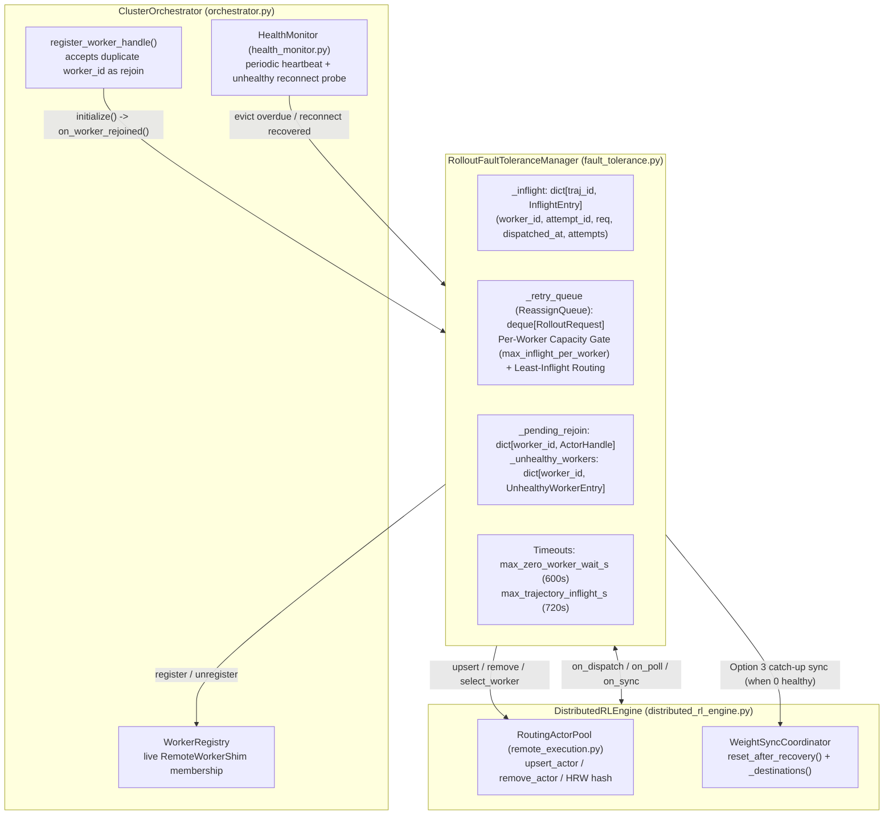
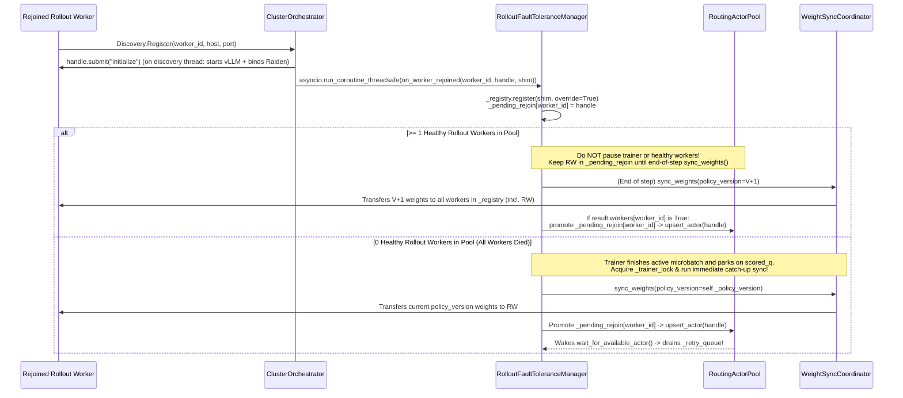

# Tunix Distributed RL: Rollout Worker Fault Tolerance & Dynamic Rejoin Specification

<!-- disableFinding(LINE_OVER_80) -->
<!-- disableFinding(LIST_NO_LINE) -->
<!-- disableFinding(LINK_RELATIVE_G3DOC) -->

> [!NOTE]
> This document specifies the **Rollout Worker Fault Tolerance & Dynamic Rejoin** architecture for `tunix/experimental`. It addresses two production reliability blockers in disaggregated RL training:
> 1. **Dynamic Worker Rejoin**: Allowing a crashed and restarted rollout worker (or a worker recovering from a transient network partition) to re-register, synchronize weights without stalling healthy workers or corrupting mid-step trainer state, and rejoin active rollout serving.
> 2. **In-Flight Trajectory Recovery (`ReassignQueue`)**: Tracking all in-flight `RolloutRequest`s at the orchestrator and automatically re-dispatching orphaned or timed-out trajectories across healthy rollout workers with per-worker capacity gating (`max_inflight_per_worker`), or parking them (up to `max_zero_worker_wait_s`) until a worker rejoins.

---

## 1. Executive Summary & Root Cause Analysis

In distributed RL runs on GKE and Cloud TPU VMs (`ClusterOrchestrator` + `StandardRLProgram` + `DistributedRLEngine`), rollout workers run long-lived multi-turn agentic or vLLM generation episodes while the trainer streams microbatches and periodically broadcasts updated policy weights via `WeightSyncCoordinator` (Raiden / gRPC). Today, a single rollout worker failure requires terminating and restarting the entire job due to two coupled gaps.

### 1.1 Issue 1: Why a Restarted Rollout Worker Cannot Rejoin Today

1. **Startup Sequence in `run_rollout_node.py:914-931` (`tunix/experimental/examples/common/run_rollout_node.py`)**:
   When a rollout worker pod starts (or is restarted by GKE `restartPolicy: OnFailure` with the same pod hostname and `--worker_id`), it brings up its local `GrpcRemoteExecutionServer`, starts the sampler (`sampler.start()`), binds its Raiden transport (`bind_weight_sync()`), and calls `context.ipc.discovery.register(...)`.
2. **Hard Rejection on Duplicate `worker_id` in `orchestrator.py:179-183` (`tunix/experimental/orchestrator/orchestrator.py`)**:
   `DiscoveryServer.Register` (`discovery.py:60-64` (`tunix/experimental/distributed/runtime/discovery/discovery.py`)) invokes `ClusterOrchestrator.register_worker_from_hostname()`, which calls `register_worker_handle()`. Line 179 checks:
   ```python
   if (
       worker_id in self._remote_worker_infos
       or worker_id in self.registry.worker_ids()
   ):
     raise ValueError(f"duplicate worker_id: {worker_id!r}")
   ```
   Because `DiscoveryServer.Register` does not catch `ValueError`, gRPC returns `StatusCode.UNKNOWN`. In `discovery.py:217-227`, `discovery.register()` only retries `UNAVAILABLE` and `DEADLINE_EXCEEDED`, so it raises a fatal `RuntimeError` and **immediately kills the restarted rollout worker process** (causing an infinite `CrashLoopBackOff`).
3. **Static Worker Snapshots Across the Control Plane**:
   Even if `Discovery.Register` accepted the re-registration:
   - `ClusterOrchestrator.bring_up_workers()` (`orchestrator.py:281-290`) calls `initialize()`, `compile()`, and `start()` only once before `program.run()`, and snapshots `rollout_workers` into `DistributedRLEngine.__init__`.
   - `DistributedRLEngine` (`distributed_rl_engine.py:88-91`) freezes `self._rollout_workers = list(rollout_workers)` and constructs a static `RoutingActorPool(self._rollout_workers)` (`remote_execution.py:1132-1168`) with no methods to add or remove actors.
   - `HealthMonitor.poll()` (`health_monitor.py:106-153`) is called **only once** before `program.run()` (`orchestrator.py:432`), and if any worker's `heartbeat()` raises an RPC exception (`health_monitor.py:128-131`), `_poll_worker` sets `abort_event.set()` and re-raises instead of isolating the dead worker.
   - `WeightSyncCoordinator` (`weight_sync_coordinator.py:553, 622-644`) sets `self._poisoned = True` whenever any destination worker fails a phase (`pre_weight_sync`, `weight_sync`, or `post_weight_sync`), rejecting all subsequent weight sync rounds until `reset_after_recovery()` is called and the dead worker is removed from `WorkerRegistry`.

### 1.2 Issue 2: Why In-Flight Trajectories Are Lost & Deadlock the Pipeline Today

1. **Fire-and-Forget Dispatch in `rl_program.py:524-534` (`tunix/experimental/orchestrator/rl_program.py`) & `distributed_rl_engine.py:128-156` (`tunix/experimental/orchestrator/distributed_rl_engine.py`)**:
   - `rollout_dispatch_stage` increments `self._in_flight_rollouts += self.num_generations` for each prompt and calls `await self.engine.dispatch_rollouts([prompt_item], ...)`.
   - `DistributedRLEngine.dispatch_rollout_requests()` routes each `RolloutRequest` to a worker via `self._rollout_pool._get_next_actor(kwargs={"route_key": req.traj_id})` and calls `worker.dispatch_task(method_name="generate", requests=[req])`.
   - Once `dispatch_task` returns the task ACK ID, **`DistributedRLEngine` discards the `RolloutRequest` reference**—there is no orchestrator-side ledger mapping `traj_id -> (worker_id, RolloutRequest)`.
2. **Silent Exception Swallowing in `poll_rollouts()` (`distributed_rl_engine.py:309-355`) (`tunix/experimental/orchestrator/distributed_rl_engine.py`)**:
   - `poll_rollouts()` long-polls `worker.poll_responses(timeout_s=50.0)` across `self._rollout_workers` via `asyncio.gather(*tasks, return_exceptions=True)`.
   - When a worker crashes (`grpc.RpcError`), lines 327–333 log `"Failed polling rollout worker ..."` and `continue`.
   - The trajectories that were in flight on that crashed worker are never returned and never re-dispatched.
3. **Permanent Pipeline Deadlock in `polling_stage` (`rl_program.py:542`) (`tunix/experimental/orchestrator/rl_program.py`) & `TrajectoryQueueManager` (`tunix/experimental/queue_manager/trajectory_queue_manager.py`)**:
   - Because `self._in_flight_rollouts` is only decremented when `poll_rollouts()` returns completed `TrajectoryItem`s (`rl_program.py:550`), `self._in_flight_rollouts` remains permanently $> 0`.
   - `polling_stage` spins forever polling dead/idle workers; `self.raw_q.close()` is never reached; and `TrajectoryQueueManager.get_group()` (`trajectory_queue_manager.py:140`) blocks forever waiting for all `G = num_generations` trajectories of the affected `prompt_id`.

### 1.3 What Happens Today When a Single Dispatched Trajectory Hangs During Long-Poll
- **Transport Layer (`remote_execution.py:76, 271-282` (`tunix/experimental/worker/remote_execution.py`))**:
  `worker.poll_responses(timeout_s=50.0)` waits up to `LONG_POLL_TIMEOUT_S = 50.0s` (`RPC_TIMEOUT_S = 60.0s`) on the worker's `_response_queue.get()`. If no trajectory completes within `50s`, `poll_response()` catches `asyncio.TimeoutError` and returns `None` (`b""`), which `poll_rollouts()` converts to `[]`. It does **not** fail the worker or orchestrator; `polling_stage` simply loops and issues another `50s` long-poll.
- **Worker Episode Layer (`collector.py:170-173, 353` (`tunix/experimental/rollout/collector.py`) & `manager.py:169-172, 295-302` (`tunix/experimental/rollout/manager.py`))**:
  Inside `RolloutWorker`, `TrajectoryCollectorEngine` passes `timeout=self.episode_timeout` (`DEFAULT_EPISODE_TIMEOUT_SECS = 600.0s`, configurable via `EPISODE_TIMEOUT_SECS`) to `TrajectoryCollectEngine.collect()`.
  - If an environment/agent turn raises `TimeoutError` at `600s`, `RolloutManager._run_and_enqueue` catches the exception and pushes a `TrajectoryError` (`RolloutResponse(status="ERROR")`) onto `_completed_queue`. Today, `_response_to_trajectory_item` (`distributed_rl_engine.py:53-70`) converts that error into a dummy 0-token `TrajectoryItem(status=FAILED, reward=0.0)` instead of retrying it.
  - Worse, if `sampler.sample()` (vLLM) wedges on a request or a task is cancelled/dropped without enqueueing to `_completed_queue`, **there is no orchestrator-side per-trajectory timeout today**, so `self._in_flight_rollouts` never reaches `0` and the job hangs forever.

---

## 2. Target Architecture (`RolloutFaultToleranceManager`)

To keep `DistributedRLEngine` (`tunix/experimental/orchestrator/distributed_rl_engine.py`) clean as a stateless compute router, all fault-tolerance state, retry scheduling, capacity gating, timeouts, and Option 3 weight-sync rejoin coordination are encapsulated in a dedicated **`RolloutFaultToleranceManager`** (`tunix/experimental/orchestrator/fault_tolerance.py` (`tunix/experimental/orchestrator/fault_tolerance.py`)).



### 2.1 Core Design Principles
1. **Zero Lost Trajectories on Worker Failure**:
   Worker crashes or transient RPC/sampler errors **never** emit synthetic `FAILED` trajectories. Every `RolloutRequest` in flight on an evicted worker is moved to `_retry_queue` (`ReassignQueue`) and re-executed from scratch on a healthy rollout worker. Because `RolloutRequest` is a self-contained value object (`request_id`, `prompt`, `prompt_id`, `group_index`, `target_policy_version`, `generation_kwargs`, `max_turns`, `max_response_length`, `metadata`), re-dispatching it is 100% idempotent, and `StandardRLProgram`'s `_in_flight_rollouts` counter and `TrajectoryQueueManager` require **zero changes**.
2. **Per-Worker In-Flight Capacity Gating (`max_inflight_per_worker`)**:
   Draining `_retry_queue` **never** floods surviving workers beyond their normal concurrency limit (`max_inflight_per_worker`). Excess retries remain queued in `_retry_queue` on the orchestrator and are pulled one-by-one as healthy workers finish their current trajectories.
3. **Bounded Wait When 0 Rollout Workers Remain (`max_zero_worker_wait_s`)**:
   If all rollout workers fail (`len(_rollout_pool) == 0`), `_retry_queue` parks and waits for a rollout worker to rejoin. If no rollout worker rejoins and completes weight sync within `max_zero_worker_wait_s` (default `600s`), `RolloutFaultToleranceManager` raises `NoHealthyRolloutWorkersError` to cleanly terminate the job instead of holding TPU trainers indefinitely.
4. **Hybrid Weight Sync on Rejoin (Option 3)**:
   When a rollout worker rejoins, it must receive the current policy weights before serving requests:
   - **If $\ge 1$ healthy rollout workers are active**: Hold the rejoined worker in `_pending_rejoin` until the next scheduled end-of-step `sync_weights()` round (`rl_program.py:1297`), avoiding any mid-step trainer pause or healthy worker interruption.
   - **If $0$ healthy rollout workers are active**: Once the trainer finishes draining `scored_q` and parks (`_trainer_lock`), immediately trigger a catch-up `sync_weights(policy_version=self._policy_version)` and promote the rejoined worker into `RoutingActorPool` to unblock `_retry_queue`.

---

## 3. Deep Dive: Weight Sync When a Worker Rejoins

### 3.1 Why Calling `prepare_weight_sync()` on the Trainer Mid-Step Must Be Avoided When $\ge 1$ Workers Are Active
1. **`train_stage` Streams Microbatches Concurrently With Rollouts**:
   In `rl_program.py:1198-1265` (`tunix/experimental/orchestrator/rl_program.py`), `train_stage` does not wait for all rollout groups of the step to complete before calling the trainer—it consumes one group at a time (`await self.scored_q.get_batch(num_groups=1)`), feeds `self.assembler.feed(payloads)`, and immediately executes `await self.engine.train_step(...)` on the `ACTOR` trainer.
2. **`TrainerWorker.prepare_weight_sync()` Transitions the Trainer to `WorkerState.SYNCING`**:
   In `trainer_worker.py:366-389` (`tunix/experimental/worker/trainer_worker.py`), `prepare_weight_sync()` sets `self.state = WorkerState.SYNCING` until `release_weight_sync()`. Any concurrent `train_step()` or `per_token_logps()` call invokes `self._ensure_ready()` (`if self.state != WorkerState.READY: raise RuntimeError(...)`), which fails unless `train_step()` is blocked behind a lock.
3. **Mid-Step Weight Version Skew When `full_batch_size > mini_batch_size`**:
   When a full step spans multiple mini-batches, `mb.is_final_batch` is `True` at the boundary of *each mini-batch*, so `train_step(..., apply_optimizer=True)` mutates `self.model` on TPU HBM mid-step. Calling `prepare_weight_sync()` mid-step would read `nnx.state(self.model)` after an intermediate mini-batch optimizer update, broadcasting **uncommitted mid-step weights** rather than `policy_version = V`.

### 3.2 Comparison of Weight Sync Rejoin Options

| Option | Pauses Healthy Rollout Workers? | Pauses Trainer / Calls `prepare_weight_sync` Mid-Step? | Works When **0** Healthy Workers Remain? | Rejoined Worker Helps Current Step? |
|---|:---:|:---:|:---:|:---:|
| **1. Full-Fleet Sync Immediately** | **Yes** (drains all workers) | **Yes** (pauses trainer + risks mid-step weight skew) | Yes | Yes |
| **2. Pure "Wait for Next Round"** | **No** | **No** | **No — Deadlocks** when 0 workers remain | No (joins at step $V+1$) |
| **3. Hybrid [Selected]: Wait for Next Round if $\ge 1$ Healthy; Immediate Catch-Up Sync When Trainer Parks if $0$ Healthy** | **No** | **No** when $\ge 1$ healthy; when $0$ healthy, trainer is **already parked** waiting on `scored_q` | **Yes** | Joins at step $V+1$ (or immediately if $0$ healthy) |
| **4B. Cached-Source Targeted Sync *(Future Enhancement)*** | **No** | **No** (reuses trainer's already-staged C++ `RaidenWorker` host DRAM buffer from step $V$ without calling `TrainerWorker`) | **Yes** | **Yes (joins immediately mid-step)** |

> [!TIP]
> **Why Option 3 (Hybrid) Is Selected for Implementation**:
> - In the normal multi-worker failover case ($\ge 1$ healthy rollout workers remain), Option 3 behaves identically to **Option 2**: zero mid-step weight sync, zero pause on the trainer, zero pause on healthy rollout workers, and zero risk of mid-step weight version skew.
> - In the all-workers-failed case ($0$ healthy rollout workers remain, or single-rollout-worker topologies), `train_stage` finishes draining any already-scored group in `scored_q` and blocks at `await self.scored_q.get_batch(num_groups=1)`. At that point both the trainer and the rollout pool are 100% idle, so acquiring `self._trainer_lock` and running `sync_weights(policy_version=self._policy_version)` pauses nothing, avoids mid-step weight skew, and requires **zero changes to `WeightSyncCoordinator._run_round`**.
> - **Option 4B Note**: Because `PeftTrainerV2.prepare_weight_sync()` (`peft_trainer_v2.py:1353-1370`) copies `policy_version = V` weights into the trainer's C++ `RaidenWorker` host CPU DRAM (`worker.d2h()`) and `release_weight_sync()` leaves that host buffer bound, a future enhancement can cache `_last_committed_src_metadata` in `WeightSyncCoordinator` and transfer directly from host DRAM to `[W_rejoined]` mid-step without touching `TrainerWorker`.

### 3.3 End-to-End Rejoin Sequence Diagram (Option 3)



---

## 4. Detailed Component Specifications

### 4.1 Per-Worker Capacity Gating & Load-Balanced Retry Routing

When a worker fails with $K$ trajectories in flight, eagerly pushing all $K$ trajectories onto surviving workers would overload them:
- Inside `RolloutManager._generate_one` (`tunix/experimental/rollout/manager.py`), every dispatched `RolloutRequest` **immediately** instantiates an environment (`env_cls(**env_config)` / `env_pool.acquire_env()`), spawns an `asyncio.Task`, and starts its **`episode_timeout` (`600s`) countdown** (`collector.py:170-173` (`tunix/experimental/rollout/collector.py`)) even while waiting in vLLM's queue behind already-running requests.
- Prematurely pushing all $K$ trajectories into one surviving worker's local queue also prevents redistributing them if another worker finishes early or the failed worker rejoins.

**Solution in `RolloutFaultToleranceManager`**:
1. **Per-Worker In-Flight Cap (`max_inflight_per_worker`)**:
   Each rollout worker is capped at `max_inflight_per_worker` active requests (defaulting to $\max(1, \lceil \frac{\text{full\_batch\_size} \times (\text{max\_staleness} + 1) \times \text{num\_generations}}{N_{\text{initial\_workers}}} \rceil)$, bounded by `worker_max_concurrency`).
2. **Incremental Pull as Current Trajectories Finish**:
   - A healthy worker `a` in `RoutingActorPool` is only eligible to receive a request if `self.inflight_count(a.worker_id) < self.max_inflight_per_worker`.
   - When `drain_retry_queue()` runs, it dispatches trajectories from `_retry_queue` **only up to the available free slots** across healthy workers. Any remaining trajectories stay in `_retry_queue` on the orchestrator (where `episode_timeout` is **not** ticking).
   - Every time `poll_rollouts()` receives a completed trajectory from a worker `w`, `self._inflight.pop(traj_id)` decrements `inflight_count(w)` below `max_inflight_per_worker`, and `drain_retry_queue()` immediately dispatches the next queued trajectory into that freed slot.
3. **Strict Priority Over New Dispatches + Least-Inflight Tie-Breaking**:
   - `_retry_queue` drains **before** new prompt dispatches (`on_dispatch()` waits until `_retry_queue` is empty and a worker has `inflight_count < max_inflight_per_worker`).
   - Among eligible workers (`inflight_count < max_inflight_per_worker`), `_select_worker(req)` chooses the worker with the lowest active in-flight count, breaking ties deterministically via Rendezvous (HRW) hashing:
     ```python
     eligible = [
         a for a in self._rollout_pool.actors
         if self.inflight_count(a.worker_id) < self.max_inflight_per_worker
     ]
     target = min(
         eligible,
         key=lambda a: (
             self.inflight_count(a.worker_id),
             -self._rollout_pool.hrw_score(a.worker_id, req.traj_id),
         ),
     )
     ```

### 4.2 Heartbeats, Pull-Based Reconnect, & Bounded Timeouts

1. **Two-Layer Failure Detection (Instant Data-Plane + Periodic Heartbeat)**:
   - **Data-Plane RPC Detection (<10ms)**: `poll_rollouts()`, `dispatch_task()`, and `sync_weights()` immediately catch `grpc.RpcError` / `ConnectionError` when a worker process terminates or closes its socket, calling `ft_manager.evict_rollout_worker(worker_id)`.
   - **Periodic Background Heartbeat Loop (`_heartbeat_loop`, default `5.0s`)**:
     `HealthMonitor.poll()` is updated to catch exceptions per worker and return `HealthReport(state=WorkerState.ERROR)` instead of aborting. `RolloutFaultToleranceManager` runs `_heartbeat_loop()` during `program.run()` to evict any worker reporting `WorkerState.ERROR` or exceeding its transient state deadline (`monitor.overdue()`).
2. **Pull-Based Reconnect for Transient Network Partitions (`_unhealthy_workers`)**:
   - What if a worker was evicted due to a transient network partition or temporary gRPC stall without the worker process crashing (so it never re-runs `Discovery.Register`)?
   - When `evict_rollout_worker(worker_id)` removes a worker from `_rollout_pool` and `_registry`, it stores the handle in `self._unhealthy_workers[worker_id]`.
   - `_heartbeat_loop()` probes `_unhealthy_workers` every `5.0s` via `handle.submit("heartbeat")`:
     - If `heartbeat()` succeeds with `report.state == WorkerState.READY` and `report.policy_version == self._policy_version`, `ft_manager` immediately restores it to `_registry` and `_rollout_pool`.
     - If `report.policy_version != self._policy_version` or `report.state == WorkerState.PENDING`, `ft_manager` initializes it and routes it through `on_worker_rejoined()` (Option 3 weight sync).
3. **Bounded Wait When 0 Rollout Workers Remain (`max_zero_worker_wait_s = 600.0s`)**:
   - When the last healthy rollout worker is evicted (`len(_rollout_pool) == 0`), `self._zero_workers_since = time.monotonic()` starts ticking.
   - If `time.monotonic() - self._zero_workers_since >= self.max_zero_worker_wait_s` before any rollout worker rejoins and completes weight sync, `RolloutFaultToleranceManager` raises `NoHealthyRolloutWorkersError`, cleanly aborting `StandardRLProgram` and `ClusterOrchestrator`.
4. **Orchestrator-Side Per-Trajectory Timeout (`max_trajectory_inflight_s = 720.0s`, `max_trajectory_retries = 3`)**:
   - Every `_inflight[traj_id]` entry records `(worker_id, attempt_id, request, dispatched_at, attempts)`.
   - On each `poll_rollouts()` pass, `check_inflight_timeouts()` scans `_inflight`: if `now - entry.dispatched_at > self.max_trajectory_inflight_s`:
     - If `entry.attempts < self.max_trajectory_retries`: removes `traj_id` from `_inflight`, increments `attempts`, queues `entry.request` into `_retry_queue`, and if the worker has timed out $\ge 2$ consecutive trajectories, evicts the wedged worker.
     - Only if `entry.attempts >= self.max_trajectory_retries` (a deterministic poison prompt that fails on multiple workers) does it emit a terminal `TrajectoryItem(status=FAILED)` so `_in_flight_rollouts` decrements and the step never deadlocks.

---

## 5. Race Conditions & Corner Cases Matrix

| ID | Scenario / Race Condition | Failure Mode If Unhandled | Exact Mitigation in `RolloutFaultToleranceManager` |
|---|---|---|---|
| **RC-1** | **Zombie / Duplicate Completion**: Worker $W_0$ stalls, is evicted, and `traj_1` is re-dispatched to $W_1$. Later, $W_0$ also returns a completion for `traj_1`. | `polling_stage` receives two completions for `traj_1`, decrementing `_in_flight_rollouts` twice (early `raw_q.close()` + corrupting group size $G$). | `_inflight[traj_id]` tracks `(active_worker_id, attempt_id)`. When `poll_rollouts()` receives a response for `traj_id`, if `traj_id not in _inflight` or `resp.worker_id != _inflight[traj_id].worker_id`, it is **dropped and logged as a stale duplicate** before reaching `polling_stage`. |
| **RC-2** | **Rejoin Mid-`sync_weights()`**: `rollout_0` rejoins and enters `_pending_rejoin` *after* an already-running `sync_weights(V+1)` snapshotted `_destinations()`. | When the in-progress `sync_weights(V+1)` finishes, blindly promoting all of `_pending_rejoin` would promote `rollout_0` even though `rollout_0` was **not** in that round's `_destinations()` (stale weights!). | At the end of `sync_weights()`, `ft_manager` checks `result.workers` (`dict[worker_id, bool]` returned by `WeightSyncCoordinator.sync()`). A worker `wid` in `_pending_rejoin` is promoted to `_rollout_pool` **only if `result.workers.get(wid) is True`**. Otherwise it remains in `_pending_rejoin` (and if `len(_rollout_pool) == 0`, triggers a catch-up sync). |
| **RC-3** | **Dispatch / Retry Racing with `sync_weights()`**: `rollout_dispatch_stage` or `drain_retry_queue()` dispatches a request to a worker while `pre_weight_sync()` has closed its `TrafficController` admission gate. | `RolloutWorker.generate()` raises `AdmissionClosedError`, turning the trajectory into a `FAILED` item. | `RolloutFaultToleranceManager` holds an `asyncio.Event` (`_weight_sync_idle`, cleared at the start of `sync_weights()` and set in `finally`). `on_dispatch()` and `drain_retry_queue()` `await self._weight_sync_idle.wait()` before dispatching, and any `AdmissionClosedError` is caught and re-queued in `_retry_queue` without incrementing `attempts`. |
| **RC-4** | **Thread-Safety of `Discovery.Register`**: `DiscoveryServer.Register` runs on a synchronous gRPC server thread, while `DistributedRLEngine` and `RolloutFaultToleranceManager` run on the `rl_program` `asyncio` event loop. | Concurrent mutation of `_pending_rejoin`, `_rollout_pool`, or `_retry_queue` across threads causes race conditions. | `ClusterOrchestrator` runs `handle.submit("initialize")` on the gRPC discovery thread (so the event loop is never blocked by vLLM initialization), and schedules `asyncio.run_coroutine_threadsafe(ft_manager.on_worker_rejoined(...), engine_loop)` so **all** state mutations execute single-threaded on the engine's `asyncio` loop. |
| **RC-5** | **Rejoined Worker Dies Again During `initialize()` or Catch-Up Sync**: `rollout_0` crashes a second time before promotion. | `_pending_rejoin` or `_registry` retains a dead handle, poisoning the next `sync_weights()` round. | If `initialize()` or catch-up `sync_weights()` fails for `wid`, `ft_manager` pops `wid` from `_pending_rejoin`, unregisters `wid` from `_registry`, calls `coordinator.reset_after_recovery()`, and keeps `_zero_workers_since` ticking toward `max_zero_worker_wait_s`. |
| **RC-6** | **`get_target_state()` at Step 0 When `self._rollout_workers[0]` Died**: `_maybe_configure_trainer_target_state` (`distributed_rl_engine.py:106`) hardcodes `self._rollout_workers[0]`. | If `rollout_0` is dead when `get_target_state()` is called, it raises an RPC error even if `rollout_1` is healthy. | Iterate over `self._rollout_pool.actors` and query the first healthy actor, evicting any actor that fails `get_target_state()`. |

---

## 6. Failure Injection & Verification Plan (Single VM: `tpu-vm` v6e-8)

### 6.1 Layer 1: Deterministic Unit & Mock-RPC Fault-Injection Tests
1. **`tests/experimental/worker/routing_actor_pool_ft_test.py`**:
   - Dynamic `upsert_actor` / `remove_actor` membership changes, HRW hash stability, `wait_for_available_actor()` wakeups, and `HealthMonitor.poll()` per-worker exception isolation.
2. **`tests/experimental/orchestrator/fault_tolerance_test.py`**:
   - **Failover with Per-Worker Capacity Gating (`max_inflight_per_worker`)**: Start with 2 workers (`max_inflight_per_worker=4`), dispatch 8 requests, fail `rollout_0` while `rollout_1` has 3 active requests; verify only `1` retry is immediately sent to `rollout_1` (capping it at `4`), and the remaining `3` retries trickle in one-by-one as `rollout_1` finishes its active trajectories.
   - **Zombie Completion Deduplication (RC-1)**: Verify a delayed response from an evicted attempt does not double-emit or double-decrement `_in_flight_rollouts`.
   - **Stuck Trajectory Timeout (`max_trajectory_inflight_s`) & `NoHealthyRolloutWorkersError` (`max_zero_worker_wait_s`)**.
3. **`tests/experimental/orchestrator/orchestrator_rejoin_test.py`**:
   - **Option 3 Branch A ($\ge 1$ healthy workers)**: Rejoin `rollout_0` mid-step $\rightarrow$ verify `sync_weights()` is not called mid-step $\rightarrow$ verify promotion at end-of-step `sync_weights()` only when `result.workers["rollout_0"] is True` (RC-2).
   - **Option 3 Branch B ($0$ healthy workers)**: Fail all rollout workers $\rightarrow$ verify trajectories park in `_retry_queue` $\rightarrow$ rejoin `rollout_0` $\rightarrow$ verify immediate catch-up `sync_weights()` under `_trainer_lock` $\rightarrow$ verify `_retry_queue` drains and completes all trajectories.

### 6.2 Layer 2: Single-VM E2E TPU Fault Injection (`ci_smoke_gsm8k_qwen3_0p6b_maxtext.sh` on `tpu-vm`)

On a single 8-chip TPU v6e-8 VM (`tpu-vm`), chips `0,1,2,3` run the MaxText **Trainer** (`TPU_VISIBLE_DEVICES=0,1,2,3`) and chips `4,5,6,7` run the **Rollout Worker(s)** (`Qwen/Qwen3-0.6B` with Raiden weight sync).

We add two opt-in environment variables to `tunix/experimental/examples/math_gsm8k_dist/launcher.sh` (`tunix/experimental/examples/math_gsm8k_dist/launcher.sh`):
1. **`ROLLOUT_RESTART_ON_FAILURE=1` (GKE `restartPolicy: OnFailure` Simulator)**:
   Wraps each rollout worker process in a supervisor loop that automatically restarts the worker with the **same `--worker_id` and `--port`** whenever it exits with a non-zero status (`kill -9`).
2. **`FAULT_INJECT_KILL_ROLLOUT=1` (Automated Mid-Step Process Killer)**:
   Monitors `$LOG_DIR/rollout_0.log` for the first in-flight rollout generation in Step 1 (after initial `step=0` weight sync), waits 1 second so trajectories are actively executing on TPU, and sends `kill -9` to `rollout_0`.

| E2E Scenario | TPU Chip Topology on `tpu-vm` (v6e-8) | Expected Fault-Tolerance Execution Flow | Verification Assertions in Logs |
|---|---|---|---|
| **Scenario A: Single Rollout Worker (0-Healthy-Worker Park & Immediate Catch-Up Sync)** | Trainer: `0,1,2,3` (TP=4)<br/>`rollout_0`: `4,5,6,7` (TP=4) | 1. `rollout_0` is `kill -9`'d mid-Step 1.<br/>2. `ft_manager` evicts `rollout_0` (`0` healthy workers left) and moves in-flight trajectories to `_retry_queue`.<br/>3. Supervisor restarts `rollout_0`; it re-registers via `Discovery.Register` without `duplicate worker_id`.<br/>4. Option 3 sees `0` active workers $\rightarrow$ runs immediate `sync_weights(policy_version=0)` $\rightarrow$ promotes `rollout_0` $\rightarrow$ drains `_retry_queue`. | - `Evicting dead rollout worker 'rollout_0'; queueing N in-flight trajectories`<br/>- `Rollout worker 'rollout_0' rejoined (0 active workers); running immediate catch-up weight sync`<br/>- Job completes `step=1` and `step=2` (`exit code 0`). |
| **Scenario B: Dual Rollout Workers (Capacity-Gated Failover + Lazy Rejoin at Next Weight Sync)** | Trainer: `0,1,2,3` (TP=4)<br/>`rollout_0`: `4,5` (TP=2)<br/>`rollout_1`: `6,7` (TP=2) | 1. `rollout_0` is `kill -9`'d mid-Step 1.<br/>2. `ft_manager` evicts `rollout_0` (`1` healthy worker `rollout_1` remains) and incrementally drains `_retry_queue` into `rollout_1` as `rollout_1` frees slots (`max_inflight_per_worker`).<br/>3. Supervisor restarts `rollout_0`; Option 3 holds `rollout_0` in `_pending_rejoin` without pausing trainer or `rollout_1`.<br/>4. At end of Step 1, `sync_weights(policy_version=1)` syncs both `rollout_0` and `rollout_1` and promotes `rollout_0` for Step 2. | - `Draining _retry_queue to 'rollout_1' (respecting max_inflight_per_worker)`<br/>- `Rollout worker 'rollout_0' rejoined (1 active worker); holding in _pending_rejoin until next sync_weights round`<br/>- `Promoted rejoined rollout worker 'rollout_0' after weight sync v1`<br/>- Both workers serve Step 2 (`exit code 0`). |

---

## 7. Stacked 4-PR Implementation Roadmap (Against `origin/atwigg/mlperf`)

| PR | Branch Name | Target Files | Scope & Deliverables |
|---|---|---|---|
| **PR 1** | `snoghabi/mlperf-ft-1-pool-health` | - `tunix/experimental/worker/remote_execution.py`<br/>- `tunix/experimental/orchestrator/health_monitor.py`<br/>- `tests/experimental/worker/routing_actor_pool_ft_test.py` | - `RoutingActorPool`: add `upsert_actor()`, `remove_actor()`, `wait_for_available_actor()`, HRW hashing (`hrw_score`), and `actors` property.<br/>- `HealthMonitor.poll()`: isolate per-worker `heartbeat()` RPC exceptions into `HealthReport(state=WorkerState.ERROR)` instead of aborting.<br/>- Unit tests for dynamic actor membership, HRW routing, and health monitor exception isolation. |
| **PR 2** | `snoghabi/mlperf-ft-2-manager-retry` | - `tunix/experimental/orchestrator/fault_tolerance.py` *(new)*<br/>- `tunix/experimental/orchestrator/distributed_rl_engine.py`<br/>- `tests/experimental/orchestrator/fault_tolerance_test.py` | - Implement `RolloutFaultToleranceManager`: `_inflight` ledger, `_retry_queue` (`ReassignQueue`), per-worker capacity gating (`max_inflight_per_worker`), least-inflight + HRW routing, zombie completion deduplication (RC-1), `max_trajectory_inflight_s` timeout + retry, `max_zero_worker_wait_s` (`NoHealthyRolloutWorkersError`), and `_weight_sync_idle` gate (RC-3).<br/>- Wire `DistributedRLEngine` (`dispatch_rollout_requests`, `poll_rollouts`, `train_step`, `sync_weights`) to `RolloutFaultToleranceManager`. |
| **PR 3** | `snoghabi/mlperf-ft-3-rejoin-sync` | - `tunix/experimental/orchestrator/orchestrator.py`<br/>- `tunix/experimental/orchestrator/fault_tolerance.py`<br/>- `tests/experimental/orchestrator/orchestrator_rejoin_test.py` | - Allow duplicate `worker_id` re-registration in `ClusterOrchestrator.register_worker_handle` after startup bring-up (`self._initialized`), run `handle.submit("initialize")` on the discovery thread, and invoke `ft_manager.on_worker_rejoined()` on the engine loop via `asyncio.run_coroutine_threadsafe` (RC-4).<br/>- Implement **Option 3 (Hybrid Weight Sync)** in `ft_manager` with participant verification (`result.workers.get(wid) is True`, RC-2) and `_trainer_lock`.<br/>- Add periodic `_heartbeat_loop()` to probe both active and `_unhealthy_workers` for pull-based reconnect. |
| **PR 4** | `snoghabi/mlperf-ft-4-e2e-smoke` | - `tunix/experimental/examples/math_gsm8k_dist/launcher.sh`<br/>- `tunix/experimental/examples/recipes/ci_smoke_gsm8k_qwen3_0p6b_maxtext.sh`<br/>- `~/repos/bin/run_smoke_test_raiden.sh` | - Add `ROLLOUT_RESTART_ON_FAILURE=1`, `NUM_ROLLOUT_WORKERS=1|2`, and `FAULT_INJECT_KILL_ROLLOUT=1` to `launcher.sh`.<br/>- Execute and verify E2E Scenario A (1 worker TP=4) and Scenario B (2 workers TP=2) on `tpu-vm` (v6e-8). |
