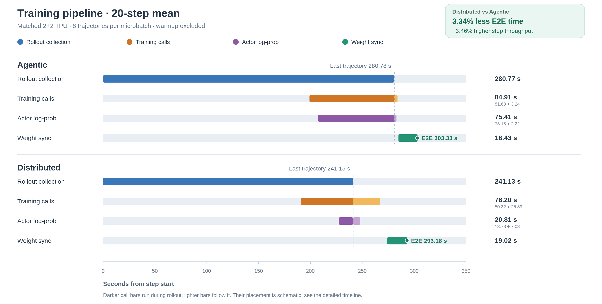
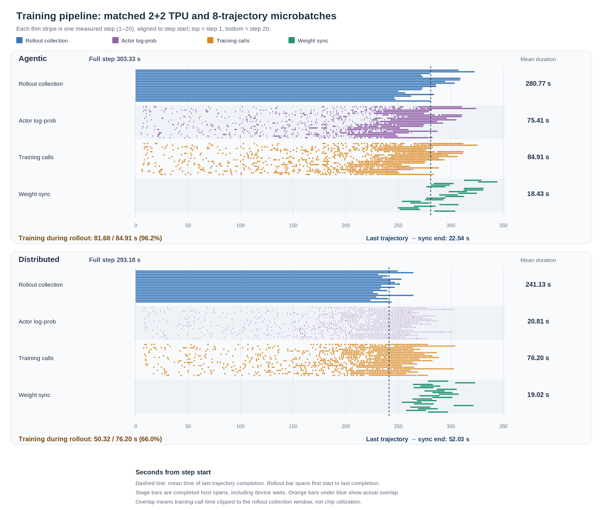

# Agentic vs Distributed Performance Benchmark

24 September 2026 · TPU v5p · 2 trainer + 2 rollout chips per stack · 20 measured steps after one warmup · 512 trajectories/step · 8 trajectories/microbatch.

## Key findings

Distributed averaged **293.18 s/step** versus **303.33 s/step** for agentic: **10.14 s (3.34%) less time per step**, equivalent to **3.46% higher step throughput**. It was faster on 15/20 steps, but the last ten averaged **288.91 versus 288.82 s/step** (distributed versus agentic): effectively equal.

| Mean over 20 measured steps | Agentic | Distributed | Dist − agentic |
| --- | ---: | ---: | ---: |
| Full step (s/step) | 303.33 | 293.18 | -10.14 |
| Rollout collection (s/step) | 280.77 | 241.13 | -39.64 |
| Post-rollout tail (s/step) | 22.54 | 52.03 | 29.48 |
| Training calls incl. update (s/step) | 84.91 | 76.20 | -8.71 |
| One training microbatch (s) | 1.327 | 1.191 | -0.136 |
| Training after last trajectory (s/step) | 3.24 | 25.89 | 22.65 |
| Actor log-prob (s/step) | 75.41 | 20.81 | -54.60 |
| Weight sync (s/step) | 18.43 | 19.02 | 0.58 |
| Reward/trajectory | 0.547 | 0.479 | -0.067 |

## Where the gap occurs

The E2E difference is **−39.64 s/step** in rollout collection, **+29.48 s/step** after the last trajectory, and about **+0.01 s/step** in rollout-start delay (distributed minus agentic). Distributed's training calls were faster, but only **66.03%** of their time overlapped rollout versus **96.19%** for agentic. It had **25.89 versus 3.24 s/step** of training left after rollout; weight sync differed by just **0.58 s/step**. The longer tail is primarily unfinished trainer-side work, not slower weight sync.

## Average timeline

[Download the average chart as SVG](training_average.svg).

Bars show mean durations and overlap; the placement of training and log-prob bars is schematic. Rollout and training overlap, so their durations must not be added to reconstruct E2E time.

## Experimental setup

| Parameter | Shared setting |
| --- | --- |
| Hardware | TPU v5p-4; trainer chips 0–1 (FSDP2), rollout chips 2–3 (TP2) |
| Model / precision | google/gemma-4-E2B-it; shared checkpoint and tokenizer; BF16 compute, FP32 load |
| Task / dataset | FrozenLake, non-slippery; 1,344 matched prompts |
| Run | 21 steps: 1 warmup + 20 measured; seed 42; distributed then agentic |
| Batch | 64 prompts/step × 8 generations = 512 trajectories/step |
| Microbatch | 8 trajectories/call; 64 training + 64 log-prob calls/step; 1 optimizer update/step |
| Context / turns | 2,048 prompt + 2,048 response tokens; up to 8 turns |
| Sampling | temperature 0.7; top_p 1.0; top_k 0 |
| vLLM scheduling | concurrency 512; max_num_seqs 32; max_num_batched_tokens 8,192; HBM utilization 0.2 |
| Objective | GSPO-token; RLOO; beta 0; epsilon 0.003/0.005; off-policy steps 0 |
| Optimizer | AdamW; learning rate 1e-6; b1 0.9; b2 0.95; global-norm clip 100 |
| Timing | stages mode; synchronized host wall time |

## Comparison limits

Chip allocation, checkpoint, prompt order, tensor shapes and call counts are aligned; sampled trainer tokens are not identical. Online trajectories differ: distributed generated **969.35 versus 842.01 output tokens/trajectory** and had mean reward **0.479 versus 0.547** (distributed versus agentic). The timing comparison therefore does not establish speed at equal task quality or isolate inference kernels. Each stack ran once (distributed first) in stage mode; fixed-input trainer speed, run-to-run uncertainty and pipeline throughput remain unmeasured.

## Detailed measurements

### Stage timings

| Metric, steady steps 1–20 | Agentic | Distributed | Dist − agentic | Dist / agentic |
| --- | ---: | ---: | ---: | ---: |
| Full step (s/step) | 303.325 | 293.180 | -10.145 | 0.97× |
| Rollout collection, first to last trajectory (s/step) | 280.767 | 241.130 | -39.637 | 0.86× |
| Actor log-prob (s/step) | 75.408 | 20.807 | -54.601 | 0.28× |
| Sampler/trainer agreement (s/step) | 1.302 | 0.204 | -1.098 | 0.16× |
| Training, all 64 microbatches plus update (s/step) | 84.912 | 76.205 | -8.708 | 0.90× |
| One training microbatch, mean (s) | 1.327 | 1.191 | -0.136 | 0.90× |
| One training microbatch, median (s) | 1.266 | 1.188 | -0.078 | 0.94× |
| One training microbatch, P90 (s) | 1.363 | 1.195 | -0.168 | 0.88× |
| Nonfinal training microbatch, mean (s) | 1.327 | 1.189 | -0.139 | 0.90× |
| Final training microbatch with update, mean (s) | 1.290 | 1.323 | 0.033 | 1.03× |
| Last trajectory to weight-sync end (s/step) | 22.543 | 52.028 | 29.484 | 2.31× |
| Weight sync (s/step) | 18.435 | 19.018 | 0.583 | 1.03× |

All durations are synchronized host wall times. Rollout and training overlap, so their totals must not be added to estimate full-step time. The last-trajectory-to-sync-end interval equals the post-rollout tail in this trace because the step boundary is sync completion. Each microbatch contains 8 trajectories. The per-microbatch sample has 1280 calls per stack across 20 measured steps; the final call in each step also includes the optimizer update. Distributed has a separate update RPC span, while agentic's optimizer update is fused inside that final JAX training call, so this report does not claim an optimizer-only speed comparison.

### Post-rollout critical path

| Mean interval per step | Agentic | Distributed | Dist − agentic |
| --- | ---: | ---: | ---: |
| Final trajectory to step end (s) | 22.543 | 52.028 | 29.484 |
| Final trajectory to sync start (s) | 4.109 | 33.010 | 28.901 |
| Weight sync (s) | 18.435 | 19.018 | 0.583 |
| Training within pre-sync window (s) | 3.236 | 25.890 | 22.654 |
| Log-prob within pre-sync window (s) | 2.224 | 7.027 | 4.803 |
| Agreement within pre-sync window (s) | 0.023 | 0.068 | 0.045 |
| Log-prob calls started after final trajectory | 1.500 | 21.050 | 19.550 |

These operation spans are clipped to the pre-sync interval. The last rollout completion does not imply that all queued microbatches have finished. The post-rollout tail measures the remaining work after the final trajectory, not the entire trainer cost.

### Measured overlap and 20-step timeline

#### Detailed 20-step timeline

Each thin stripe is one measured step aligned to its own start. Blue marks rollout collection; purple and orange mark completed log-prob and training calls; green marks weight sync. Unlike the mean diagram, these horizontal positions are actual observed timestamps. The dashed line marks mean last-trajectory completion.

| Overlap metric, steady steps 1–20 | Agentic | Distributed |
| --- | ---: | ---: |
| Training within rollout window (s/step) | 81.68 | 50.32 |
| Training after rollout window (s/step) | 3.24 | 25.89 |
| Training within rollout window (% of training) | 96.19 | 66.03 |
| First training after rollout start (s) | 14.75 | 16.58 |

The overlap seconds clip each training-call interval to its step's rollout collection window, then average the 20 steps. The fraction is overlap seconds divided by all completed training-call seconds; it does not measure chip utilization. Per-step intervals and derived values are in [`training_timeline_summary.json`](training_timeline_summary.json).

### Workload and measurement controls

| Item | Agentic | Distributed |
| --- | ---: | ---: |
| Trajectories/step | 512.00 | 512.00 |
| Training trajectories/call | 8.00 | 8.00 |
| Training calls/step | 64.00 | 64.00 |
| Actor log-prob trajectories/call | 8.00 | 8.00 |
| Actor log-prob calls/step | 64.00 | 64.00 |
| Padded token slots/step | 2,097,152.00 | 2,097,152.00 |
| Output tokens/trajectory | 842.01 | 969.35 |
| Reward/trajectory | 0.55 | 0.48 |

All comparison parity checks passed: training and log-prob sequence lengths, trajectories per step, padded token slots per step, per-call trajectory counts, full tensor shapes, and calls per step match. Both stacks use BF16 compute, FP32 checkpoint loading, and exact token continuity. Prompt and completion tensors have length 2048 each. Sampled output tokens and reward are online outcomes and can differ across stacks. Both runs exited successfully.

### Complete aggregate metrics

| Metric | Agentic | Distributed | Dist − agentic | Relative difference |
| --- | ---: | ---: | ---: | ---: |
| Full step (s/step) | 303.325 | 293.180 | -10.145 | -3.34% |
| Rollout collection (s/step) | 280.767 | 241.130 | -39.637 | -14.12% |
| Trajectory latency mean (s) | 181.920 | 173.136 | -8.784 | -4.83% |
| Trajectory latency P90 (s) | 260.439 | 235.636 | -24.803 | -9.52% |
| Rollout start delay (s/step) | 0.015 | 0.023 | 0.007 | 47.76% |
| Post-rollout tail (s/step) | 22.543 | 52.028 | 29.484 | 130.79% |
| Output tokens/trajectory | 842.008 | 969.354 | 127.346 | 15.12% |
| Prompt tokens/model call | 1,627.737 | 1,598.495 | -29.242 | -1.80% |
| Turns/trajectory | 2.243 | 1.941 | -0.302 | -13.48% |
| Reward/trajectory | 0.547 | 0.479 | -0.067 | -12.29% |
| Generation API time/trajectory (s) | 180.058 | 173.129 | -6.929 | -3.85% |
| Environment time/trajectory (s) | 0.999 | 0.004 | -0.995 | -99.55% |

| Outcome rate | Agentic | Distributed | Dist − agentic |
| --- | ---: | ---: | ---: |
| SUCCEEDED | 56.562 | 48.750 | -7.812 pp |
| MAX_CONTEXT_LIMIT_REACHED | 43.438 | 51.250 | 7.812 pp |

`SUCCEEDED` records normal episode completion; it does not by itself mean reward=1. Use reward/trajectory for task outcome quality.

### Distributed RPC versus completed worker time

| Operation | Calls/step | Outer RPC (s/step) | Completed worker (s/step) | Outside worker (s/step) |
| --- | ---: | ---: | ---: | ---: |
| Actor log-prob | 64 | 20.792 | 20.675 | 0.117 |
| Forward/backward | 64 | 76.060 | 75.678 | 0.382 |
| Optimizer update | 1 | 0.135 | 0.133 | 0.002 |

The worker spans include Python/JAX work, result materialization, and device-completion waits; they are not pure chip kernel times. Every worker span is nested in exactly one RPC and has completion evidence.

## Appendix: step-level and raw records

### Per-step results

A = agentic; D = distributed. Speedup is (agentic E2E / distributed E2E − 1) × 100%; positive values favor distributed. All durations are seconds.

| Step | E2E A (s) | E2E D (s) | D speedup (%) | Rollout A (s) | Rollout D (s) | Tail A (s) | Tail D (s) |
| --- | ---: | ---: | ---: | ---: | ---: | ---: | ---: |
| 1 | 329.03 | 297.57 | +10.58% | 307.27 | 249.27 | 21.75 | 48.27 |
| 2 | 344.15 | 323.06 | +6.53% | 322.52 | 264.32 | 21.61 | 58.72 |
| 3 | 302.68 | 282.93 | +6.98% | 280.23 | 230.91 | 22.43 | 52.00 |
| 4 | 299.05 | 289.92 | +3.15% | 271.81 | 239.79 | 27.22 | 50.10 |
| 5 | 294.98 | 283.56 | +4.03% | 273.14 | 234.91 | 21.83 | 48.62 |
| 6 | 331.16 | 305.50 | +8.40% | 309.09 | 253.05 | 22.04 | 52.43 |
| 7 | 330.51 | 294.04 | +12.40% | 308.75 | 242.74 | 21.75 | 51.28 |
| 8 | 315.46 | 301.52 | +4.62% | 294.63 | 246.76 | 20.81 | 54.74 |
| 9 | 324.77 | 307.38 | +5.66% | 303.67 | 251.55 | 21.08 | 55.81 |
| 10 | 306.51 | 289.03 | +6.05% | 285.52 | 233.55 | 20.98 | 55.46 |
| 11 | 312.58 | 301.41 | +3.71% | 285.97 | 246.64 | 26.59 | 54.75 |
| 12 | 294.85 | 282.23 | +4.47% | 273.21 | 232.73 | 21.61 | 49.48 |
| 13 | 292.96 | 286.52 | +2.25% | 272.14 | 239.43 | 20.80 | 47.07 |
| 14 | 271.37 | 272.15 | -0.29% | 250.04 | 226.03 | 21.32 | 46.11 |
| 15 | 279.63 | 283.78 | -1.46% | 256.60 | 230.54 | 23.03 | 53.21 |
| 16 | 307.10 | 321.51 | -4.48% | 284.18 | 264.37 | 22.91 | 57.12 |
| 17 | 285.46 | 280.44 | +1.79% | 262.18 | 228.96 | 23.27 | 51.46 |
| 18 | 269.29 | 287.49 | -6.33% | 246.09 | 239.98 | 23.18 | 47.48 |
| 19 | 270.83 | 276.38 | -2.01% | 247.29 | 223.42 | 23.52 | 52.94 |
| 20 | 304.14 | 297.19 | +2.34% | 281.01 | 243.67 | 23.12 | 53.50 |

| Step | Train A (s) | Train D (s) | Log-prob A (s) | Log-prob D (s) | Microbatch A (s) | Microbatch D (s) |
| --- | ---: | ---: | ---: | ---: | ---: | ---: |
| 1 | 83.53 | 76.93 | 73.91 | 20.39 | 1.305 | 1.202 |
| 2 | 86.52 | 76.22 | 76.17 | 20.80 | 1.352 | 1.191 |
| 3 | 84.32 | 76.47 | 72.74 | 20.83 | 1.318 | 1.195 |
| 4 | 86.15 | 76.14 | 72.57 | 20.87 | 1.346 | 1.190 |
| 5 | 84.69 | 76.09 | 74.57 | 20.84 | 1.323 | 1.189 |
| 6 | 86.60 | 76.14 | 79.89 | 20.81 | 1.353 | 1.190 |
| 7 | 83.87 | 76.40 | 77.71 | 20.87 | 1.310 | 1.194 |
| 8 | 84.69 | 76.12 | 77.66 | 20.78 | 1.323 | 1.189 |
| 9 | 82.66 | 76.18 | 81.10 | 20.80 | 1.292 | 1.190 |
| 10 | 87.55 | 76.19 | 73.49 | 20.85 | 1.368 | 1.190 |
| 11 | 84.06 | 76.44 | 75.15 | 20.84 | 1.313 | 1.194 |
| 12 | 86.01 | 76.13 | 78.30 | 21.20 | 1.344 | 1.190 |
| 13 | 84.78 | 76.06 | 75.34 | 20.77 | 1.325 | 1.188 |
| 14 | 84.56 | 76.05 | 76.12 | 20.74 | 1.321 | 1.188 |
| 15 | 81.30 | 76.19 | 71.11 | 20.79 | 1.270 | 1.190 |
| 16 | 83.87 | 76.07 | 73.28 | 20.85 | 1.310 | 1.189 |
| 17 | 88.97 | 76.09 | 76.35 | 20.77 | 1.390 | 1.189 |
| 18 | 83.50 | 75.98 | 74.81 | 20.72 | 1.305 | 1.187 |
| 19 | 84.66 | 76.09 | 72.92 | 20.79 | 1.323 | 1.189 |
| 20 | 85.96 | 76.10 | 74.98 | 20.83 | 1.343 | 1.189 |

Each stack ran once, in distributed then agentic order. 20 consecutive steady steps describe within-run variation and do not establish run-to-run confidence intervals.

### Rollout and training overlap

| Step | Agentic trajectories ready at first train | Dist trajectories ready at first train | Agentic first-train lead before last trajectory (s) | Dist first-train lead before last trajectory (s) |
| --- | ---: | ---: | ---: | ---: |
| 1 | 15 | 15 | 299.664 | 241.294 |
| 2 | 11 | 15 | 292.916 | 232.083 |
| 3 | 19 | 12 | 271.834 | 223.773 |
| 4 | 8 | 8 | 264.153 | 225.845 |
| 5 | 8 | 8 | 262.515 | 222.559 |
| 6 | 8 | 8 | 295.116 | 240.711 |
| 7 | 8 | 8 | 298.201 | 234.778 |
| 8 | 8 | 8 | 285.506 | 237.549 |
| 9 | 8 | 8 | 287.977 | 234.168 |
| 10 | 8 | 8 | 274.431 | 224.511 |
| 11 | 8 | 8 | 278.268 | 237.433 |
| 12 | 18 | 14 | 236.783 | 196.383 |
| 13 | 13 | 13 | 264.676 | 230.146 |
| 14 | 9 | 13 | 243.162 | 215.937 |
| 15 | 18 | 19 | 238.296 | 213.642 |
| 16 | 18 | 8 | 241.766 | 237.729 |
| 17 | 8 | 15 | 256.561 | 208.582 |
| 18 | 11 | 13 | 240.302 | 212.576 |
| 19 | 11 | 9 | 230.757 | 206.926 |
| 20 | 16 | 20 | 257.491 | 214.424 |

Each step has 512 trajectories. The first training call begins once one 8-trajectory microbatch is ready, while other trajectories continue to finish. Counts can exceed 8 because production continues during preprocessing and scheduling. Both implementations finish the step's gradient accumulation before optimizer update and weight sync.

### Complete recorded API counts and host spans

| API span | Agentic calls/step | Dist calls/step | Agentic host s/step | Dist host s/step |
| --- | ---: | ---: | ---: | ---: |
| `actor_log_probs` | 64.00 | 64.00 | 75.4078 | 20.8071 |
| `checkpoint_save` | — | 1.00 | — | 0.0009 |
| `metrics_fetch` | — | 1.00 | — | 0.0010 |
| `rollout_dispatch` | — | 64.00 | — | 2.4832 |
| `rollout_poll` | — | 512.95 | — | 290.4718 |
| `sampler_trainer_agreement` | 64.00 | 64.00 | 1.3025 | 0.2044 |
| `trainer_worker_fwd_bwd` | — | 64.00 | — | 75.6781 |
| `trainer_worker_per_token_logps` | — | 64.00 | — | 20.6746 |
| `trainer_worker_update` | — | 1.00 | — | 0.1328 |
| `training` | 64.00 | 64.00 | 84.9122 | 76.2045 |
| `weight_sync` | 1.00 | 1.00 | 18.4346 | 19.0180 |
| `worker_rpc_fwd_bwd` | — | 64.00 | — | 76.0602 |
| `worker_rpc_get_metrics` | — | 1.00 | — | 0.0009 |
| `worker_rpc_per_token_logps` | — | 64.00 | — | 20.7919 |
| `worker_rpc_save_checkpoint` | — | 1.00 | — | 0.0006 |
| `worker_rpc_update` | — | 1.00 | — | 0.1348 |

These host spans can nest. `rollout_poll` largely records waiting and must not be added to trainer or full-step durations.

### Process completion

| Item | Agentic | Distributed |
| --- | ---: | ---: |
| Exit code | 0 | 0 |
| Process runtime including startup/shutdown (s) | 6,566.67 | 6,344.33 |
| Warmup step 0 (s) | 480.19 | 337.75 |
| Steady step mean (s) | 303.33 | 293.18 |
| Steady step median (s) | 303.41 | 289.47 |
| Steady step sample SD (s) | 21.70 | 13.80 |
| Trajectories/full-step second | 1.688 | 1.746 |

Process runtime includes time outside the training-step boundaries and is not the steady-step metric.

### Raw event supplements

| Event metric, steady steps 1–20 | Agentic | Distributed |
| --- | ---: | ---: |
| Generation calls | 22,973 | 19,877 |
| Generation calls/step | 1,148.650 | 993.850 |
| Generation call latency, mean (s) | 80.259 | 89.190 |
| Generation call latency, median (s) | 76.715 | 88.793 |
| Generation call prompt tokens, mean | 1,627.737 | 1,598.495 |
| Generation call output tokens, mean | 375.317 | 499.380 |
| Generation output tokens, total | 8,622,160 | 9,926,185 |
| Trajectory events | 10,240 | 10,240 |
| Trajectory latency, median (s) | 199.894 | 195.248 |
| Initial prompt tokens/trajectory | 1,096.684 | 1,096.684 |
| Environment tokens/trajectory | 236.575 | 181.666 |
| New conversation tokens/trajectory | 1,078.583 | 1,151.020 |
| Environment tokens, total | 2,422,531 | 1,860,258 |
| New conversation tokens, total | 11,044,691 | 11,786,443 |
| Environment time/trajectory, median (s) | 0.028 | 0.003 |
| Reward sum | 5,597 | 4,909 |
| SUCCEEDED with reward=1 | 5,597 | 4,909 |
| SUCCEEDED with reward=0 | 195 | 83 |
| Reward timing field, nonzero count | 0 | 0 |

| Step | Agentic generation calls | Distributed generation calls |
| --- | ---: | ---: |
| 1 | 1026 | 967 |
| 2 | 1068 | 985 |
| 3 | 1036 | 896 |
| 4 | 1041 | 912 |
| 5 | 1069 | 917 |
| 6 | 1121 | 988 |
| 7 | 1089 | 957 |
| 8 | 1100 | 961 |
| 9 | 1150 | 1012 |
| 10 | 1097 | 944 |
| 11 | 1135 | 978 |
| 12 | 1131 | 978 |
| 13 | 1166 | 995 |
| 14 | 1155 | 1023 |
| 15 | 1203 | 1017 |
| 16 | 1310 | 1049 |
| 17 | 1219 | 1034 |
| 18 | 1209 | 1035 |
| 19 | 1249 | 1085 |
| 20 | 1399 | 1144 |

A trajectory can contain multiple generation calls. Every measured generation and trajectory has `ok=true`; every trajectory has `exact_token_continuity=true` and its conversation-token count equals generated plus environment tokens. Zero reward-timing fields indicate unavailable timing measurements, not zero reward computation cost. The environment-time field includes executor queue and wall waiting, not just FrozenLake compute.

Agentic's first and last ten steps averaged **317.83 and 288.82 s/step**; distributed averaged **297.45 and 288.91 s/step**. The earlier four-step run found a **39.42 s/step (12.21%)** distributed advantage. The longer-run estimate above supersedes that short-run gap.

### Reproducibility

Source revision: `c2442a7131ce5317042f648be05c5eee33726601` with matching working-tree diff hashes in both manifests. The benchmark command used `--agentic-chip-layout split2x2 --match-training-microbatch --timing-mode stages --steps 21 --warmup 1 --batch 64 --generations 8 --micro-groups 1 --prompt 2048 --response 2048 --turns 8 --concurrency 512 --seed 42`. Exact commands, environment, source and model hashes are in [`stages-agentic/manifest.json`](stages-agentic/manifest.json) and [`stages-dist/manifest.json`](stages-dist/manifest.json). Raw logs and events remain in the original run directories, outside this snapshot. Unrounded values and all API spans are in [`stages-comparison.json`](stages-comparison.json) and [`stages-analysis.json`](stages-analysis.json), and [`overlap-analysis.json`](overlap-analysis.json). Configuration and residual differences are documented in [`alignment_audit.md`](alignment_audit.md). The benchmark configuration code is [`frozenlake.py`](../../frozenlake.py).
