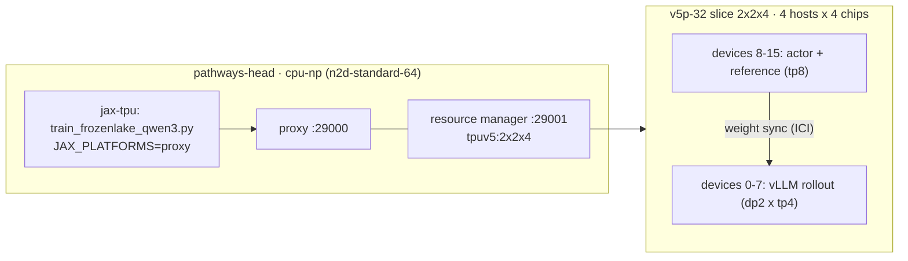

# Score Centering 长程多轮 A/B（v5p-32 / GKE）实施计划

> [!NOTE]
> **状态**：2026-09-25 已批准，§8 的决策均采用括号内的建议默认值。
> 配套文档：[`score_centering_walkthrough.md`](score_centering_walkthrough.md)（设计）、
> [`score_centering_validation.md`](score_centering_validation.md)、
> [`score_centering_validation_12grid.md`](score_centering_validation_12grid.md)（前两轮验证）。

---

## 1. Score Centering 做了什么（对比 main）

### 1.1 对比基线
- 本地 `main`（`03281e6a`）已经过时，`sc-val` 比它领先 161 个 commit（大多是上游改动）。
- SC 相关的 diff 是 **`a6109efe..sc-val`**：26 个文件，+2846 / −82。
  - `419a7a0a`：SC 核心实现（loss、rollout、trajectory、packing、测试）。
  - 之后的 5 个 `snapshot` commit：修复传输链路 bug、改 recipe 参数、加两份验证报告。
- `origin/main` 里完全没有 SC。

### 1.2 要解决的问题
- rollout 的 token 从采样器 `q` 采（vLLM、bf16），梯度却在训练策略 `p_θ` 下计算。
- 普通 PG 估计量 `A·w(y)·∇log p_θ(y)` 在 `q≠p` 时有一个与"采了哪个 token"无关的漂移项：
  `A·E_{v~q}[w(v)∇log p_θ(v)]`。
  - A>0 时它把 `p` 往 `q` 拉，A<0 时往反方向推。
  - on-policy（`q=p`）时它为 0，因为 `Σ_v p∇log p = 0`。
- SC 在每个 token 位置减掉这个期望（控制变量），只保留"相对采样分布选了哪个 token"的信号：

```
ĝ = A · [ w(y)∇log p_θ(y) − E_{v~q̂}[ ŵ(v)∇log p_θ(v) ] ]
w = 1 (standalone, Eq.8)   或   w = min(p/q, C) (与 token-TIS 组合, Eq.11/14)
```

### 1.3 实现原理：O(k) 技巧
- 期望分布 `q̂` 由两部分拼成：
  - 采样器 top-k 头部：直接用 `q_v`，`v∈H`。
  - 尾部：用训练器自己的 `ρ·p_θ(v)`，其中 `ρ = q_tail / p_tail`。
- 利用 `Σ_v p∇log p = 0`，尾部求和可以折叠进头部：
  `E_q̂[ŵ∇log p] = Σ_{v∈H} sg[q_v·w_v − α·p_v] ∇log p_θ(v)`，其中 `α = ρ·f(1/ρ)`。
- 代码实现方式：
  - 先算代理项 `Δ_SC = Σ_H c_v · log p_θ(v)`，`c_v` 做 stop-grad。
  - 再执行 `per_token_loss += adv · Δ_SC`（[algo_core.py](../algo_core.py#L553-L567)）。
  - 梯度经过 `logsumexp` 流到全词表，但不需要构造 `[B,L,V]` 概率张量。
- 当 `p=q` 且 `C≥1` 时 `c_v ≡ 0`，所以 `abs_coeff_sum = Σ|c_v|` 可以直接看作 sampler/trainer 的失配程度。

### 1.4 分层改动

| 层 | 文件 | 新增内容 |
|---|---|---|
| Rollout | `configs.py`, `base_rollout.py`, `vllm_sampler.py`, `generate/utils.py`, `vllm_rollout.py` | `num_logprobs=k`；vLLM `logprobs/max_logprobs=k`；输出 `topk_token_ids/topk_logprobs [L,k]` |
| 传输修复 | [rl_cluster.py](../rl_cluster.py#L924-L952) | `RLEngine.generate()` 原来会丢掉 top-k（验证报告 §1.1），已修 |
| 轨迹 | `agent_types.py`, `trajectory_collect_engine.py` | 每个 Step 存 top-k；env/后缀 token 用 `(0,-inf)` 掩码；导出 `old_topk_*`；另外修了响应预算越界 |
| Learner | [agentic_grpo_learner.py](agentic_grpo_learner.py) | `score_centering / _top_k / _eps`；pad 成 `[max_resp,k]` 写入 `TrainExample`；注册 4 个新 metric |
| 核心 | [common.py](../common.py#L218-L330), `packing.py`, `rl/utils.py` | `selective_topk_log_softmax`、`compute_score_centering_correction`；chunked logps 返回 top-k；packing 支持 2D per-token 字段 |
| Loss | [algo_core.py](../algo_core.py#L423-L664) | SC 项；`score_centering/{head_mass_q,head_mass_p,tail_ratio_rho,abs_coeff_sum}_mean` |

> [!WARNING]
> **一个已知混杂因素**：SC 开启且 `num_iterations==1` 时，`old_logps := sg(current)`，PPO ratio 被固定为 1。
> - SC-on 组从不裁剪（`pg_clipfrac=0`、`ppo_kl=0`）。
> - SC-off 组在 gspo-token 的 0.003/0.005 裁剪带下，会裁掉 2–6% 的 token（12grid 报告 §3.3）。
> - 所以两组的差别不只有 SC 这一项（见 §8 的可选第三组）。

---

## 2. 新数据集（5×5 到 12×12）

- 给 [data.py](../../../examples/frozenlake/data.py) 加 `--min_grid_size / --max_grid_size`（闭区间）。默认值保持当前行为。
- 规模和种子沿用原数据集：train 10,000（seed 42），test 100（seed 123）。
  - `size ~ U{5..12}`
  - `p ~ U(0.6, 0.85)`
- 上传到**新前缀**，不覆盖原文件：
  - `gs://tunix/data/Frozenlake/grid5to12/{train,test}.parquet`
  - 用 `gcloud storage cp --no-clobber`。
  - 根目录下原有的 `train.parquet` / `test.parquet`（2–9 格，2026-05-26）不动。
- **还需要一份镜像**：`gs://linchai-bucket-dev/data/frozenlake/grid5to12/`。
  - 原因：集群节点 SA（`390987599272-compute@`）在 `jax3p-jax-bonsai`（`gs://tunix` 所属项目）没有任何权限，pod 读不了 `gs://tunix`。
  - 它在 `cloud-tpu-multipod-dev` 有 `storage.objectAdmin`，所以能读写 `linchai-bucket-dev`。
- 难度画像（顺带记录）：
  - 用 env 自带的地图生成器（`max_steps=15`）统计 BFS 最短路分布和各尺寸占比。
  - 注意：生成器会拒绝 ~16 步内不可达的地图，所以 12×12 的难点主要在长观测（每轮约 400 token）和步数多，而不是地图无解。

---

## 3. 代码改动

### 3.1 库：给 SC-off 组加"只记录诊断"模式
你要求两组都在 W&B 记录新 metric，但 SC-off 组现在根本不会产生 `score_centering/*`。计划如下：

- `GRPOConfig.score_centering_diagnostics: bool = False`
  - 开启后：向 vLLM 要 top-k，计算并记录 4 个 SC metric。
  - **不**加修正项，**不**固定 PPO ratio。
- [algo_core.py](../algo_core.py)：
  - 满足 `(SC 或 diag) 且有 top-k` 时计算统计量。
  - 只有 SC 开启时才执行 `per_token_loss += adv·Δ` 和 ratio 固定。
- [agentic_grpo_learner.py](agentic_grpo_learner.py)：
  - metric 注册、`has_topk_data`、`num_logprobs` 自动配置都把 diag 模式算进去。
  - 如果开启了 SC/diag 但 batch 里没有 top-k，直接 `raise`。这是验证报告 §1.2 建议的"在原因处失败"，避免跑到一半才 `KeyError`。
- 单测（加到 `agentic_grpo_learner_test.py`）：
  - SC-off 时 diag 开/关，loss 和梯度逐位一致。
  - diag 开启时 metric 存在。
  - SC-on 的行为不变。

### 3.2 Recipe：[train_frozenlake_qwen3.py](../../../examples/frozenlake/train_frozenlake_qwen3.py)
只加 opt-in 参数，单机默认行为不变，旧报告里的复现命令照样能跑。

| 参数 / 环境变量 | 作用 |
|---|---|
| `--max_response_length 8192` | 已有参数，通过 CLI 传入。KV cache 为 2048+8192+256 |
| `--env_max_steps 15` | 新参数；现在是写死的 15 |
| `--rollout_devices 8` | 拆分 mesh：`devices[:8]` 给 rollout `(dp=2,tp=4)`，`devices[8:]` 给 trainer `(fsdp=1,tp=8)`；**REFERENCE 复用 trainer mesh** |
| Pathways 设置 | `FLAGS_pathways_enforce_subset_devices_form_subslice=false`，`allow_split_physical_axes=True`（照搬 Gemma4-31B Pathways recipe） |
| `--vllm_hbm_utilization 0.7` | rollout 独占芯片（共享 mesh 时是 0.20）；每个 DP rank `max_num_seqs=64` → 128 条同时跑 |
| `--score_centering_diagnostics` | 见 §3.1 |
| `--eval_every_n_steps`, `--num_test_batches` | 评估节奏 |
| `CKPT_DIR`, `SAVE_INTERVAL_STEPS`, `WANDB_*` | 改为从环境变量读（现在 `CKPT_DIR=None` 是写死的）；learner 已支持从 ckpt 恢复并快进数据 |

### 3.3 GKE 文件（新建 `examples/frozenlake/gke/`）
- `frozenlake_sc_ab_v5p32.yaml`：带占位符的 JobSet 模板。
- `launch_sc_ab.sh`：渲染模板并 `kubectl apply`，支持 `--arm sc-on|sc-off|both`、`--smoke`、`--dry-run`。
- `cloudbuild.yaml`：构建镜像，并在镜像里跑 SC 单测。
- `README.md`：简短说明。

---

## 4. 镜像

- `frozenlake-latest`（2026-06-11）早于 `sc-val` 的依赖，不能用。计划用 Cloud Build 在 `cloud-tpu-multipod-dev` 重建（你是 owner，其他人今天也在这里 build）。
  - 构建上下文 = 工作区快照，外加一个空的 `raiden_wheels/`（Dockerfile 会 `COPY` 这个目录）。
  - 推送到 `europe-west4-docker.pkg.dev/cloud-tpu-multipod-dev/linchai-repo/tunix_base_image:sc-ab-<sha>`。
  - 镜像和集群同在 europe-west4；节点 SA 有这个项目的 `artifactregistry.reader`。
- 依赖栈：vllm@`51da0ca` + tpu-inference@`6f913c7` → **jax/jaxlib 0.11.0**，外加 `pathwaysutils`。
  - Pathways proxy/server 用 `20260911-jax_0.11.0`。本集群 9/14 的 `qwen3-rl-fix` 就是用它在 v5p-32 上成功跑过 Pathways。
  - 注意：之前的验证是在 JAX 0.10.2 上做的，这里是 0.11.0。
- Cloud Build 里加一步：在镜像内用 `JAX_PLATFORMS=cpu` 跑 `pytest -k ScoreCentering`，作为上线前的门槛。

---

## 5. GKE：`bodaborg-v5p-nap`（europe-west4，cloud-tpu-shared-capacity）



- Kueue：LocalQueue `multislice-queue` → ClusterQueue `default`。
  - v5p 名义配额 224 芯片，当前用了 72。
  - 两组共 32 芯片，仍在名义配额内，不会被 cohort 回收。
  - 用 `priorityClassName: medium`（用户可用的最高优先级）。
- 模板基于你的 paste，并对照本集群成功跑过的 `qwen3-rl-fix` 调整：

| paste 里的配置 | 问题 | 本计划的改法 |
|---|---|---|
| `gke-nodepool: linchai-v5p-128-pw-np-0` | 本集群没有这个 pool，会导致 Kueue flavor 不匹配（和现有 pending 作业报错相同） | 用 `tpu-v5p-slice` + `topology: 2x2x4` + reservation 标签 + tolerations |
| `4x4x4`，16 个 worker | v5p-128 | `tpuv5:2x2x4`，4 个 worker × 4 芯片 |
| head 共 900G 内存 | 放不进 n2d-standard-64（256G） | proxy 16C/100G，RM 8C/32G，main 24C/100G；每台节点独占（exclusive-topology），避免 hostNetwork 端口冲突 |
| PVC `linchai-cpu-np-pvc-2`，`HF_TOKEN` | 本集群没有这个 PVC；Qwen3 是公开模型 | `HF_HOME=/tmp/hf`（hostPath） |
| `WANDB_API_KEY` 明文 | 泄露风险 | 放进 k8s Secret `wandb-api-key`，用 `secretKeyRef` 注入；**不写进任何仓库文件** |

- kubectl：需要 `kubectl` 和 `gke-gcloud-auth-plugin`（`sudo apt install kubectl google-cloud-cli-gke-gcloud-auth-plugin`）。
  - 没有 sudo 时，可以用 `apt-get download` + `dpkg -x` 解压到用户目录。
  - 用单独的 `KUBECONFIG`，不改 `~/.kube/config`：`gcloud container clusters get-credentials bodaborg-v5p-nap --region=europe-west4 --project=cloud-tpu-shared-capacity --dns-endpoint`。
- W&B 故障保护：tunix 的 `WandbBackend` 初始化失败时只打一条 INFO 然后跳过（[metrics_logger.py](../../sft/metrics_logger.py#L189-L199)）。所以 entrypoint 会先 `wandb.login()` 做预检，失败就直接退出。
  - `WANDB_RUN_ID` 固定、`WANDB_RESUME=allow`：作业从 ckpt 重启后会续写同一个 run。

---

## 6. 实验设计

| 共同配置 | 值 |
|---|---|
| 模型 | **Qwen/Qwen3-1.7B**（§8 已确认） |
| batch | 16 prompt × 8 gen = 128 条轨迹/步，mini_batch 16 |
| 步数 | `num_batches=200`, `num_epochs=1` → max_steps 200 |
| 种子 | 两组都用 42，每步看到的 prompt 相同（配对设计） |
| 优化 | lr 1e-6，AdamW(0.9, 0.95)，gspo-token ε 0.003/0.005，rloo |
| IS | `sampler_is="token"`，阈值 2.0；`off_policy_steps=0`，`num_iterations=1` |
| 采样 | temperature 0.7，top_p 1.0，top_k 0；max_prompt 2048 / **max_response 8192** / **env max_steps 15** |
| SC | `score_centering_top_k=32`（12grid 报告里 Qwen 的 head mass 约为 1.0） |
| 评估 | 每 20 步，固定 32 个 test prompt × 8 gen（约 +10% 墙钟时间） |
| 日志 | W&B 项目 `tunix-frozenlake`，group `sc-ab-v5p32-g5to12-8k`；TB 写到 `gs://linchai-bucket-dev/tensorboard/grpo/...`；`DISABLE_TRAJECTORY_LOG=1`（参考 12grid §4 GCS 日志事故） |

| 组 | JobSet | 唯一差别 |
|---|---|---|
| A | `fl-sc-on-s42` | `--score_centering` |
| B | `fl-sc-off-s42` | `--score_centering_diagnostics`（只记录，不影响训练） |

- 预估：rollout 主导，每步 2–4 分钟，200 步约 7–14 小时（两组在两个 slice 上并行）。

### 执行顺序
1. 改代码和单测 → 生成数据、上传 GCS → Cloud Build（含单测）。
2. 创建 `wandb-api-key` Secret。
3. **Smoke**：两组各跑 3 步，第 2 步评估、第 2 步存 ckpt。检查以下各项：
   - Pathways + 拆分 mesh + DP=2 vLLM 能正常启动。
   - 权重同步正常。
   - GCS 读取正常。
   - 两组的 W&B run 里都有 `score_centering/*`。
   - 8k 预算下没有触发 exact-token 越界。
   - ckpt 能写出。
   - 实测单步耗时。
   - 验证完删除 smoke 作业。
4. **正式**：启动两组，都用新的 W&B run 和新的 ckpt 目录。

---

## 7. 监控与停止条件

- 每 30 分钟检查一次（W&B API + `kubectl logs`），结果追加到 `experiment_log.md` artifact。
- **"持续 collapse"判定**（任一组满足任一条；我会先看曲线确认再停，避免把难度波动误判为 collapse）：
  1. 奖励：reward 的 10 步滑动均值 ≤ 本组最佳 10 步均值的 50%（第 20 步之后），并持续 ≥20 步；或者 ≤0.02 持续 ≥10 步。
  2. 生成退化：打满响应预算的轨迹占比 ≥80% 持续 ≥10 步；或者 entropy ≥ 前 10 步均值的 3 倍，持续 ≥10 步。
  3. 数值：loss 或 grad_norm 出现 NaN/Inf；或者 grad_norm ≥ 运行中位数的 10 倍，持续 ≥5 步。
- 停止：一组触发判定，或者两组都到 200 步，就 `kubectl delete jobset` 删掉两组。然后写最终报告，格式与现有两份报告一致。
- 作业崩溃或被抢占：从最近的 ckpt 续跑一次；再失败就停下来向你报告。

---

## 8. 需要你确认的决策（括号里是我的建议默认值）

1. **模型**：Qwen3-1.7B（建议；可以和之前的 A/B 对比，也省时间）还是 Qwen3-8B（每步大约慢 3–5 倍，200 步可能超过 24 小时）？
2. **SC-off 组用 diag 模式**来记录 `score_centering/*`，可以吗？（建议可以。代价是 SC-off 组也会向 vLLM 要 top-k，采样分布不变。）
3. **exact_token_continuity**：用默认的 True（建议；sampler 和 trainer 上下文完全一致，top-k 才严格对齐）。之前两份报告都用 False，而且越界修复在长跑里还没验证过；如果 smoke 复现越界，就退回 False。
4. **评估**：每 20 步、32 个 prompt（建议），还是像之前一样关掉？
5. **collapse 判定和"一组 collapse 就两组都停"**，可以吗？
6. **可选第三组** `sc-off + force_on_policy_ratio=True`：同样固定 ratio 为 1，用来把"SC 修正项本身"和"不裁剪"分开。要多占一个 v5p-32；配额够，但 reservation 能不能再切出 2x2x4 不确定。（建议先不加。）
7. `off_policy_steps` 保持 0（建议；只改 horizon 这一个变量）。12grid 报告的结论是：SC 设计上要发挥作用的场景是有真实策略滞后的时候，这可以作为下一轮实验。

## 9. 风险
- **v5p-32 容量**：目前 v5p 节点全是 4x4x4 或 2x2x1，需要 NAP 从 reservation 新建两个 2x2x4 pool。如果 reservation 没有余量，作业会排队，最坏情况两组只能串行跑。
- **vLLM（tpu-inference@6f913c7）在 Pathways 上跑 DP=2 没验证过**：smoke 会检查。备选是 rollout mesh `(1,8)`，也就是 Gemma4-31B Pathways recipe 的配置。
- **每组只有一个种子**：12grid §4.5 已经说明，同一种子内部的差异不能归因于 SC。如果需要结论性的判断，之后再补种子。
