# Score Centering in `tunix` (`agentic_grpo_learner`)

Implementation of **Score Centering (SC)** from [arXiv:2609.20807](https://arxiv.org/abs/2609.20807) (*"Score Centering Stabilizes Off-policy Reinforcement Learning"*) across `tunix`'s `VllmRollout`, `TrajectoryCollectEngine`, `GRPOLearner`, and `grpo_loss_fn`.

---

## 1. Mathematical Formulation & $O(k)$ Autodiff Trick

### 1.1 Score Centering Objective
Under off-policy sampling where trajectories are generated from sampler $q$ and trained on policy $p_\theta$, the importance-weighted policy gradient for token $y$ with advantage $A$ and weight function $w(v) = f(p_\theta(v)/q(v))$ is centered by subtracting the expected score under the sampling distribution:

$$\hat{g}(\theta) = A \cdot \left[ w(y) \nabla_\theta \log p_\theta(y) - \mathbb{E}_{v \sim \hat{q}(\cdot \mid x)}\!\big[\hat{w}(v) \nabla_\theta \log p_\theta(v)\big] \right]$$

where:
- **Standalone Score Centering (`sampler_is=None`)**: $f(r) = 1$, $\hat{w}(v) = 1$.
- **Composed Truncated IS + Score Centering (`sampler_is="token"`)**: $f(r) = \min(r, C)$ where $C = \text{sampler\_is\_threshold}$.
- **Top-$k$ Head + Scaled-Tail Approximation ($\hat{q}$)**:
  Given the top-$k$ token set $H$ from sampler $q$:
  $$\hat{q}(v \mid x) = \begin{cases} q(v \mid x) & v \in H \\ \rho \, p_\theta(v \mid x) & v \notin H \end{cases}, \quad \rho = \frac{\operatorname{clip}(1 - \sum_{v \in H} q(v \mid x), 0, 1)}{\max(1 - \sum_{v \in H} p_\theta(v \mid x), \epsilon)}$$

### 1.2 Exact Full-Vocabulary Gradient in $O(k)$ Time
Using the score function identity $\sum_{v \in \mathcal{V}} p_\theta(v) \nabla_\theta \log p_\theta(v) = \mathbf{0}$, the tail sum $\sum_{v \notin H} \rho \, f(1/\rho) \, p_\theta(v) \nabla_\theta \log p_\theta(v)$ reduces to a head-only sum:

$$\mathbb{E}_{v \sim \hat{q}}\!\big[\hat{w}(v) \nabla_\theta \log p_\theta(v)\big] = \sum_{v \in H} \underbrace{\operatorname{sg}\!\big[q_v w_v - \alpha p_v\big]}_{c_v} \nabla_\theta \log p_\theta(v), \quad \alpha = \rho \, f(1/\rho)$$

Because `selective_topk_log_softmax` in `tunix/rl/common.py` computes $\log p_\theta(v) = z_v - \operatorname{logsumexp}(z)$ for $v \in H$, differentiating the scalar surrogate:

$$\Delta_{\text{SC}} = \sum_{v \in H} \operatorname{sg}\!\big[q_v w_v - \alpha p_v\big] \log p_\theta(v)$$

automatically propagates gradients through $\operatorname{logsumexp}(z)$ to **all $V$ vocabulary logits** (both head $u \in H$ and tail $u \notin H$) in $O(k)$ memory and compute without materializing a $[B, L, V]$ probability tensor.

---

## 2. Architecture & Dataflow

```mermaid
flowchart LR
  subgraph Rollout["1. Rollout (vLLM)"]
    A["RolloutConfig(num_logprobs=k)"] --> B["VllmSampler & VllmRollout"]
    B --> C["RolloutOutput(topk_token_ids, topk_logprobs)"]
  end

  subgraph Collect["2. Trajectory Collection"]
    C --> D["TrajectoryCollectEngine._one_step"]
    D --> E["Step(topk_token_ids, topk_logprobs)"]
    E --> F["collect(mode='Token') -> old_topk_token_ids, old_topk_logprobs"]
  end

  subgraph Learner["3. Learner & Packing"]
    F --> G["GRPOLearner._process_results"]
    G --> H["TrainExample(old_topk_token_ids, old_topk_logps)"]
    H --> I["pack_sequences / unpad_train_example (2D [L, k] support)"]
  end

  subgraph Loss["4. Forward & Loss (grpo_loss_fn)"]
    I --> J["compute_per_token_logps / compute_chunked_logps"]
    J --> K["selective_topk_log_softmax -> trainer_topk_logps [B, L, k]"]
    K --> L["compute_score_centering_correction -> sc_logp_correction [B, L]"]
    L --> M["per_token_loss += advantages[:, None] * sc_logp_correction"]
  end
```



---

## 3. Modified Files Summary

| Layer | File | Changes |
| :--- | :--- | :--- |
| **Rollout Config & Output** | `tunix/common/configs.py`, `tunix/generate/base_sampler.py`, `tunix/rl/rollout/base_rollout.py` | Added `num_logprobs: int = 1` to `RolloutConfig` and `topk_token_ids` / `topk_logprobs` (`[L, k]`) to `SamplerOutput` and `RolloutOutput`. |
| **vLLM Rollout Extraction** | `tunix/generate/utils.py`, `tunix/generate/vllm_sampler.py`, `tunix/rl/rollout/vllm_rollout.py` | Added `get_topk_logprobs_from_vllm_output` to extract top-$k$ token IDs and logprobs (with `0` / `-inf` padding for missing slots) and wired `num_logprobs` through `VllmSampler` and `VllmRollout`. |
| **Agent Trajectory Collection** | `tunix/rl/agentic/agents/agent_types.py`, `tunix/rl/agentic/trajectory/trajectory_collect_engine.py` | Stored per-step `topk_token_ids` and `topk_logprobs` on `Step` (masking environment/observation tokens with `0` and `-inf`) and exported `old_topk_token_ids` and `old_topk_logprobs` in `collect(mode="Token")`. |
| **Core RL Primitives & Packing** | `tunix/rl/common.py`, `tunix/rl/packing.py`, `tunix/rl/utils.py` | Added `old_topk_token_ids` and `old_topk_logps` to `TrainExample` and `PER_TOKEN_FIELDS`, implemented `selective_topk_log_softmax` and `compute_score_centering_correction`, updated `compute_per_token_logps` & `compute_chunked_logps`, and added 2D `[L, k]` per-token field packing/unpadding support. |
| **GRPO Loss & Learner** | `tunix/rl/algo_core.py`, `tunix/rl/agentic/agentic_grpo_learner.py` | Added `score_centering`, `score_centering_top_k`, and `score_centering_eps` to `GRPOConfig`, integrated `sc_logp_correction` and `score_centering/*` diagnostics into `grpo_loss_fn`, and auto-configured `rollout_config.num_logprobs` in `GRPOLearner`. |
| **Unit & Integration Tests** | `tunix/rl/agentic/agentic_grpo_learner_test.py` | Added `ScoreCenteringTest` verifying zero-drift on-policy behavior, exact match between $O(k)$ autodiff and $O(V)$ full-vocabulary expected score gradients, `-inf` slot NaN-safety, chunked/unchunked `grpo_loss_fn` with standalone SC and `TIS + SC`, and end-to-end `GRPOLearner.train`. |

---

## 4. Usage Example

```python
from tunix.rl.agentic import agentic_grpo_learner

# 1. Composed TIS + Score Centering (Paper Eq. 11 & 14 - Recommended for off-policy stability)
grpo_config = agentic_grpo_learner.GRPOConfig(
    loss_algo="grpo",
    use_rollout_logps=True,
    sampler_is="token",
    sampler_is_threshold=2.0,
    score_centering=True,
    score_centering_top_k=128,
    score_centering_eps=1e-6,
)

# 2. Standalone Score Centering (Paper Eq. 8)
grpo_config_standalone = agentic_grpo_learner.GRPOConfig(
    loss_algo="grpo",
    use_rollout_logps=True,
    sampler_is=None,
    score_centering=True,
    score_centering_top_k=128,
)
```
